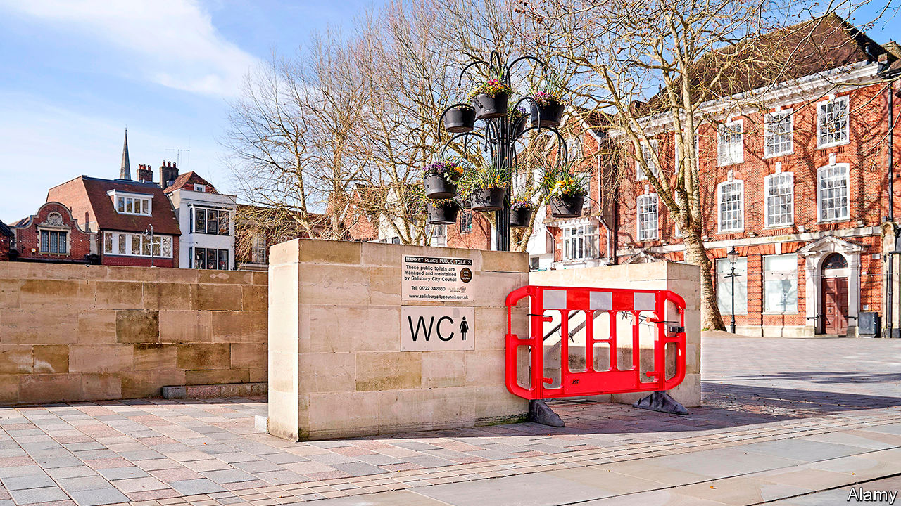

## Sanitation

# Lockdown and the toilet problem

> A nation is caught short

> Jun 13th 2020

IT WAS A mortifying moment. Crouched in a bush, Katie was confronted by a dog owner whose hound had discovered her al fresco lavatory. The woman remonstrated loudly that (pooch practices notwithstanding), Katie shouldn’t relieve herself in a public place. “It was quite embarrassing and awkward as I was mid-pee, and I just tried to explain it was a desperate situation,” she recalls.

Relieving oneself in public is an offence, but lockdown has closed most public toilets as well as cafés and pubs. That makes long outings difficult for all sorts of people, including menstruating women and those reluctant to relieve themselves in public. Emma Curtis suffers from irritable bowel syndrome, exacerbated by the anxiety the covid-19 crisis has caused. She hasn’t been able to join her family for walks along the coast in Dorset near her home as a result.

Many are less inhibited, and throw caution and bodily fluids to the wind. Beauty spots have been sullied by urine and worse. Takeaway pints and the warm weather do not help. David Vincent, a retired chef living near Saundersfoot Beach in Pembrokeshire, complains that “the amount of people using the beach as a loo is unprecedented.” Stuart Fox runs the White Horse Inn in Dover. People have been using the bins in an alleyway behind the pub for their own human waste. Complaints to the council have gone unanswered, so “it’s just been a case of us throwing out hot buckets of bleachy water to minimise the stench.”

Public incontinence is encouraging councils to try to keep people away from popular venues. After complaints of “large gatherings, public nuisance, public urination and littering on our seafront,” Brighton and Hove council restricted access to the main beach by blocking access to the promenade at certain points. Brian Perry, a retired mental-health worker, launched an online petition asking the government to close Blackpool to visitors. The city “has been invaded by people leaving our town filthy not taking notice of spacing [and] urinating in the streets”, he complained. Within four days he collected more than 14,000 signatures.

Hackney Council in London reopened its park toilets on May 30th and cleans them seven times a day. But on sunny weekends the parks are jammed and queues long. In London Fields alone, 72 fines at £150 a pop were issued for littering or public urination over the last weekend in May; more than 300 fines have been issued across the borough since the start of the lockdown, around 90% for urination. The mayor, Philip Glanville, tweeted that public urinators were “morally culpable”. The council has issued so many fines that at one point it ran out of paper, presumably a concern shared by the guerilla defecators.