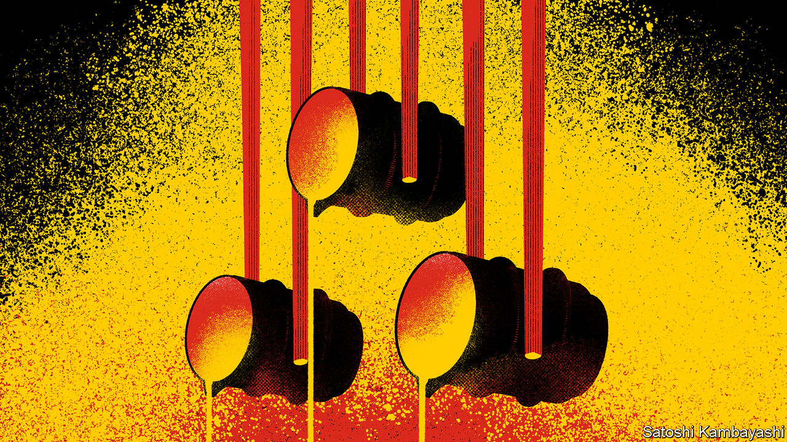

## Buttonwood

# The reasons behind the spectacular rally in metal prices

> Quite a lot of the story seems to be about China

> Jun 11th 2020

TOO SOON. That is the judgment a lot of investors apply to the recent across-the-board surge in asset prices. For it is not just the stockmarket that has rallied. The prices of industrial raw materials have also risen sharply in the past month or so. Iron ore has increased from $80 a tonne to over $100. Copper prices are also up 25%. This is remarkable. The global economy is only just reopening. It feels a bit early for a commodity boom.

It is tempting to see parables here. Perhaps the metals rally is a template for the post-virus economy, in which supply bottlenecks push prices up as activity gets going again. Perhaps it shows how mindlessly the ocean of liquidity created by the Federal Reserve and the European Central Bank has washed into financial markets of all kinds. For the “too-soon” school it is a sign that optimism is running ahead of reality. Perhaps it is. But quite a lot of the commodity story seems to be about China.

China’s role is both curious and obvious. It is curious because China’s economy is meant to have become more reliant on consumer spending and less on building booms financed by ever-larger dollops of debt. It is obvious because, notwithstanding this stated goal, China is still the world’s biggest buyer of industrial commodities. Almost all the seaborne trade in iron ore goes there. If metal prices are going up, it is a fair bet that something is happening in China.

And so it is. Steel mills are working flat out. In the first week of June, China’s steel blast furnaces were operating at 92% of capacity. That is a good deal above the 80-85% rates considered normal. Much of the steel manufactured in China is for buildings and for infrastructure, such as bridges, railways and subway lines. Sure enough, indicators of construction activity look strong. Sales of excavators are up by a fifth so far this year, compared to a year earlier. A pipeline of orders had already been building before the pandemic struck. In its aftermath, construction has been given an extra push by the government’s efforts to gin up the economy. China-watchers say lessons have been learned. There has been a greater focus than in the past on selecting worthwhile projects, says Sean Darby, a Hong Kong based analyst for Jefferies, an investment bank.

The supply response to this has been led by Australia, the world’s largest exporter of iron ore. It swiftly took steps to contain the virus at the outset. It has managed, at the same time, to keep its mines in the ore-rich Pilbara region open. Exports of ore have risen this year. This contrasts with Brazil, where the spread of the virus has crippled production. Such bottlenecks are one reason for higher prices. And there is a bigger picture. The mining industry suffered a brutal reckoning in 2014-16, after a decade-long boom fuelled, yes, by China. Investment was cut; mines were closed; debts were paid. The result is that the industry does not have the chronic over-capacity of many other cyclically sensitive ones—think European banks or global carmakers.

There is a speculative element to the rise in metal prices, too. Buying or selling copper futures is a popular way to express a view about the world economy. Indeed copper can be all about belief, says Max Layton of Citigroup, a bank. Many of the bets laid on it are by trading algorithms, which mechanically respond to financial signals that have worked well in the past. The dollar, which has fallen by 6% against a basket of currencies since March, is usually part of the semaphore. A weaker dollar allows for easier terms of finance in emerging markets. Anything that helps emerging-market economies is generally good for commodity prices. So the algorithms buy.

The complex of price changes becomes self-reinforcing. Higher ore prices bring higher-cost producers back to the market. But their profit margins are then squeezed as their home currency appreciates, because that raises the cost of labour in dollars, in which commodities are priced. To restore margins, prices must go up. Moreover, marginal costs rise when the prices of steel (used for mining parts) and oil (used for energy and chemicals) go up. These higher costs push up prices further, says Mr Layton.

A pattern in markets is that a lot happens by rote. China’s response to a weak economy is to build; investors’ response to the Fed’s easing is to buy stocks; the algorithms’ response to a weaker dollar is to buy commodities. Higher prices beget higher prices. The sceptics, the too-sooners, note that this also works in reverse. Quite so. But the momentum is now with the believers.

## URL

https://www.economist.com/finance-and-economics/2020/06/11/the-reasons-behind-the-spectacular-rally-in-metal-prices
