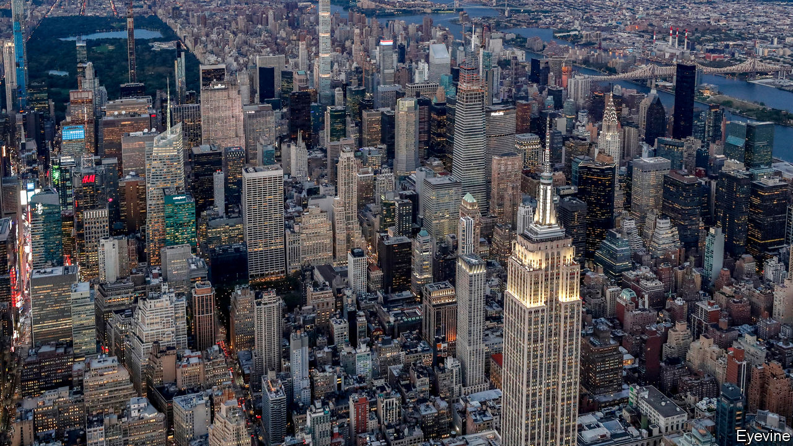

## Urban living

# Great cities after the pandemic

> How much harm has covid-19 done to large Western cities?

> Jun 11th 2020

UNTIL RECENTLY big cities were unstoppable. Year after year places like New York, London and Paris grew richer and busier. Since the turn of the century they have shrugged off a dotcom crash, a financial crisis, terrorist attacks and political populism caused partly by resentment at their prosperity and arrogance. Could their magical run possibly be coming to an end?

There are reasons to worry. Covid-19 struck the most exciting, global cities hardest—the ones you find on the side of bags full of designer clothes. With 3% of America’s population, New York has suffered 19% of deaths attributed to the disease (see [Briefing](https://www.economist.com//briefing/2020/06/11/covid-19-challenges-new-yorks-future)). One in four French deaths was in Paris and its region. Even as lockdowns lift, international travel restrictions and fear of infection will linger: London is only 15% as busy as normal.

Such quietness poses a grave threat to cities, especially the big, global ones. Much of the joy of suburban life derives from the houses and gardens that are more affordable there. The pleasure of village life is the peace and the countryside. But cities thrive on their busy streets, restaurants and theatres, which are now quiet or closed. That is a loss for urban consumers, and a calamity for the many people, often immigrants, who sell services.

The virus has attacked the core of what makes these cities vibrant and successful. They prosper not so much because of what they do for businesses, but because they cram together talented people who are fizzing with ideas. Americans in cities with more than 1m people are 50% more productive than those elsewhere.

But crowding people in offices and bars now seems irresponsible. And, in contrast to when Spanish flu struck a century ago, many workers have alternatives. People are learning to toil from home; some have discovered that they like it. Facebook, until recently a heroic office-builder, has announced that it will let many employees keep working remotely even after the virus is seen off. Commercial- and residential-property markets could slump as jobs move out of cities, even if only for part of the week. High-street shops and cafés are likely to go under as they adjust to the cut in office workers, tourists and students.

If they lose people, cities will run into a fiscal crunch, too. Their income from things like hotel taxes and bus fares has evaporated. New York’s independent budget office reports “absolute gloom and uncertainty” and frets that tax revenues may fall by $9bn in the next two fiscal years. The great danger is that cities enter a spiral of budget cuts, deteriorating services, rising crime and middle-class flight. It would be the 1970s all over again.

And yet cities are stronger and more resilient than they seem. As with so much else, the fate of cities hangs on the development of treatments and vaccines. But their magic cannot be woven from afar as easily as some suppose.

Cities remain invaluable as places where people can build networks and learn how to collaborate. The brain-workers now logging into Zoom meetings from commuter towns and country cottages can do their jobs because they formed relationships and imbibed cultures in corporate offices. Their heads are still in the city, though their feet are not. Even a socially distanced, half-full office is essential for teaching new hires how a company works. If offices facilitate chit-chat and gossip, they are functioning well. Answering emails can be done from home.

The hope is that, even if bankers and programmers stop coming into town, cities will adjust. Young people, who are at less risk from covid-19 and less worried about crime, could suddenly discover that life in the big smoke is affordable again.

To encourage that, cities need to run themselves for the post-covid era. They are already grappling with how to move millions of people when nobody wants to squeeze onto crowded buses and trains. Some have bold plans for expanded networks of bike paths, and have erected plastic barriers to encourage walkers to occupy the roads. This is encouraging. But cities that fear commuters will drop trains and buses for private cars, clogging the roads, would do even better to manage demand by pricing driving and parking more highly.

Cities also need more autonomy. New York’s hapless mayor, Bill de Blasio, has been a poor advertisement for muscular local government. But Seoul’s world-beating coronavirus response has been organised largely by the metropolitan government and by local officials. By contrast, the mayor of London, Sadiq Khan, had to lobby the national government to insist on face masks on public transport. It agreed two months too late.

National governments and states will need persuading that cities should have more power, especially as many will also be begging for money. They should step back anyway. Great cities are obnoxious, but they are normally big contributors to national budgets. And the trick they perform for their countries is not just economic. Cities are where people learn to live in a modern, open society. They are machines for creating citizens. ■