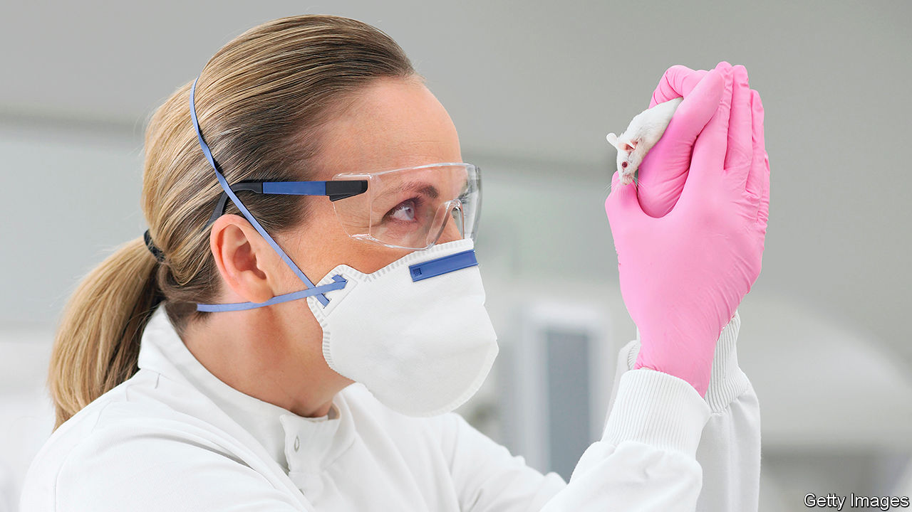

## Laboratory mice

# An animal model of covid-19 is now available

> Another is on its way

> Jun 11th 2020

MICE ARE, as it were, the guinea pigs of science. And these days they are often genetically engineered guinea pigs, to boot. The emergence of covid-19, for example, has created demand for laboratory animals that have human versions of a protein called the ACE2 receptor. This molecule is the hook that SARS-CoV-2, the virus which causes covid-19, uses to attach itself to a cell before entering and turning that cell into a virus factory. The murine version of ACE2 is, however, the wrong shape for the virus to link up with. That means unmodified mice cannot catch the infection. Hence the need for genetic engineering.

The first version of such a mouse has recently become available courtesy of the Jackson Laboratory, a not-for-profit biomedical research institution in Maine that specialises in breeding laboratory mice. By luck, the team that produced it had a head start. The original SARS virus (now known as SARS-CoV-1), which came close to causing a pandemic in 2003, also uses ACE2 as its point of entry. As a consequence Stanley Perlman and Paul McCray of the University of Iowa, who were researching SARS, created a mouse with human ACE2 receptors in 2007.

That project was eventually put on ice. But not before Dr Perlman had given some semen from his modified mice to the Jackson Lab. On hearing about the virus in early January researchers there, led by Cat Lutz, quickly thawed out this stored semen and started work. Five months later they have created enough of Dr Perlman’s mice to start making them widely available.

The Perlman mice are, however, not quite perfect for the job. Though their genome has had human ACE2 added, the mouse variety has not been subtracted. This means they make both versions of the protein. Also, the human version of the gene is in the wrong place in the cell nucleus. The ACE2 gene’s proper home is the X chromosome, one of the sex chromosomes. In Perlman mice it is elsewhere. That could change its activity.

Help may be on its way, though, from Wang Youchun at the National Institutes for Food and Drug Control in Beijing. As they describe in this week’s Cell Host & Microbe, Dr Wang and his colleagues have excised the murine version of the ACE2 gene completely from their own mice and substituted the human version in exactly the same place. They did this using CRISPR/Cas9 gene-editing technology, a technique unavailable to Dr Perlman back in 2007.

Dr Wang’s initial tests of the new mouse suggest it generates ACE2 receptor molecules in all of the parts of the body where researchers think the virus makes its initial attacks in human beings. They show, too, that SARS-CoV-2 replicates well in the animals’ lungs and tracheas, and also in their digestive systems—another part of the human body that seems susceptible to SARS-CoV-2 infection. In the case of the digestive systems, however, the dose of virus needed to establish a gut infection is ten times that needed to start a respiratory-tract infection. Dr Wang suspects that this might be important. If alimentary-canal infection requires an equivalently large initial dose of viruses in people, as well, then that might make it easier to stop it happening in human intestines, by the practice of good food hygiene.

One further result of Dr Wang’s investigation was the discovery that the virus also replicates in the brains of his mice. This suggests it may be making use of human nervous tissue for replication in a way that is not currently being detected, but is suspected by some researchers because one symptom of some people who have the illness is loss of the sense of smell.

Curiously, despite their propensity to infection by SARS-CoV-2, Dr Wang’s mice, unlike Dr Perlman’s, do not show obvious symptoms when infected. Given the apparently high rate of symptomless infection in human beings, that, too, may be a pertinent observation.■

Editor’s note: Some of our covid-19 coverage is free for readers of The Economist Today, our daily [newsletter](https://www.economist.com/https://my.economist.com/user#newsletter). For more stories and our pandemic tracker, see our [coronavirus hub](https://www.economist.com//news/2020/03/11/the-economists-coverage-of-the-coronavirus)

## URL

https://www.economist.com/science-and-technology/2020/06/11/an-animal-model-of-covid-19-is-now-available
