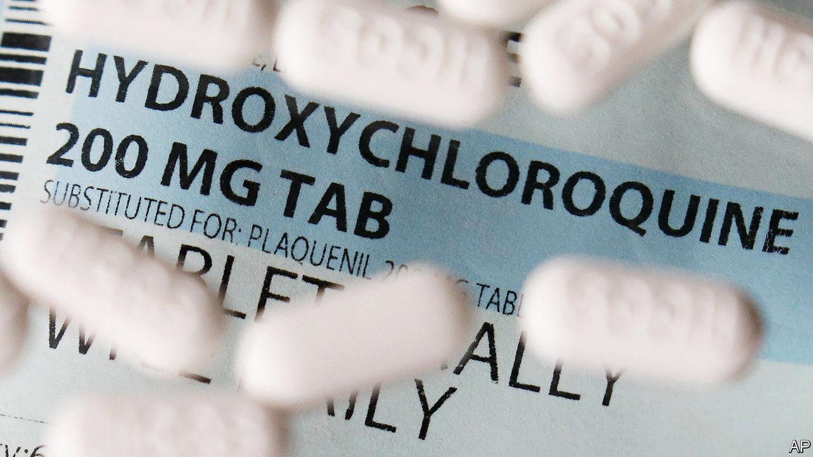

## The search for a covid-19 treatment

# Hydroxychloroquine is embroiled in yet more controversy

> And so is the idea of peer review

> Jun 13th 2020

ONCE PRAISED as a miracle cure for covid-19, an antimalarial drug called hydroxychloroquine has rarely been out of the headlines since the start of the pandemic. It was hoped it might find a new use as a therapy in patients who are unwell with the novel coronavirus. But in recent weeks a scientific picture has emerged of a treatment that does not appear to be helping patients at all, and might even be causing harm.

Whether it helps seems clear now: it doesn’t. When it comes to the harm, though, it turns out that the scientific literature may be misleading. On June 4th the Lancet, a respected medical journal, retracted a high-profile paper published only a month previously. This had suggested that hydroxychloroquine and its analogue, chloroquine, actually increased the death rate in hospitals when taken by those with covid-19. This led the World Health Organisation to halt its trials of the drug. It also caused considerable concern to patients and to those enrolled on other such trials.

Towards the end of May, however, scientists started to question the reliability of the data that had been used. The New England Journal of Medicine had retracted a separate paper looking at blood pressure medicines in covid-19 which relied on data from the same firm, Surgisphere, that provided the data set for the Lancet article.

Surgisphere, based in Chicago, had said in the Lancet paper that 671 hospitals on six continents had provided data. The data set had been said to include almost 100,000 detailed patient records. On June 2nd the Lancet said that an independent audit of the data was under way, and wrote that “serious scientific questions” had been brought to its attention. The editor of the New England Journal of Medicine expressed similar concern, and said the authors had been asked to provide evidence their data were reliable.

The Economist was unable to contact Surgisphere for comment. All content has been removed from its website. However the firm’s site had stated that its mission was to harness the power of data analytics to “improve the lives of as many people as possible”. The firm said it used machine learning, artificial intelligence and big data to empower hospitals to make better decisions. Science, a leading academic journal, approached the paper’s authors for comment on June 8th, but they did not respond.

Many are wondering, more broadly, what could go so badly wrong as to lead to two retractions of papers at well-known medical journals. There are calls for the Lancet to publish the comments they received on the article during the process of peer review.

One irony of the affair is that concerns about the rush to publish science during the pandemic had been focused on preprints. These are papers posted online without independent scrutiny. Yet it is two peer-reviewed journals of repute that have found themselves in difficulty. Whether this incident will shift the balance of power in scientific publishing remains to be seen.

Editor’s note: Some of our covid-19 coverage is free for readers of The Economist Today, our daily [newsletter](https://www.economist.com/https://my.economist.com/user#newsletter). For more stories and our pandemic tracker, see our [coronavirus hub](https://www.economist.com//news/2020/03/11/the-economists-coverage-of-the-coronavirus)