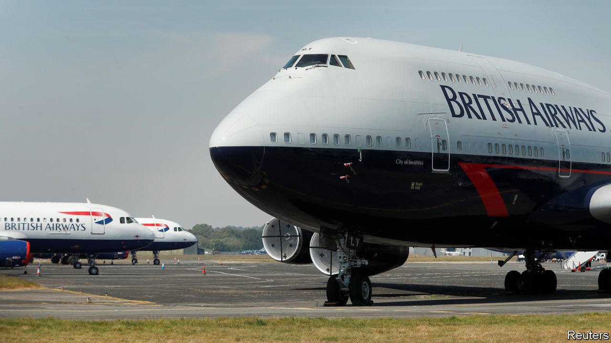
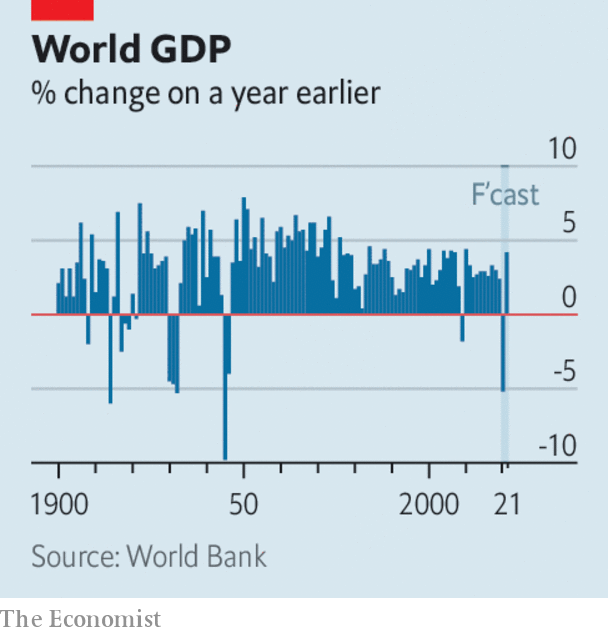

# Business this week

> Jun 11th 2020

British Airways and other big airlines in Britain threatened the government with legal action over the quarantine for arrivals that came into force on June 8th. All passengers flying to Britain, including British citizens, must now complete a form stating where they will self-isolate for two weeks, subject to spot-checks and fines if they break the rules. The airlines, and the hospitality industry, are livid, believing more travellers will stay away, causing irreparable damage to their struggling businesses. See [article](https://www.economist.com//britain/2020/06/11/britains-new-quarantine-rules-are-a-head-scratcher).

Cathay Pacific received a HK$39bn ($5bn) bail-out led by the government of Hong Kong, which will end up with a 6.1% stake in the airline. Swire Pacific remains the controlling shareholder but its holding has been reduced, as have the stakes of the other big investors, Air China and Qatar Airways. Cathay was in trouble before the outbreak of covid-19. Last year its chief executive was pushed out amid pressure on the airline from China over staff who had participated in pro-democracy protests.

Hot on the heels of an aid package for the car industry, the French government announced a €15bn ($17bn) rescue deal for companies working in aviation (including €7bn already earmarked for Air France). Bruno Le Maire, the finance minister, said that without the aid a third of jobs could be lost permanently in the industry. Airbus, for example, has slashed production.

Christine Lagarde defended the measures taken by the European Central Bank in response to the euro zone’s downturn, describing them as “temporary, targeted and proportionate”. The ECB’s president made her comments a few days after the bank expanded its bond-buying programme by €600bn ($683bn), taking the total amount to €1.35trn, and extended the scheme until at least June 2021. At its latest meeting the Federal Reserve said it did not envisage raising interest rates, which are near zero, before the end of 2022.

In a sobering assessment of the world economy, the World Bank said it expects global GDP to contract by 5.2% this year, bringing about the fourth- deepest recession since 1900 and the most severe since the end of the second world war. Rich-country economies are projected to shrink by 7% on average, and emerging markets by 2.5%, the first contraction for developing countries as a group in at least 60 years. Income per head will fall by 3.6%, pushing millions of people into extreme poverty. See [article](https://www.economist.com//leaders/2020/06/11/most-investors-and-some-firms-are-upbeat-about-the-world-economy).

OPEC and Russia agreed to extend their deal on curbs to oil production until the end of July. With oil prices stabilising, Saudi Arabia will end its additional cut of 1m barrels a day this month. Brent crude was trading above $40 a barrel, double its price in mid-April. See [article](https://www.economist.com//finance-and-economics/2020/06/13/investment-in-oil-supply-has-collapsed-it-may-not-roar-back).

Stockmarkets continued on their upward streak for the most part. On June 8th the S&P 500 closed at 3,232, above its close on December 31st though still below mid-February’s record peak. The Nasdaq index hit the highest mark in its history.

Investors were buoyed in part by an unexpected drop in America’s unemployment rate in May to 13.3%, from April’s 14.7%. Some 2.5m people were added to the payrolls as lockdowns started to ease. See [article](https://www.economist.com//node/21787958).

Volkswagen shook up senior management following mishaps in the manufacture of some of its models, replacing Herbert Diess as head of the VW passenger-cars brand with Ralf Brandstätter. Mr Diess remains chief executive of the VW group, but only after apologising to the supervisory board for claiming it had been the source of leaks about the glitches in production.

In a second attempt to end its Anglo-Dutch dual structure, Unilever announced plans to make London its sole legal domicile. Two years ago its attempt to make Rotterdam its legal base caused a revolt among investors. Addressing what was a bone of contention in 2018, the conglomerate expects still to be included in share indices in both London and Amsterdam.

With the issue of race now firmly on the company agenda, Amazon said it would stop providing its facial-recognition technology to police forces for a year while it considers the issues. IBM is pulling out of the facial-recognition business altogether.

Slack’s share price struggled to recover from the drubbing it received after the company’s quarterly earnings disappointed investors. Revenue was up by 50% year on year, but that was only a slight improvement in growth on the previous quarter, before offices turned en masse to remote working.

Just Eat Takeaway, a food-delivery service in Europe, sealed an agreement to buy Grubhub, one of America’s biggest operators in the market, for $7.3bn. Uber had reportedly approached Grubhub last month about a merger with Uber Eats, but had found there was little appetite for a deal.