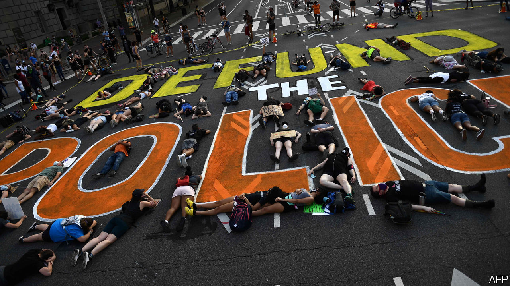

## The shifting ground

# In America protests have already brought policy changes

> Congress, cities and states have all suggested changes since George Floyd’s killing

> Jun 11th 2020WASHINGTON, DC

FOR YEARS, reformers have advocated a host of policies to make police more accountable to the people they serve, to little avail. But over the past two weeks, police have made better cases for reform than advocates ever could by brutalising journalists and peaceful protesters in broad daylight. Across America the political ground has shifted, as legislators long reluctant to take on the police have started to act.

On June 8th House Democrats unveiled a sweeping reform bill, which would, among other things, make prosecuting and suing police easier, create a national registry of police-misconduct complaints, mandate more extensive data collection, ban chokeholds for federal officers and no-knock warrants in federal drug cases (and require state and local agencies which want federal grant money to do the same) and limit the transfer of military equipment to police. Democrats plan to bring the bill up for a vote by the end of June.

Congressional Republicans, meanwhile, say they are working on their own reform proposal. Tim Scott, the Senate’s lone black Republican and a longtime advocate for police reform, proposed requiring states to report data on no-knock warrants and deadly use of force and increasing funding for body cameras and for hiring “officer candidates who have racial and ethnic characteristics similar to their community”.

While legislators in Washington talk, some in cities and states have acted (as they should: most of America’s 18,000 law-enforcement agencies are locally governed). Many police departments have banned or restricted chokeholds and “carotid restraints”—the neck-compression technique that killed George Floyd—though without clear consequences the bans risk being hortatory and ultimately ignored.

The New York Police Department has banned chokeholds since 1993, and that did not stop officer Daniel Pantaleo from choking Eric Garner to death in 2014. So on June 8th New York’s legislature created the crime of “aggravated strangulation”, punishable by up to 15 years in prison, for officers whose chokehold “or similar restraint” kills or seriously injures someone.

New York is also poised to pass bills creating an investigative office to look into deaths caused by police officers, requiring courts to publish racial and demographic data on low-level offenders, requiring state-police to wear cameras and repealing a statute that shielded officers’ disciplinary records from the public. Washington, DC’s city council has passed measures that forbid the police department from hiring officers with a history of misconduct and require it to disclose the names of any officers who use force.

More radical measures, such as defunding—which in practice can mean something less alarming, like rethinking how police departments function and redirecting some of their budgets—are also getting a hearing. Minneapolis’s city council vowed to disband the city’s police department, though how, when and what might replace it remain unclear. And the mayors of Los Angeles and New York said they would take money from police budgets for social-service programmes.

Along with this flurry of activity have come two important cultural shifts. First, the shares of Americans who support Black Lives Matter and believe that police treat whites better than African-Americans have soared. Second, prosecutors have shed some of their traditional reluctance to go after the police, and have charged officers in several cities who were caught on camera assaulting unarmed people. Perhaps this shift is temporary. Or perhaps a lot of Americans have seen officers act as if they are above the law, and they do not like it.■

## URL

https://www.economist.com/united-states/2020/06/11/in-america-protests-have-already-brought-policy-changes
