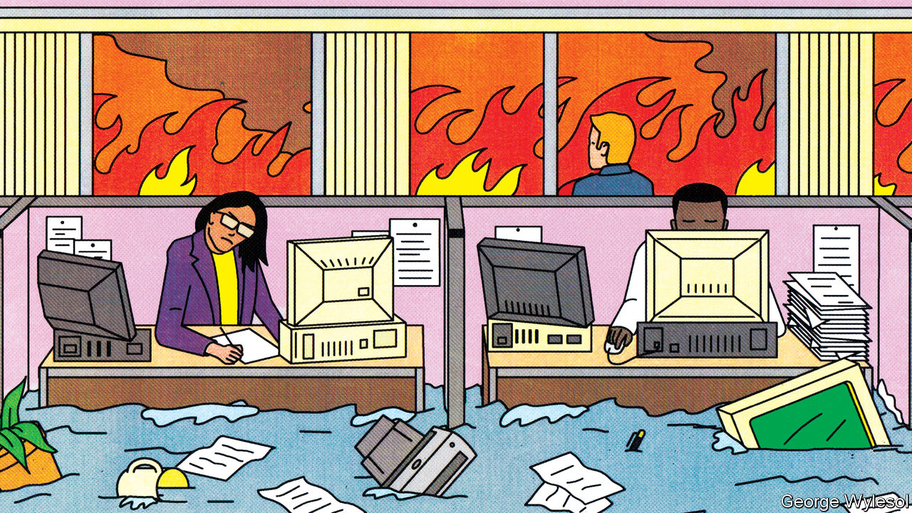
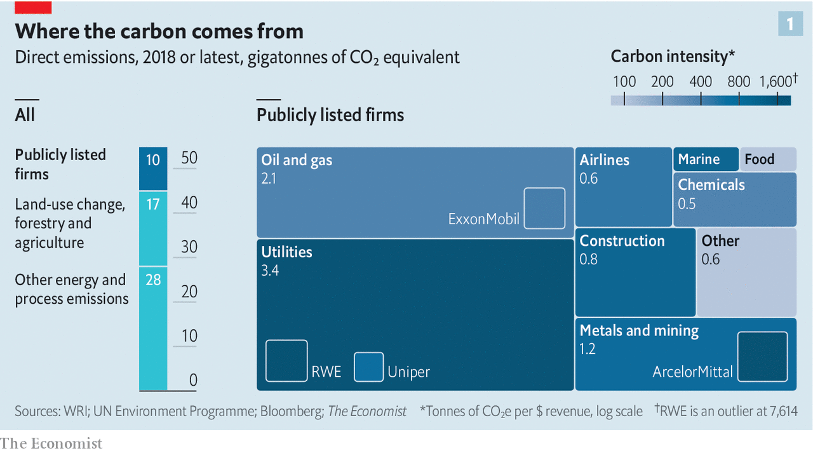
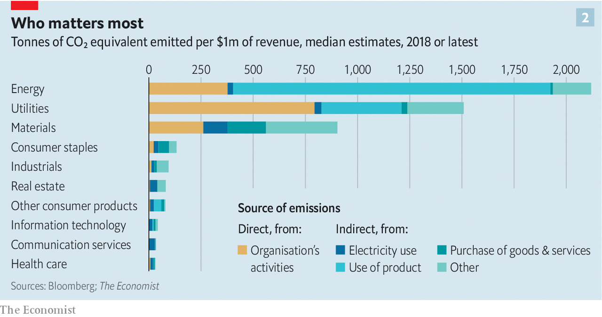
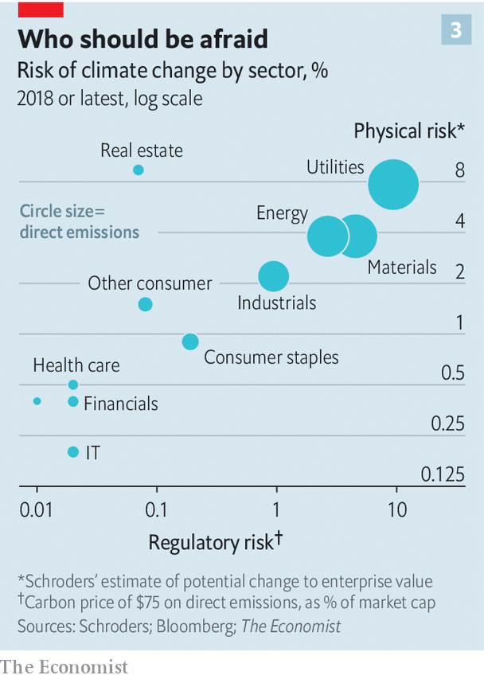

## Hotting up

# How much can financiers do about climate change?

> The role that green investing can play must not be misunderstood or overstated

> Jun 20th 2020

IN THE MAYFAIR office of Chris Hohn, the boss of TCI, a hedge fund, an enormous photograph of a melting iceberg hangs on one wall. Robert Gibbins, the founder of Autonomy Capital, another London hedge fund, says his desk is adorned with the deformed remains of a car bumper, melted by an Australian wildfire. An interest in modish office decor is a long-standing feature of high finance. An interest in climate change, though, was until recently rare; the preserve of boutique investment houses and pokey back offices in the large asset managers. Now it is all the rage.

One reason for this is the realisation that extreme weather events pose threats to businesses seeking investment. Last year PG&E, a Californian utility, was forced into bankruptcy for its role in sparking wildfires. Another reason is that governments are taking steps to limit the emission of greenhouse gases that could have real impacts on firms’ future revenues. A third is pressure from clients. Large asset owners, including Japan’s Government Pension Investment Fund, the world’s biggest, are badgering the companies which manage their money to attend more to the environmental, social and governance (ESG) bona fides of the companies they put money into. A fourth factor is that asset managers are facing shrinking margins. By offering their clients various sorts of greenery they can also charge higher fees.

The greening trend could be a force for good in the fight to reduce climate change. But the role that financial services can play must not be misunderstood or overstated. The sector is responding to changes in government and broader circles of opinion, not driving change itself. And there is a limit as to how much it can do. Calculations by The Economist suggest that the amount of direct control over carbon emissions exerted by companies in which investors hold sway is lower than is often thought. Less than a quarter of industrial emissions come from companies that can be influenced by investors in stockmarkets. And when one gets away from the key sectors of energy and natural resources, the amount that can be done by green investment may not be very much at all.

In 2019 the greenhouse emissions from human activity—mostly carbon dioxide, but with contributions from methane, nitrous oxide and other gases too—had the warming effect you would get from 55bn tonnes of carbon dioxide. The carbon dioxide from fossil-fuel emissions and industrial processes accounted for 37bn tonnes.

In order to see how much of this might be amenable to investor-led action The Economist analysed emissions disclosures from over 5,000 publicly listed companies which between them account for about 90% of the value of the world’s stockmarkets. The number of companies making such disclosures has been rising steadily in America (from 53% of the companies in the S&P 500 five years ago to 67% today); over the same time it has shot up in Europe and Japan, from 40% to 79% of companies in the Euro Stoxx 600 and from 13% to 46% on the Nikkei 225.

Those disclosures differentiate between the emissions that companies make directly (which the Greenhouse Gas Protocol, widely used for such reporting, calls “scope-one” emissions) and “scope-two” emissions which are produced by the companies which provide them with energy, mostly in the form of electricity. The scope-two number is vital to assessing the emissions caused by a company’s activities, but in order to look at the total emissions we considered only scope one, since adding in scope two leads to double-counting.

As you would expect, the largest emissions come from companies which burn fossil fuels in the normal course of their business: those that run fossil-fuel power stations, or fleets of aircraft or steelworks. In Europe ArcelorMittal is the biggest emitter because steelmaking requires the burning of coal. In America the biggest operational emitter is ExxonMobil, which unlike many large companies produces much of the electricity and heat that it uses itself.

Using the emissions disclosed by these companies, we estimated emissions for non-disclosing firms on the basis of those disclosed by similar firms in the same sector with comparable revenues. Given that a firm’s decision whether to disclose and its emissions intensity may not be independent, this step could introduce error.

Totting everything up reveals that each year publicly traded companies emit greenhouse gases equivalent to 10bn tonnes of carbon dioxide from their operations (see chart 1). Perhaps a quarter of those are produced by listed firms that are majority owned by governments. That leaves eight gigatonnes of emissions that stock markets can influence directly. That is 14% of the world’s total emissions, or 19% of the emissions related to energy use and industrial processes. (Those estimates undercount oil emissions. If you add the emissions from the oil sold by institutionally controlled energy firms, part of what is called “scope three” emissions, then it increases to 23% and 32%, respectively.)

Where are the rest of the emissions coming from? In large part from consumers of those companies’ wares. An oil company’s scope-one emissions include all the carbon dioxide and methane it gives off in its operations, but not the carbon dioxide given off when its wares are burned in engines and boilers. Attempts to take this into account are found in the scope-three disclosures, which cover the entire value chain of a business from the extraction of its raw materials through its suppliers and on to its end users.

Only two-fifths of the firms in the S&P 500 and half of those in the Euro Stoxx 600 disclose a figure for their scope-three emissions. The figures are, unavoidably, larger than for scope one. They are biggest for the extractive industries. Of the companies in our dataset that disclosed their scope-three emissions, Royal Dutch Shell topped the list, followed by BHP, a mining firm.

Large scope-three emissions point to business models that depend on either suppliers or customers emitting greenhouse gases in bulk. This makes them hard to change. A company can reduce its scope-one emissions by changing its internal processes, and its scope-two emissions by changing its electricity supplier—for example, choosing one that uses a lot of renewable energy sources or nuclear power plants. To change its scope-three emissions, though, it needs to change either the practices of its suppliers or, harder still, what it sells.

The first may be feasible through investment. The Swedish furniture retailer IKEA has a €200m ($224m) fund to help its suppliers transition to using renewable energy, among other things. Changing what happens downstream, though, may be harder. As long as BHP goes on selling iron ore to steelmakers who use coal to smelt it, BHP will have high scope-three emissions; as long as Royal Dutch Shell sells oil and gas it will, too.

Scope-three emissions are highly concentrated within a small number of firms. When The Economist looked at scope-three emissions with the same methodology we used for scope-one emissions, 220 of our 5,000-odd companies, with a value of about $14trn, accounted for 84% of the total carbon footprint. This fits with a separate analysis by the Carbon Disclosure Project (CDP), a group which tracks firms’ climate disclosures. In 2015 the CDP looked at 224 fossil fuel firms and totted up scope-one emissions and a subset of scope-three emissions: emissions that come from the use of a firm’s products. The CDP found that between them the companies and their wares produced the equivalent of 31bn tonnes of carbon dioxide.

In our analysis 76% of the heavy emitters are majority investor-owned. And this ownership is also highly concentrated. When the stakes that they hold in a company are weighted according to that company’s emissions, the biggest 250 financial firms control about 86% of the emissions from the investor-controlled companies with the highest scope-three emissions. The financial firms with the largest holdings by this measure are the biggest asset managers, such as BlackRock (10% of the emissions from the investor-owned, heavy-emitters subgroup), Vanguard (6%) and State Street Capital (3%).

Some of these investors, including BlackRock, are part of Climate Action 100+, a group of institutional investors with over $40trn in assets. They ask firms to set emissions-reduction targets, disclose carbon-footprint data and generally clean up their act. Of the 161 firms targeted by CA100+, 70% have set scope-one emissions targets. But only 9% have set goals that a research group called Transition Pathway Initiative sees as compatible with the target of keeping global warming since the Industrial Revolution below 2°C. A similarly small proportion has made the promise no longer to lobby against green regulation that CA100+ asks for.

Rather than trying to change the actions of the companies at the heart of the climate crisis, most green investment seeks to reward and encourage companies in all sectors which either emit less than they might or help others so to do. JPMorgan, a bank, estimates that at least $3trn of institutional assets are now managed in a way that tracks ESG factors. Though that is a lot, it is only 4% of total assets under management.

Hortense Bioy of Morningstar, a research firm, says that in Europe there are about 400 green funds managing €132bn in assets. Some simply exclude fossil-fuel companies. Others seek out “climate-solution firms” developing technologies that reduce energy demand. One popular green-fund category is “low-carbon”. Low-carbon fund managers offer the chance to invest in the companies with the highest revenues per tonne of carbon dioxide emitted, either in a given sector or on a given index. They face the problem, though, that current carbon accounting does not make such comparisons easier. Apple has only a tiny fraction of Samsung’s operational emissions; but Samsung makes things, while Apple has others do that for it.

Nevertheless, carbon intensity may be a useful measure (see chart 2). The Economist looked at data from firms that disclose their operational emissions in the S&P 500 and Euro Stoxx 600. Calculating carbon intensity on a variety of measures shows that greener firms trade at a premium. Whether that means better returns in the long run, though, remains inconclusive.

Perhaps the most obvious avenue for green investing is in firms whose technologies replace those that emit greenhouse gases on a grand scale. Renewable energy is one obvious possibility, but one which does not at the moment offer a wide range of choices to investors. Only three firms in the S&P 500 produce renewable energy, making up less than 1% of the index’s market capitalisation. Even among private-equity and venture-capital firms only $11bn were invested in renewables in 2019, according to BloombergNEF, a consultancy.

A study by Mariana Mazzucato of University College London and Gregor Semieniuk of University of Massachusetts Amherst looked at renewable-energy investments from 2004 to 2014. Institutional investors provided 7% of the funding and commercial banks provided 12%.

Another way to reduce emissions by rejigging finance is to make it harder for companies to get money if either climate change or action to avert it poses a particular problem to them. This is the idea behind the “stress tests” that central banks in England, France, the Netherlands and Singapore are forcing on banks and insurers: by modelling a 4°C world, or a $100/tonne carbon price, they seek to discover how badly the banks’ lending to their current portfolio of clients endangers them.

So far, these tests are not producing results as worrying as some might have expected. The central bank of the Netherlands found only 3% of banks’ loan books were at risk. This may be because much of the data needed for rigorous testing do not exist. Daniel Klier of HSBC, a bank, says only 12% of the companies in the bank’s loan portfolio reveal climate data. Insurance firms tend to have a better grasp on which assets are at what physical risks. But neither industry has the complete picture. For now stress tests are a work in progress.

It is also possible that the risks are not, in fact, that catastrophic. There are clearly businesses which will not survive serious action on climate change. For the world to limit warming to 2°C nine-tenths of today’s coal reserves will have to stay in the ground, according to JPMorgan. But this hardly means that, in Mr Hohn’s words, “Coal is the new subprime.” Western banks tend to have little exposure to the energy sector. The biggest ten have between 8-14% of the total credit exposure of all listed energy firms. Their share of exposure to coal will be even smaller.

Chinese banks probably have a much bigger share, though disclosure is patchy at best. One analysis by UBS, a bank, found that between January 2014 and September 2017, 60% of the financing for the world’s biggest 120 coal-plant developers came from Chinese banks. The next-biggest lenders were Japanese banks (8%) and Indian ones (7%).

The fact that banks will stay standing if coal companies topple does not mean that efforts to reduce emissions will have no effect on the financial sector. At present only 20% of world emissions are covered by a carbon price. If prices were to increase in both their level and the share of emissions that they cover, banks and investors would need to take notice. Particularly as the pain will be spread unevenly across sectors (see chart 3).

The IMF thinks that a $75 per tonne price on all emissions might keep warming below 2°C. If you applied such a price to companies’ scope-one emissions, pre-tax profit in the S&P500 would fall by 8%, and in the Euro Stoxx 600 firms by 12%. That overstates the damage; the whole idea of carbon prices is that they make sensible reductions in emissions that were not cost effective before. But it gives a sense of the extent of change that companies and those who invest in them would face.

Axel Weber, chairman of UBS, sees that change in truly cosmic terms: “We need to build a new universe, not add some galaxies to the existing one.” He envisions a whole new financial system centred on a carbon price and tradable emission permits. Secondary markets in carbon futures and derivatives would allow investors to plan and invest for the long term.

Such calculations hint at a powerful future for finance, not as a driver of climate action, but as its enabler, making it more flexible and better able to tap insights and capital from investors around the world. If that also helps the financial firms doing the legwork, that will be all to the good. And if it shows up some of today’s green financing attempts as window dressing and marketing wheezes, that will be good, too. ■

Sign up to our fortnightly climate-change newsletter [here](https://www.economist.com//theclimateissue/)

## URL

https://www.economist.com/briefing/2020/06/20/how-much-can-financiers-do-about-climate-change
