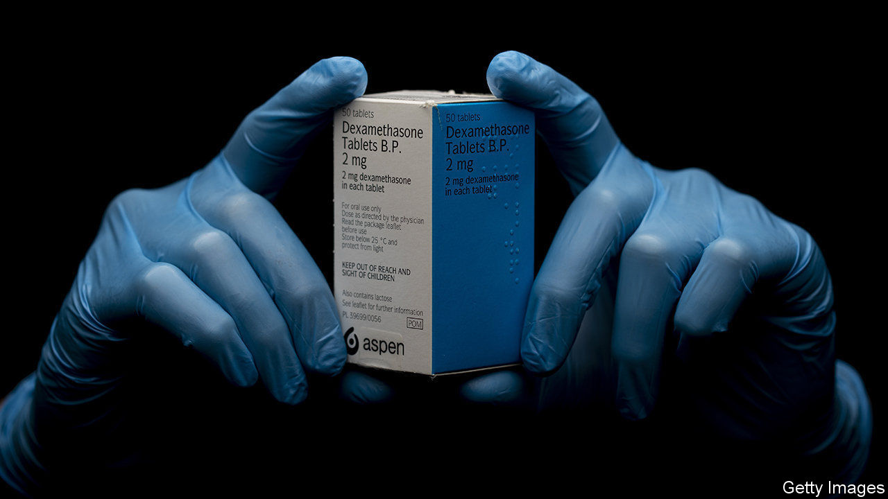

## Drug discovery

# Dexamethasone cuts covid-19 deaths

> A cheap drug can make a big difference

> Jun 18th 2020

THE GOVERNMENT’S public-health performance may not look good, but Britain’s scientists are still top-notch when it comes to inventing and discovering drugs. On June 16th researchers at the University of Oxford announced that they had identified the first drug proven to reduce mortality from covid-19. Dexamethasone, a cheap steroid, reduces deaths by a third among the most severely ill patients. It is set to become the standard of care for the National Health Service (NHS) across Britain. Doctors around the world will, undoubtedly, follow suit.

The results came from RECOVERY (Randomised Evaluation of COVid-19 thERapY), the world’s biggest clinical trial for covid-19 drugs. The trial, run by Oxford and the NHS, is testing a range of drugs on covid-19 patients in 176 hospitals across Britain. Dexamethasone is an anti-inflammatory that is already used to treat a variety of health problems, such as rheumatoid arthritis, eczema, asthma and some cancers. It was included in the covid-19 trial because steroids were tried as a treatment for SARS (severe acute respiratory syndrome), a related lung disease, with mixed results.

As part of the British trial 2,104 patients were randomly assigned to receive dexamethasone and compared with 4,321 patients who received the usual standard of care alone (which includes treatment for dehydration and pre-existing health problems, plus oxygen or a ventilator if needed). Among those who received only the usual care, 41% of patients ill enough to need ventilators died within 28 days; so did 25% of those on only supplemental oxygen and 13% of those who did not need help to breathe. For patients treated with dexamethasone, the 28-day death rate was 28% for those on ventilators and 20% for those on oxygen. There was no benefit from the drug for the rest.

This is big. If doctors in Britain had known from the start what they know now about the effectiveness of dexamethasone, they could have saved as many as 5,000 lives since the country’s covid-19 epidemic began. That is roughly 10% of the number of people who have died from the illness in Britain. It is a generic drug that hospital pharmacies usually have on their shelves. A course of treatment costs the NHS about £5 ($6.30). In poor countries it would cost about $1.

Clinical trials of various drugs are going on in many other countries. But Britain has been particularly committed to doing large, rigorous trials while battling a big covid-19 wave. Such trials are easier to do in the NHS than in more fragmented health-care systems, especially when results are needed urgently. As the pandemic gathers speed around the world, dexamethasone can make it a little less deadly.■

Editor’s note: Some of our covid-19 coverage is free for readers of The Economist Today, our daily [newsletter](https://www.economist.com/https://my.economist.com/user#newsletter). For more stories and our pandemic tracker, see our [coronavirus hub](https://www.economist.com//news/2020/03/11/the-economists-coverage-of-the-coronavirus)

## URL

https://www.economist.com/britain/2020/06/18/dexamethasone-cuts-covid-19-deaths
