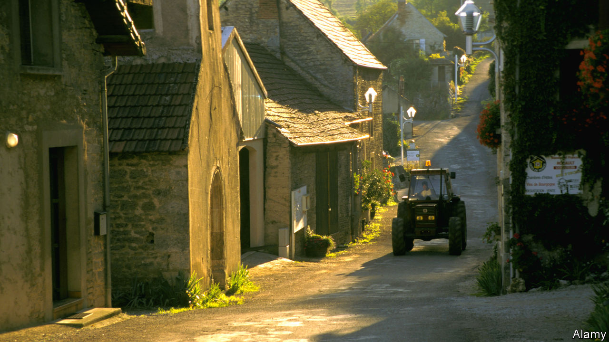

## Townies v tractors

# French urbanites fuss about rustic noises and smells

> Some second-home owners have sued over loud livestock and church bells

> Jun 18th 2020VAISON-LA-ROMAINE

FRANCE’S SENSE of itself has long been rooted in the land, even though three-quarters of French people live in towns. Now, however, having locked down in small airless spaces, many city-dwellers feel the call of the wild. Estate agents report an uptick in searches for homes with gardens. Diehard urbanites talk wistfully of a bucolic existence in la France profonde. In a poll, 61% of the French think confinement will encourage people to move to the country or buy a second home. But do today’s townsfolk know what rural life really entails?

The question arose late last year, when Pierre Morel-À-L’Huissier, a deputy from the Lozère, a remote rural area, introduced a bill to protect France’s “sensory heritage”. By this, he meant “the crowing of the cockerel, the noise of cicadas, the odour of manure”, and other rural sounds and smells. Some of his fellow citizens, it turned out, had judged these intrusions into their romanticised idyll a form of intolerable pollution.

Last year second-home owners on the Ile d’Oléron, off the west coast, brought a case against a cockerel for crowing too early. The court ruled against them, rescuing Maurice, the unfortunate bird, from banishment or worse. In Soustons, in the south-west, a case was brought against the owner of 50 ducks and geese which made a din. Near the Pyrenees, a new resident in Foix filed a complaint against the village because the church bells were too noisy.

Rural people are pushing back against this nonsense. The mayor of Saint-André-de-Valborgne, in southern France, has put up a sign outside his village warning visitors that they are entering a risk zone. Church bells ring often. Tractors make a racket. All because “farmers are working to give you what you eat.” These noises are “not a nuisance but intrinsic and authentic characteristics” of rural life, said Mr Morel-À-L’Huissier. And on its first reading, the National Assembly unanimously backed his bill.