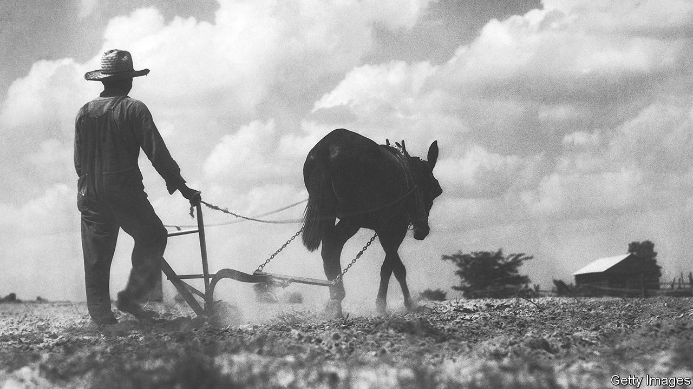

## Forty acres and a mule

# The economics of reparations

> The difficulties of working out how to compensate the descendants of slaves

> Jun 18th 2020

IN A SURVEY last year 29% of Americans supported the idea that the government should make cash payments to black Americans who were descendants of slaves—twice the share that agreed in the early 2000s. As protests have rocked America in recent weeks, the idea of reparations to atone for the atrocity of slavery, as well as to reduce the persistent gaps in income and wealth between people of different skin colours, has gained further prominence. Joe Biden, the presumptive Democratic nominee for president, has said he wants to explore it. On June 11th California’s state lawmakers passed a bill that establishes a task-force to study and propose recommendations for reparations. The chances of the federal government implementing such a policy seem remote. But how would such a scheme work?

As “From Here to Equality”, a new book written by William Darity, a scholar on reparations at Duke University, and A. Kirsten Mullen, shows, the practicalities tend to take a back seat to philosophical arguments over whether reparations are needed in the first place. Genealogists would face the tricky task of determining who would be eligible for them. Economists, meanwhile, would have to consider two questions: how much to pay, and how best to spend the money?

History offers a guide to the first question. Past claims for reparations have relied on the notion that people were wrongly deprived of income or property, or were unfairly forced to incur costs. For instance, Israel calculated its claims for reparations from Germany after the second world war in part by estimating the expenditure it incurred in order to resettle Jewish victims of Nazi persecution. An official report into America’s forced relocation and incarceration of Japanese-Americans during the war reached the conclusion that they had been unfairly deprived of income and property worth $3bn (in today’s prices). In 1988 the American government issued a formal apology and eventually compensated 80,000 victims.

Many scholars have tried to work out what would count as sufficient compensation for the descendants of slaves, but there is little agreement between them. One approach is to focus on compensation promised by the Union Army to freed slaves in 1865—the value of 40 acres of land and a mule—which was never realised. The amount of cropland required to meet that commitment today has a value of about $160bn (0.7% of American GDP in 2019).

Other approaches lead to much bigger sums. One calculates the difference between what slaves were given by way of maintenance, and what free workers were paid. An estimate puts that at roughly $4trn in today’s money (19% of GDP), once you account for the financial returns that could have been made if the money had been paid on time. But some argue that slaves held down the wages of free workers, meaning that the true value of slaves’ lost wages is higher. Mr Darity and Ms Mullen say that the difference in mean net wealth between white and black households ($795,000 in 2016) is the “most robust indicator of the cumulative economic effects of white supremacy”. That points to reparations of nearly $8trn, or 37% of GDP. (The authors suggest that this should be partly financed by printing money, something that will make most wonks queasy.)

Another area of disagreement concerns the form that reparations should take. Mr Darity and Ms Mullen argue that for “both symbolic and substantive reasons, an effective programme of restitution must include direct payments”. But cash transfers may do less to reduce inequality than their supporters hope. Research on inheritances, for instance, suggests that most heirs consume their windfall within a few years (purchases of cars are especially popular). A sizeable part of the income gap between black and white Americans reflects differences in education levels; big one-off payments alone cannot alter that. And research by Mr Darity and Dania Francis of the University of Massachusetts Boston finds that reparation payments could increase non-black incomes relative to black ones, if the spending thus facilitated flowed largely to non-black-owned firms. “Our paper points to the need to improve the infrastructure of black-owned businesses and banking so that dollars from reparations can flow into black communities,” says Ms Francis.

To this end, some economists argue that reparations should fund training and education programmes, or subsidise business lending. Others point to “baby bonds”, which would be targeted at poor children and help them pay for university or to start up a business. Naomi Zewde of the City University of New York finds that baby bonds could substantially reduce racial wealth gaps among young people.

Reparation payments could be spent in other ways. Money paid out to Japanese ex-internees has been used to fund academic chairs and historical archives. Reparations from Germany pay for food and medicine for Holocaust survivors. But before America can widen support for reparations, it will have to debate what works. ■

## URL

https://www.economist.com/finance-and-economics/2020/06/18/the-economics-of-reparations
