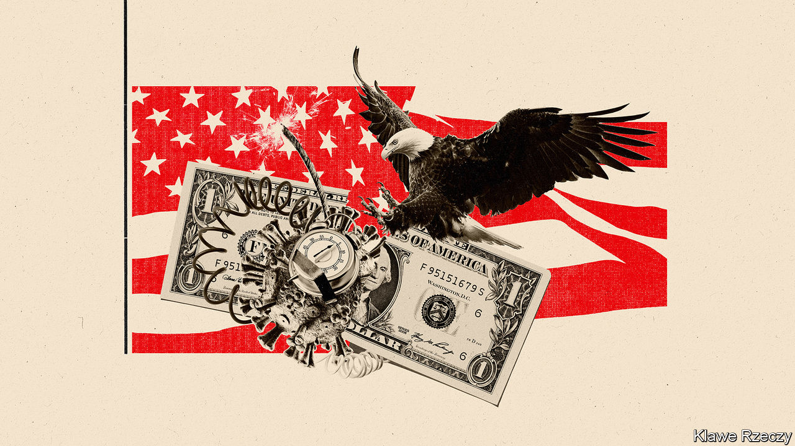
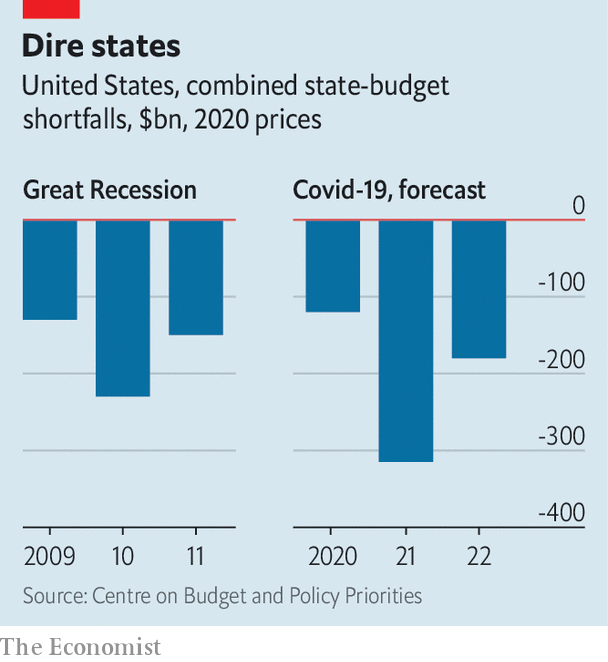

## The pandemic and state finances

# The state-budget train crash

> Why this could cost lives and set back economic recovery

> Jun 18th 2020

THE START of the fiscal year—July 1st in most states—is usually about as exciting as a 501(a) tax filing and as unpredictable as a Saudi weather forecast (sunny again!). Not this time. State tax revenues collapsed in April, falling on average by half, according to the Urban Institute, a think-tank. Demands on spending soared because the states are responsible for much of America’s spending on public health, unemployment and policing. By some calculations, state-budget deficits will reach a quarter of revenues in the coming fiscal year—or would do, if most states had not bound themselves by law to run balanced budgets. So instead of vast deficits, the states will have to make savage cuts to public services in the midst of a recession and pandemic. Through no fault of their own, their budgets are out of control and are about to hit the buffers.

Two-thirds of state revenues come from income taxes or sales taxes. Sales taxes have been devastated by the closure of shops and restaurants and income taxes by the rise in unemployment. The jobless rate was 13.3% in May, according to the Bureau of Labour Statistics, up from 3.5% in February. Each percentage-point rise in the unemployment rate cuts state tax revenues by over $40bn, or 4.5%.

Revenues have fallen so fast that some states do not even know by how much. Of those that have reported estimates, Louisiana saw tax revenues drop by 43% in April compared with April 2019 (“surreal”, the state treasurer called that). New York’s were down by two-thirds and California’s income-tax receipts plunged 85%. Revenues in April were doubly depressed because the federal government, with states following suit, moved tax-filing day from April to July, causing uncertainty about when income tax will be paid. Revenues may recover somewhat. But Ronald Alt of the Federation of Tax Administrators, which advises state governments, reckons that, collectively, state tax revenues will fall by $150bn between the start of April and the end of June. He expects income taxes to fall by half and sales taxes to fall by 44%. This decline is larger in nominal terms than during the Great Recession, when state tax revenues fell by $100bn from peak to trough in three years.

State and local governments spend slightly less than the federal government, about 17% of GDP, compared with a federal share of 20%. But they are disproportionately important to the coronavirus response because unemployment insurance, public health and Medicaid (which provides health insurance for the poor) are largely organised by states. Connecticut usually gets 3,000-3,500 new unemployment claims a week. In April it got 30,000 in a week. In New Jersey, enrolment in Medicaid was nine times higher in April than it had been a year earlier.

For the past nine years, states have cautiously increased spending. At the start of 2020, before the pandemic hit, states were expecting increases in both revenues and spending of about 2%. Instead, the virus has driven a wedge between the two.

Lucy Dadayan of the Urban Institute estimates that the gap will be around $75bn in fiscal 2020 and $125bn in fiscal 2021. The Centre on Budget and Policy Priorities (CBPP), another think-tank, reckons it will be even higher: $120bn in the current fiscal year, $315bn in fiscal 2021 and $180bn in 2022, a grand total of $615bn, which is six months of current spending. (These forecasts show the difference between what was expected before the pandemic and what is expected now.)

The range in estimates reflects the difficulty of forecasting the impact of the pandemic and expectations of spending cuts. The exact amounts, however, matter less than the fact that, first, the figures are large and, second, that most states cannot run deficits anyway, so the numbers indicate the extent of future spending cuts, rather than deficit-financing needs.

These cuts will be mitigated by states’ financial reserves and by federal help. The rule that states must balance budgets has made them fiscally conservative. Most used the 2010s to build up reserves. According to the Pew Charitable Trusts, a nonpartisan think-tank, these reached $75bn in 2019, the highest ever, equal to 8% of spending (or 28 days’ worth). But that is just an eighth of CBPP’s forecast of the shortfall in 2020-22. The costs of the pandemic have swept away the benefits of caution.

The federal government has also offered help, but not enough. It is financing new unemployment insurance introduced during the pandemic and in March gave states an extra $110bn. But the money may not be used to compensate for revenue shortfalls. And anyway, the (bipartisan) National Governors Association reckons states need $500bn. Glenn Hubbard, the former head of George W. Bush’s Council of Economic Advisers, calls the extra help “about as close to a no-brainer...as possible”. In mid-May the House of Representatives promised $500bn. But the bill stalled in the Senate, where the majority leader, Mitch McConnell, has said states should be allowed to declare bankruptcy instead (which may not be constitutional). This leaves states struggling to balance budgets largely on their own.

With tax increases politically unfeasible at the moment, states will have little choice but to impose big spending cuts. Ohio’s governor has instructed state agencies to chop their budgets by 20% in the coming fiscal year. In Washington state, the reduction is 15%. California’s governor and legislators are deadlocked over plans for $14bn of spending cuts, but even these would not be enough to close the expected $54bn deficit. Spending cuts imply lay-offs. The states have already furloughed or sacked 1.5m workers in March, April and May, twice as many as in 2009-11.

Such cuts will be a drag on growth when recovery starts. As Pew’s Josh Goodman points out, states were reining back spending years after the Great Recession, resulting, as late as 2018, in shortages of teachers, and infrastructure spending at 50-year lows as a share of GDP. The budget squeeze now will be greater than it was then. And remember what programmes are provided by states: Medicaid at a time of covid; unemployment insurance at a time of recession; policing at a time of protest. In the absence of proper presidential leadership, governors such as Maryland’s Larry Hogan and Michigan’s Gretchen Whitmer have provided much of what useful guidance America has had during the pandemic. But they, and other governors, must now brace themselves for the coming crash. ■