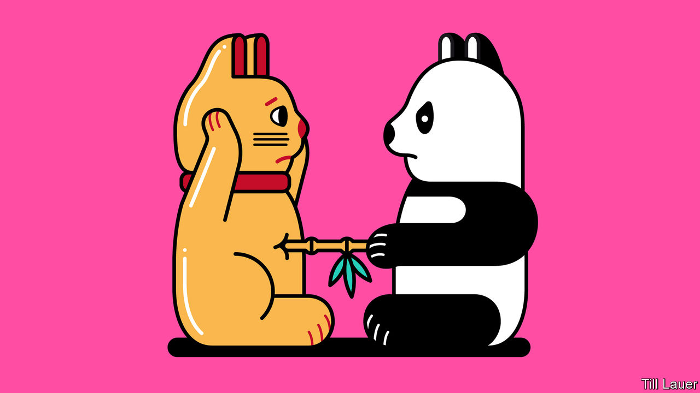

## Banyan

# A supposed detente between Japan and China is already fading

> Hong Kong, Taiwan and territorial disputes are sources of growing tension

> Jun 27th 2020

BACK IN FEBRUARY, when covid-19 was raging in China, a young girl in Japan took Chinese social media by storm. Dressed in a traditional Chinese cheongsam, she stood on the streets of her hometown bowing to passers-by to solicit donations for the afflicted. Calligraphers, too, knelt in Tokyo, inkbrush in hand, writing prayers for the people of Wuhan. Consignments of face masks made their way from Japan to China with poems on the box: “Though separated by mountains and waters, we look at the same sky.”

To any scholar of East Asia’s classical history, such acts have context. Japan and China share an extraordinarily long interaction. The Japanese language had no written form until Chinese characters were imported over 1,500 years ago. Kyoto, Japan’s cultural heart, was laid out in emulation of the Tang dynasty capital of Chang’an (modern-day Xi’an). Japanese monks and scholars helped bring from China three religions that played a big part in shaping Japanese culture: Confucianism, Taoism and Buddhism.

Yet to a student of the two countries’ more recent relations, the Japanese gestures of sympathy amid the outbreak and their warm reception in China might be surprising. Anti-Japanese riots broke out in China only eight years ago, as a bellicose leadership issued threats over Japan’s Senkaku islands, which China claims. Then, in 2015, China belaboured Japan’s wartime guilt, to mark the 70th anniversary of the end of the second world war. President Xi Jinping snubbed Japan’s prime minister, Abe Shinzo, after coming to power in 2012. Mr Abe, for his part, saw China as an existential threat, eating Japan’s lunch in economic terms and challenging its security.

If anything changed, it was the election of Donald Trump as America’s president. His mercurial approach unsettled not only China, which got lambasted over trade and more, but also Japan: Mr Trump’s disdain for alliances undermined the basis of its security. As an adviser to Mr Abe put it at the time, China and Japan both recognised they could not fight a war on two fronts—the Trump front was quite enough. A rapprochement was inevitable. Besides, China wanted Japanese investment, while Japan’s hopes for an economic revival included more tourists from China.

Last year nearly 10m Chinese flocked to Ginza’s swanky shops and to the snows and onsen (hot springs) of Hokkaido. A modern pilgrimage route leads young Chinese to the locations that feature in their favourite anime films. Admittedly, Japanese hold their noses at breaches of etiquette—not least, flatulence in the onsen. But Chinese views of Japan have been transformed. An opinion poll in September by the Genron NPO, a Japanese think-tank, found 46% of Chinese had a favourable opinion of Japan. That is up from 5% in 2013.

Mr Xi defined it as a “new era” in relations. He was to have come on a state visit in April (the first by a Chinese leader since 2008), to be greeted by the new emperor, Naruhito. Partly to ensure it went well, the Japanese government was still welcoming Chinese tourists in late January, even as the virus raged in Wuhan. That seeded an outbreak on Hokkaido, hastening the spread of covid-19 throughout Japan. When the pandemic forced Mr Xi’s visit to be postponed, Mr Abe’s advisers breathed a sigh of relief. The prime minister was getting flak from his right wing for hosting a dictator.

The new era has since been losing its shine. Since April Chinese coastguard vessels have sharply increased operations around the Senkakus, with near-daily visits. And now Hong Kong has become a thorn in the relationship. In its strongest language against Japan in years, China lashed out at criticism of its plan to impose a draconian security law in the territory (see [article](https://www.economist.com//china/2020/06/27/china-is-secretive-about-its-new-national-security-law-for-hong-kong)), even though Mr Abe had walked a delicate line by declining to join Australia, Britain, Canada and the United States in an admonitory joint statement.

Some 1,400 Japanese companies and 26,000 Japanese make Hong Kong their home. But Japan’s greater concern is what China might do to Taiwan, its democratic neighbour and friend. It all means, for Mr Abe, that domestic political constraints will grow, too. Already, ordinary folk increasingly fault China for Japan’s epidemic. And, crucially, they remain suspicious of China’s intentions. The same Genron NPO poll found that the proportion of Japanese with an unfavourable opinion of China had remained at 85%. Bet on Mr Xi’s state visit never happening. Don’t count on the new era lasting either.■