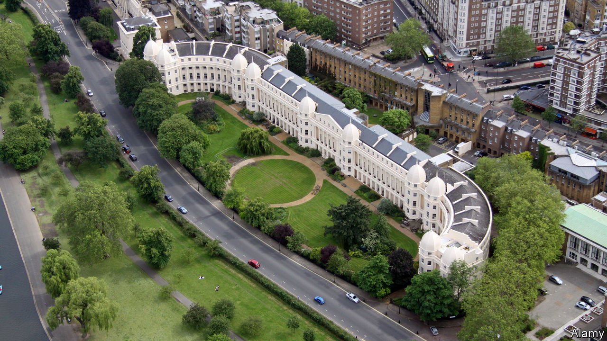
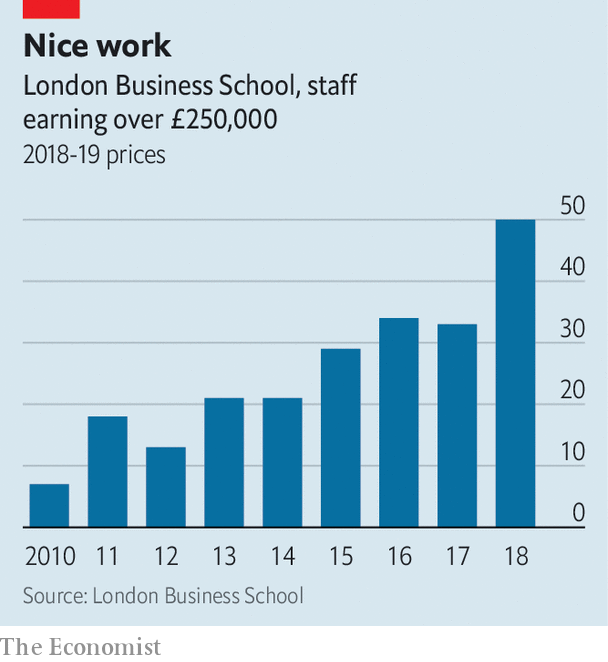

## Business education

# Lean times at the London Business School

> Staff at LBS did well in the fat years, but now the lean times have come

> Jun 25th 2020

A RECENT STUDY of Britain’s 178 providers of higher education sought to rank how vulnerable they were to the current downturn. Most of those high up the list were not names that lend polish to an executive CV. But one was: sitting at number 20 was the London Business School.

LBS has benefited from a long boom in the business of business education and a good reputation. The Economist’s MBA ranking puts it 25th in the world last year. Those two factors allowed it to push up prices. Its Masters in Business Administration, which cost £50,000 in 2010, now sets students back £90,000 ($112,000).

LBS is unusual among British business schools in being a stand-alone entity. Most of its peers, such as the Said School at Oxford or the Judge School at Cambridge, are parts of larger institutions, which have tended to run their business schools as cash cows, subsiding less sought-after degrees. LBS has not needed to siphon off cash to support less lucrative educational products.

The staff have benefited. “It’s run like an investment bank”, says a faculty member. “The core asset is the people that work here and we take the upside." In 2019, the school’s revenues came in at just over £160m, of which £80m paid for 830 staff. While academic pay has been broadly flat across British universities over the past decade, that has not been the case at LBS. Fifty staff members earn more than £250,000: a 12-fold increase, in inflation-adjusted terms, while 126 members of staff earn over £100,000.

The school argues that pay levels represent “the quality of our faculty and the strong demand for their services in top business schools around the world”. Remuneration packages at American institutions are certainly larger. Many staff members at business schools in the United States pull in over $1m, while LBS’s best-paid employee, the dean, François Ortalo-Magné, got a mere £609,000 last year. But to academics at other British universities, whose average salary is £48,000, LBS’s pay level is eye-watering.

LBS’s vulnerability comes not from high levels of debt, with which many British universities are burdened. It borrowed to cover the refurbishment of its Marylebone building and the purchase of the Royal College of Gynaecologists’ building in Regents Park, but its interest payments are only £1.5m a year on debts of £66m.

Nor is its difficulty the international nature of the student body, as it is with many institutions that offer primarily undergraduate degrees. Many such universities expect a collapse in demand from abroad. Some 60% of LBS’s self-paid students are international but they do not seem to have been put off. International as well as domestic demand for MBAs has held up, and applications for “pre-experience masters” have been strong, as graduate jobs have dried up and many of those finishing university this year have decided to delay entering the labour market.

The problem lies with the source of what a faculty member calls “the big bucks”. Executive education programmes that do not lead to degrees, which the school runs for both individuals and corporate clients, make up around 30% of revenues. Demand has “fallen off a cliff”, as training budgets are slashed. Insiders talk of a potential drop in turnover of 20-25% this year.

LBS has responded quickly by trimming salaries rather than cutting headcount. A spokesperson confirmed that “our faculty and senior leadership decided to take a temporary cut in compensation in order to support the school in these difficult times”. LBS will not say how large a cut, but faculty members put it at 19%. Just how temporary the cuts prove to be will depend on how quickly corporate training budgets bounce back from their post-covid lows. Sympathy may be limited. As a staff member puts it: “No one is happy with a pay cut, but it’s not like this is going to push anyone below the breadline, is it?”■