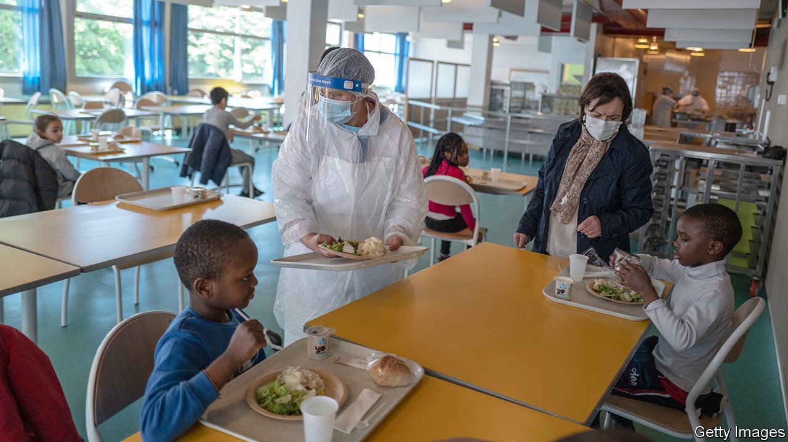
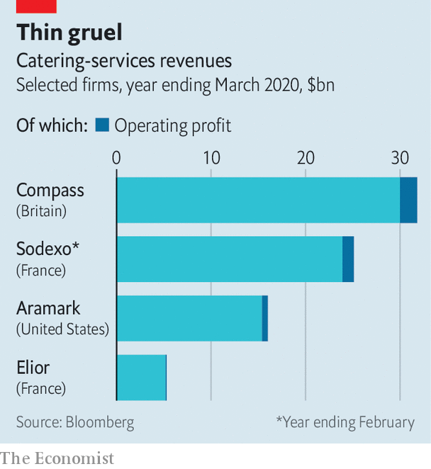

## Crash diet

# Catering groups are going through lean times

> The pandemic has stripped customers from companies that keep workers and students fed

> Jun 27th 2020PARIS

IF SOME WORKERS, after months spent at home, reluctantly concede that they are missing their colleagues, few will admit any longing for the office canteen. Companies that cook up meals for workers, pupils and hospital patients have been hit by covid-19 just as hard as restaurants (usually) open to the public. As employees trickle back to cafeterias, their prospects look no less mixed than those of other eateries.

What purveyors of catered grub lack in customer enthusiasm they make up for in size. The four big food-outsourcing firms—Compass Group in Britain, America’s Aramark and Sodexo and Elior in France—together serve up perhaps 14bn meals a year. Of the nearly $300bn spent on feeding workforces, student bodies and the like, roughly half is outsourced, and half of that goes to the multinationals. Growth was steady if not spectacular before covid-19, helped by acquisitions of local rivals.

Lockdowns have brought short-term pain and long-term uncertainty. Beyond offices, food outlets everywhere from schools to stadiums and conference centres are shut. A few usually reliable earners have dried up: hospital catering has slowed as beds were freed up for covid patients and visits banned. Even some prisoners, literally captive consumers, have been let out because of the pandemic. Compass, the biggest of the big four, said in May that half its 600,000 staff were on furlough.

Investors are also worried about what happens next, which is why the caterers’ share prices have not rebounded with the rest of the stockmarket. Home-working has nibbled at growth and looks likely to continue doing so after the pandemic. In factories social distancing means a smaller workforce toiling for longer shifts, so fewer mouths to feed. University students, who along with pupils consume a quarter of catered meals, may also stay away from campuses as online courses gain steam.

Because of high fixed costs, losing a few diners can eat into margins (see chart). Operating profits are already wafer-thin: around 36 cents per meal, or roughly $100 per site per day, in the case of Compass. Rising expenses, such as hiring more staff to enforce stricter cleaning protocols, will not help. Passing the costs on to clients is tricky in a recession. A slower economy will weigh on consumers; overpriced stadium hot dogs are an easy luxury to forgo in a downturn even once live sports return.

The caterers hope a recession might help them secure new clients. Firms that currently operate their own kitchens could cut costs by maybe a fifth by outsourcing to the professionals, who are at pains to explain that keeping kitchens up to complicated new hygiene standards is best left to them. The last recession, in 2008-09, saw a small uptick in contracts.

Still, many employers may instead conclude that those employees still turning up to work can be satiated with bulk deliveries from food apps like Uber Eats. They had been trying to eat the caterers’ lunch even before the pandemic. ■

## URL

https://www.economist.com/business/2020/06/27/catering-groups-are-going-through-lean-times
