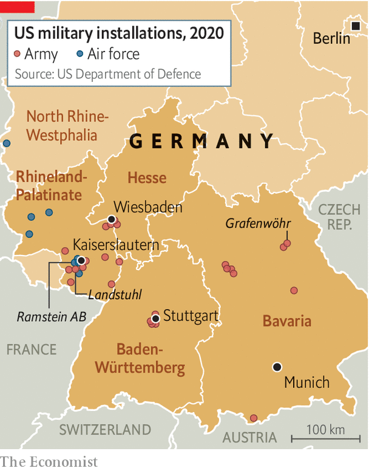
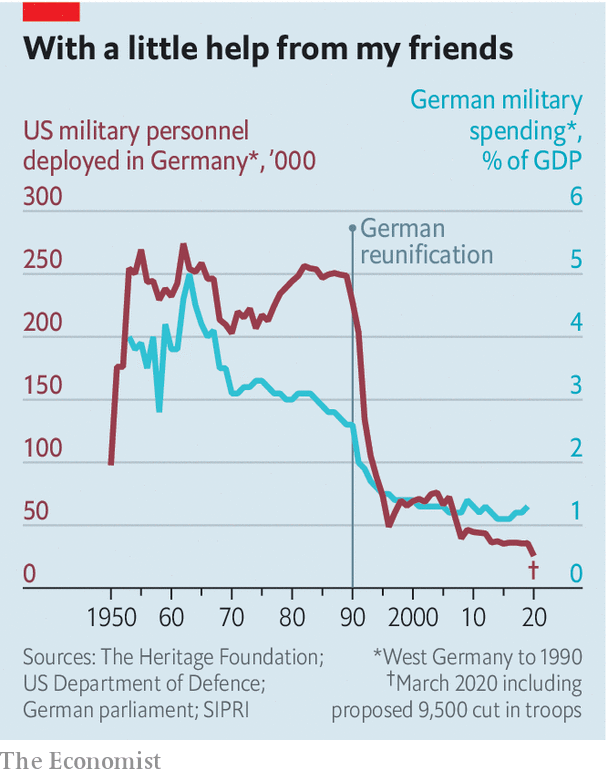

## Going home

# Donald Trump’s baffling proposal to withdraw troops from Germany

> It makes little sense, and may never happen

> Jun 25th 2020KAISERSLAUTERN

“IT’S LIKE having a stroke, and then a second one in the ambulance,” sighs Stefan Weiler, economic-development chief for Kaiserslautern, in south-west Germany. The city was already battling high debt and the effects of covid-19. Then came Donald Trump’s announcement that America would withdraw 9,500 of its 34,500 troops stationed in Germany. Some 50,000 American soldiers, civil staff and family members live in and around Kaiserslautern. The bases employ 2,700 locals and tens of thousands indirectly, from hotel-owners to parts suppliers. “They’re our neighbours, they rent our houses, our kids play football together,” says Ralf Hechner, mayor of nearby Ramstein-Miesenbach, which adjoins a vast American air base.

This local warmth found a national echo. Over decades dozens of American military bases—concentrated in Germany’s south, the area of post-war American occupation (see map)—have cemented the bond between the NATO allies. “I used to get a visit almost every year from the [premier] of Bavaria,” says Jim Townsend, the Pentagon’s former top official for Europe. “We were important to him, and he was important to us.”

Mr Trump and surrogates like Richard Grenell, his boorish former ambassador in Berlin, have long threatened to prune America’s military presence in Germany. This time it looks credible. At a rally in Oklahoma on June 20th Mr Trump justified his proposal with a familiar charge-sheet: a “delinquent” Germany free-rides on American protection, spending nugatory sums on defence while backing a Russian gas pipeline. “On top of it they treat us very badly on trade,” the president huffed. A day later Robert O’Brien, Mr Trump’s national security adviser, attempted to retrofit a strategic rationale onto his boss’s decision. The cold-war practice of massive army garrisons with families was “obsolete”, he wrote in the Wall Street Journal, because “modern warfare is increasingly expeditionary”. Troops were needed in Asia to counter China, he added.

This account “would not pass muster” at any military college, says Ben Hodges, who commanded American army forces in Europe until 2017. Although the reduction would represent just 15% of its troops in Europe, Germany is a crucial cog in America’s global military machine. The Pentagon’s European and African commands, which control every soldier, tank, warplane and warship in their domains, are based in Stuttgart. The army’s European headquarters are in Wiesbaden, and Germany hosts five of its seven European garrisons, including Grafenwöhr, its largest base outside America. Ramstein is a hub for directing drone strikes in Afghanistan, Pakistan, Somalia and Yemen (to some German consternation). The Landstuhl military hospital has treated 95,000 American soldiers wounded in Iraq and Afghanistan since 2001. “The amount of time and lives that that has saved is just incredible,” says Rachel Ellehuus, a former Pentagon official now at the Centre for Strategic and International Studies, a think-tank. A vast $990m replacement, nicknamed the “UFO” by locals, is being built nearby. At least 40% of American activity in Germany supports operations elsewhere, estimates Ms Ellehuus.

A drawdown would follow a decades-long thinning of America’s presence. Over 10m of its troops were cycled through Germany from 1950 to 2000, with 250,000 deployed for much of that time. That had dwindled to under 70,000 by the turn of the millennium, and fell by half again between 2006 and 2018. Between 2005 and 2020 America’s overall footprint in Europe shrank by over a third. That leaves little fat to trim. American capabilities in Europe are spread so thinly across various functions that cutting any one of them by 30% would, in effect, eliminate it, warns General Hodges. American generals in Germany are said to be baffled by the proposal.

Yet among Germans the plan has elicited a broad shrug, at least in public. Watching a Pentagon apparently at odds with the White House, German officials know they can only hope to be bystanders. Barely half of German voters see American bases as important to national security. Although Germany is still far short of the NATO defence-spending target of 2% of GDP (see chart), and plans to reach it only in 2031, recent increases mean that in absolute terms its military budget is now not much different from that of Britain or France. American accusations of free-riding therefore no longer carry quite the same sting.

Nerves are jumpier farther east. A drawdown from Germany could weaken NATO’s ability to send reinforcements to “tripwire” battle groups stationed in Poland and the Baltic states to deter Russia. Worse still, America seems to be playing allies off against one another, undermining NATO cohesion. On June 24th Mr Trump, standing beside Andrzej Duda, Poland’s president, at the White House, said some American troops would probably be moved from Germany to Poland. The meeting was a welcome boost for Mr Duda, who faces elections on June 28th and has long courted a greater American military presence. (In June last year Mr Trump agreed to send Poland 1,000 troops, on top of 4,500 already there.) But Mr Duda also felt compelled to say that he had asked Mr Trump not to withdraw any troops from Europe.

At home, Mr Trump’s announcement has had the unusual effect of galvanising bipartisan opposition. Twenty-two Republican members of Congress objected that cutting troops would encourage Russian aggression and undermine American military effectiveness. A Democratic bill seeks to deny funding for costs incurred by the withdrawal. With barely four months until an election that could see Mr Trump defeated by Joe Biden, who says he wants to repair America’s alliances, delay to a withdrawal plan that already faces considerable logistical hurdles could be fatal.

Yet as Heiko Maas, Germany’s foreign minister, has warned, the Atlantic is clearly widening. Tiffs over energy, trade, security and China are now threaded through the entire transatlantic relationship. Pro-American Germans say the sabre-rattling of Mr Trump and Mr Grenell makes it harder for them to make their case to a sceptical public. A recent Pew poll found that Germans now value their relations with China as strongly as those with the United States. Still, at least in Kaiserslautern, Americaphilia reigns supreme. “We don’t want the troops to leave,” says Mr Weiler. “It’s an honour to have them here.” ■