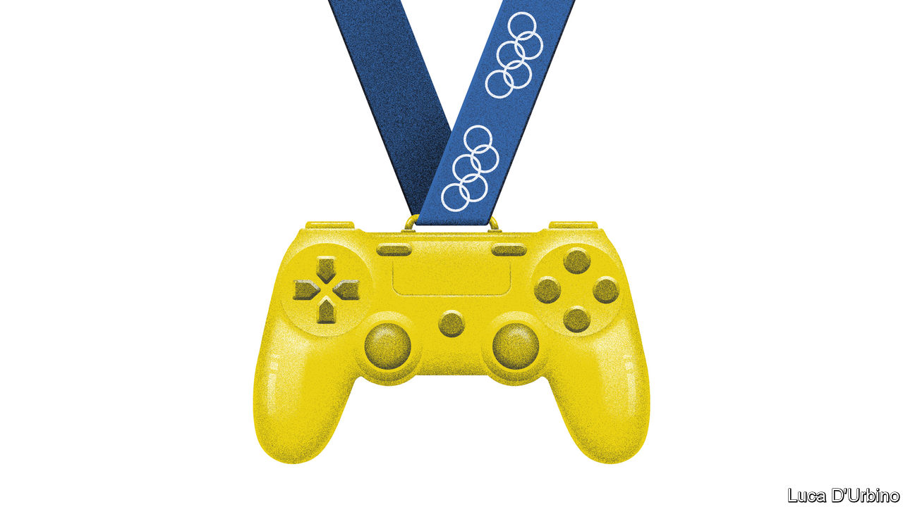

## Citius, Altius, Fortnite

# Why the next Olympics should include Fortnite

> If dressage and curling are Olympic sports, why not video games?

> Jun 25th 2020

CHAMPIONS FROM many countries are dropped on an island, wearing tight, garish outfits that show off their muscles. They search for weapons, such as guns and rocket-launchers. In teams of two, they try to kill everyone else on the island. The last pair standing wins gold medals and global adulation.

The Tokyo Olympics, which were supposed to start next month, have been postponed until 2021, thanks to covid-19. That delay offers a chance for reflection. The International Olympic Committee wants to make the games more popular with young people. To that end, it is introducing new events, such as skateboarding, surfing and climbing. Why not go further and let national teams compete at video games? Electronic sports such as “Fortnite”, described above, are vastly more popular than Olympic oddities such as dressage or curling. In fact, they are more popular than most mainstream sports (see [article](https://www.economist.com//international/2020/06/27/the-pandemic-has-accelerated-the-growth-of-e-sports)). Only 28% of British boys aged 16-19 watch any traditional live sports; 57% play video games.

Stick-in-the-muds may grumble that e-sports are not proper sports. Many parents, observing their surly teenagers sitting on the sofa all day twiddling their thumbs and shouting “Quick, pass me the shotgun!” at a screen, would agree. Yet video games are highly competitive, with professional leagues that play to packed stadiums. There are perhaps only 200 tennis stars in the world who can make a living from playing in tournaments. By contrast “League of Legends”, a fantasy game played by teams of five, supports over 1,000 on good wages. Its World Championship final last year was watched by 44m people.

New sports have always been unpopular at first. King Edward II of England tried to ban football in 1314, because he thought boys should be learning archery instead. In 19th-century America churchy types objected to baseball, which they worried was too much fun. The best e-sports require as much skill and dexterity as many conventional sports—professional gamers typically carry out five distinct actions every second. Video games are also cheaper and more accessible than, say, sailing or horse-riding.

Critics of e-sports offer moral objections, too. They are addictive. Prince Harry has called for “Fortnite” to be banned for this reason. They are violent. Surely, at a time of global disharmony, it is a bad idea to make simulated killing an Olympic sport? The Olympics aim to promote peace. Finally, video games are crassly commercial. Nobody owns basketball; “League of Legends” is owned by Tencent, a Chinese megacorporation.

None of these arguments is very convincing. The idea that an activity, rather than a substance, can be addictive is contentious among doctors, as is the existence of a causal link between gaming and violence. And the notion that warlike sports have no place in the Olympics is hard to square with history. Javelin-throwing and wrestling were introduced in 708BC. They are still there. Modern pentathlon, which includes shooting and fencing, was designed to train soldiers. The imaginary mayhem in “Fortnite” cannot be compared to the real harm caused by boxing. Packs of e-sports fans do not rampage through town centres as soccer or ice-hockey fans sometimes do.

As for the fact that e-sports belong to companies, so what? The Olympics already generates billions from broadcasting and sponsorship. Commercial pressure can make for livelier entertainment. Having a video game named as an Olympic sport would be a huge prize. Companies would vie to create games as exciting to watch as they are to play. This sounds like a recipe for fun. Those who disagree can always watch the 20,000-metre speed-walk. Put “Fortnite” in the Olympics, and millions will tune in who might otherwise not have bothered. They might even stumble across a traditional sport and decide to try it, too. And if the experiment fails, no matter. The International Olympic Committee could drop it in 2024, as it has previously dropped croquet, tug-of-war and solo synchronised swimming.■

## URL

https://www.economist.com/leaders/2020/06/25/why-the-next-olympics-should-include-fortnite
