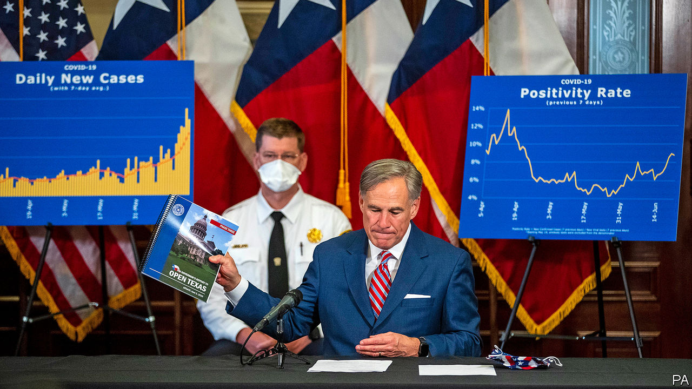
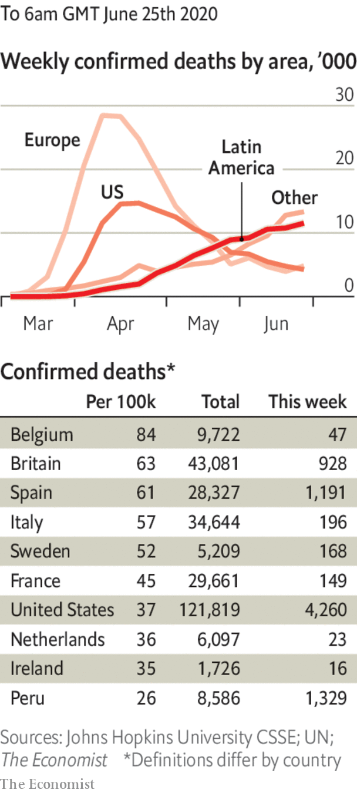

# Politics this week

> Jun 25th 2020

Some states in the south and west of the United States recorded their biggest daily rise in cases of covid-19, bringing America’s total to over 2.3m. The governor of Texas, Greg Abbott, urged people to stay indoors. He also declared that the state remained “wide open for business”. California recorded new highs in hospital admissions. Connecticut, New Jersey and New York are to quarantine visitors from states that are covid hotspots. See [article](https://www.economist.com//united-states/2020/06/27/decoding-the-confusing-messages-of-the-coronavirus-epidemic-in-america).

Donald Trump sacked Geoffrey Berman as the federal prosecutor for Manhattan. Mr Berman’s office had successfully prosecuted Mr Trump’s former lawyer (Mr Berman was recused from the case) and is investigating his current one, Rudy Giuliani. See [article](https://www.economist.com//united-states/2020/06/24/has-americas-department-of-justice-been-politicised).

Less than a month after the killing of George Floyd in Minneapolis, an attempt to reform police procedures in Minnesota came to naught when Democrats and Republicans failed to reach a compromise in the state legislature.

Suriname’s president, Dési Bouterse, who has dominated the country’s politics for more than 40 years, conceded defeat in an election held on May 25th. His likely successor is Chan Santokhi, of the mainly Indo-Surinamese Progressive Reform Party. In November a military court found Mr Bouterse guilty of murdering 15 political opponents in 1982.

Brazilian police arrested a former aide to Flávio Bolsonaro, the eldest son of the president, Jair Bolsonaro, in an investigation into corruption. Flávio, a senator, is himself being investigated for possible involvement in the scheme when he was a state deputy in Rio de Janeiro.

Brazil’s education minister, Abraham Weintraub, resigned after the Supreme Court included him in an inquiry of a criminal scheme to spread slurs and threats directed at its judges. Mr Weintraub had described the judges as “bums” who should be jailed. He has flown to America.

Singapore called an early election on July 10th. Lee Hsien Loong, the prime minister, has said he will step down during the next parliamentary term. Negative campaigning is effectively banned, which makes it hard for the opposition. See [article](https://www.economist.com//asia/2020/06/25/singapores-ruling-party-calls-an-election).

Almazbek Atambayev, a former president of Kyrgyzstan, was sentenced to prison for 11 years for illegally releasing a crime boss, who subsequently fled to Russia. Mr Atambayev was arrested in August after throngs of soldiers and police stormed his compound. See [article](https://www.economist.com//asia/2020/06/25/a-former-president-of-kyrgyzstan-is-imprisoned-for-corruption).

India expelled half the staff at Pakistan’s embassy in Delhi, accusing them of spying and working for terrorists. Pakistan’s foreign ministry said it had responded in kind, telling half the diplomats at India’s embassy in Islamabad to leave.

After blowing up their joint liaison office, North Korea tried to de-escalate tensions with South Korea by saying it would not take any further action. The North had threatened to deploy troops in the demilitarised zone between the two countries to punish the South for letting activists send pamphlets critical of Kim Jong Un, the North’s despot, over the border by balloon.

America named four more Chinese media organisations operating in the United States as government foreign missions. The State Department said the four—CCTV, China News Service, the People’s Daily and Global Times—produced propaganda for the Chinese Communist Party.

The installation of China’s Beidou navigation system was completed with the placing in orbit of its final satellite. Beidou, a rival to America’s GPS, has taken two decades to build.

China charged two Canadians with spying, more than 18 months after they were arrested. China is widely thought to be keeping the men in custody in response to Canada’s detention of a senior executive of Huawei following an extradition request from America.

Police in Tanzania arrested Zitto Kabwe, an opposition leader. He was charged with “endangering the peace” after meeting supporters. To prepare for an election in October the government has arrested journalists, closed newspapers and harassed dissidents.

Malawians voted in a re-run of a presidential election after courts overturned the results of a rigged one supposedly won last year by the incumbent, Peter Mutharika. Electoral officials have eight days to release the count. See [article](https://www.economist.com//middle-east-and-africa/2020/06/25/more-african-judges-are-standing-up-to-governments).

A suicide-bomber killed two people in an attack on a Turkish military base in Somalia that was claimed by al-Shabab, a jihadist group. Turkey is helping to train Somali soldiers.

Egypt’s president, Abdel-Fattah al-Sisi, threatened to intervene in neighbouring Libya if Turkish-backed militias captured Sirte, a strategic port, from Khalifa Haftar, a rebellious general who is also backed by Russia. The militias have been moving towards General Haftar’s heartland in the east.

Prosecutors from a court in The Hague said they were charging Hashim Thaci, the president of Kosovo, with war crimes, murder and torture relating to the period during and immediately after the war there in 1999. Mr Thaci had been about to attend a summit at the White House, but cancelled his visit. See [article](https://www.economist.com//europe/2020/06/27/kosovos-president-hashim-thaci-faces-war-crimes-charges).

The World Health Organisation reported a record increase in the number of new infections, bringing the total to more than 9.1m. It expects the 10m mark to be reached within days.

Brazil recorded another big surge in cases, bringing its accumulated total to 1.1m.

Officials reimposed a lockdown in Chennai, the capital of Tamil Nadu in southern India, after a surge in deaths. The number of infections in Delhi, meanwhile, overtook that in Mumbai.

Saudi Arabia’s state media said strict limits would be placed on the number of pilgrims allowed to make this year’s haj. Citizens from other countries already in Saudi Arabia may attend, but international visitors are barred.

Novak Djokovic apologised after he and three other tennis players contracted covid-19 at a tournament he was hosting.

## URL

https://www.economist.com/the-world-this-week/2020/06/25/politics-this-week
