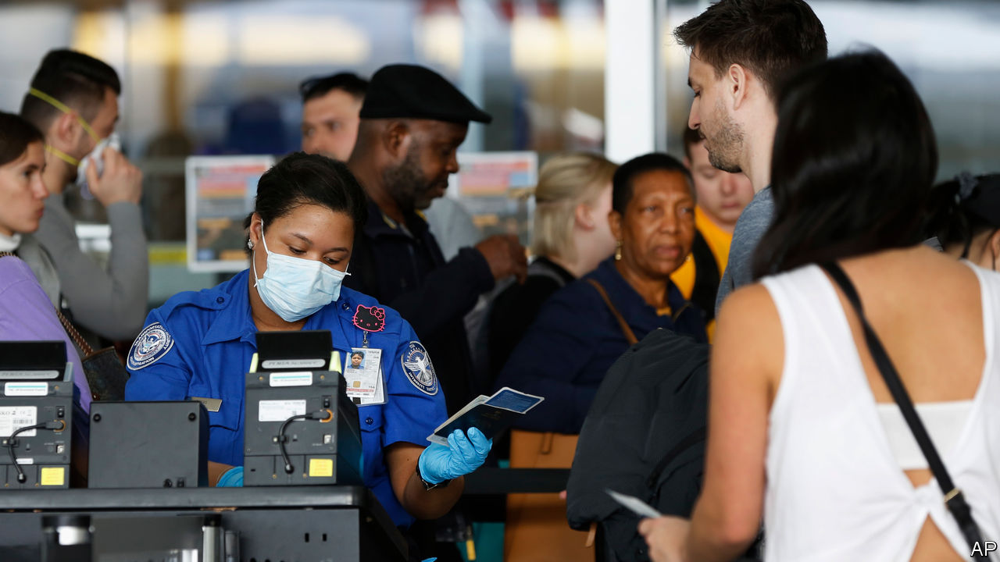

## More bricks in the wall

# Highly skilled migrants are no longer welcome in America. Maybe

> Software engineers, go home

> Jun 23rd 2020CHICAGO

FOUR YEARS ago Donald Trump set out a ten-point plan for reshaping a chaotic immigration system. Beyond building a wall and deporting foreigners, he vowed America would “choose immigrants based on merit”, while imposing controls “to boost wages and to ensure that open jobs are offered to American workers first.”

To a remarkable extent he has since found ways to choke off inflows of foreigners. Before covid-19 hit, his administration cut arrivals of undocumented migrants by striking a deal last year with Mexico’s government to prevent Central Americans claiming asylum at the border. It has greatly reduced the number of official resettlement opportunities for refugees, where America had led the rest of the world for decades. It also made it harder for those already in America to apply for the green cards that allow them to live and work in the country. Now it is using the economic slump to justify a clampdown on high-skilled migrants too.

A broad executive order issued on June 22nd suspends the issuance of four types of visa: H-1Bs, widely used by employees at tech companies; H-2Bs, for lower-skilled, often outdoor workers; J visas, for au pairs, temporary summer workers and some academics; and L visas, for professionals who are moved within companies.

The practical impact is hard to pin down. The Migration Policy Institute (MPI) in Washington reckons 29,000 people will see their H-1B visas blocked in the second half of 2020. Another 72,000 people had expected to travel on J-1 “exchange visitor” visas, typically used for temporary summer jobs. In theory, therefore, the new rules could affect hundreds of thousands.

In reality, however, few visas were being issued, after consulates suspended work during the pandemic. It is also impossible to know how strictly the order will be implemented. Demetrios Papademetriou, of the MPI, says “you can drive a truck through” an order with as many waivers as this one has. Workers who are exempt include those necessary for the secure supply of food, for medical research or for reasons of “economic recovery”. They could turn out to be numerous, but statistics on that are unlikely to arrive before the end of the year.

Correction: This article originally said that 169,000 people entered America on an H-1B visa in the second half of 2019.

Dig deeper:

## URL

https://www.economist.com/united-states/2020/06/23/highly-skilled-migrants-are-no-longer-welcome-in-america-maybe
