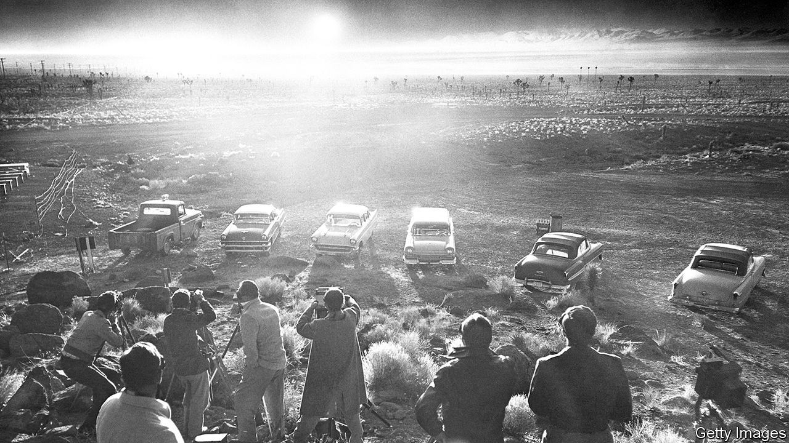
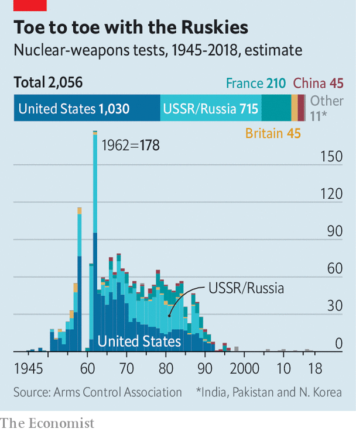

## Nukes in Nevada

# Will Donald Trump resume nuclear testing?

> America’s 28-year moratorium on setting off nukes is looking shakier than ever

> Jun 24th 2020

THE CARS drove an hour out of Las Vegas and lined up along the edge of the Yucca Flat on April 22nd 1952. They pointed towards the desert, as if it were a drive-in cinema. Newsmen, among them Walter Cronkite, had gathered for a killer performance: the first televised nuclear test, ten miles away at the Nevada Test Site. “This is the greatest show on Earth,” an army captain assured soldiers in trenches, there to practise storming across an irradiated battlefield, ahead of a similar test the next year. “You won’t be hurt. Relax and enjoy it.”

Over four decades, America’s government conducted 928 nuclear tests in Nevada. The mushroom clouds could be seen from Las Vegas, where the chamber of commerce cannily issued tourist calendars with dates, times and plum viewing spots. On September 23rd 1992, the ground shook for the last time. President George H.W. Bush, following the Soviet Union’s example the previous year, joined a moratorium on nuclear-weapons testing that has been extended by every president since. Yet some fear that America’s 28-year nuclear lull may be drawing to a close.

On June 23rd the State Department told Congress that it suspected that Russia had conducted “nuclear weapons-related experiments that have created nuclear yield”, in violation of the Comprehensive Test Ban Treaty (CTBT). It also said that excavation and other activity at China’s Lop Nur test site “raise concerns regarding China’s adherence to its testing moratorium”. All three countries signed the CTBT in 1996, but only Russia has ratified it. The treaty would not enter into force until 44 designated countries ratify it; of those, India, Pakistan and North Korea have not even signed up.

Most experts say the accusations are thin gruel. America itself does in Nevada much of what it says China is doing at Lop Nur. Moreover, all three countries conduct “subcritical” tests, in which there is no critical mass of plutonium, no chain reaction and therefore no yield. Under the CTBT, these are kosher. Some, however, can be outwardly indistinguishable from illicit tests with tiny yields. In 1997 a Russian “test” turned out to be an earthquake.

But the charges are ominous. In May, according to the Washington Post, American officials considered conducting a “rapid test” to demonstrate the country’s nuclear prowess, with the intention of forcing Russia and China into trilateral nuclear talks, something that China has thus far resisted.

Detonating a nuke is relatively straightforward. American law requires the government to be able to conduct a nuclear test within two to three years of a presidential order. The problem is that it can be done properly, or quickly, but not both. A “fully instrumented” test, designed to capture useful data, would take at least 18 months, according to the National Nuclear Security Administration (NNSA). But a crude detonation designed as a theatrical act of chest-beating, rather than a meaningful scientific endeavour, could be slapped together in months, well before Mr Trump’s first term concludes in January.

A test would cost somewhere between tens and hundreds of millions of dollars, according to insiders. And although the Nevada site is kept in working order, the population of Las Vegas and its environs has more than tripled since 1992, coming uncomfortably close. “When they used to do underground tests, it would at times rock buildings in Las Vegas,” says Cheryl Rofer, who worked at Los Alamos as a scientist from 1965 to 2001 (though modern tests would have far smaller yields). An editorial in the Las Vegas Sun, one of the city’s newspapers, offered a pithy response to the idea of churning up the ground again: “No. Hell no. Not now. Not ever.” The sentiment is widespread. Polls conducted last year show that 72% of Americans (and 59% of Republicans) disapprove of testing.

Unsurprisingly, the Department of Energy, which oversees nuclear weapons, and its laboratories, like Los Alamos in New Mexico, is not keen on the idea. Nor are the Pentagon or the armed forces. On June 16th a dozen distinguished scientists, many formerly associated with America’s nuclear laboratories, wrote an open letter to Mitch McConnell, the Senate majority leader, arguing that explosive testing “would serve no technical or military purpose”. That is because there are now sophisticated ways to inspect and improve nuclear weapons without setting them off.

America spends eye-watering sums to tend its arsenal; the NNSA requested nearly $16bn for the coming fiscal year. That buys some impressive kit. Modern supercomputers can simulate thermonuclear explosions with remarkable fidelity. In 1993, shortly after the last test, the world’s most powerful supercomputer, at Los Alamos, could manage less than 60 gigaflops, a measure of computing speed. Today’s equivalent, at the Oak Ridge National Laboratory in Tennessee, can exceed 148 petaflops, which is more than 2m times faster. American government laboratories own six of the world’s 20 fastest supercomputers, though China has been catching up. The debate over testing is in part a “conflict of generations”, says one senior scientist: many who cut their teeth on explosive tests distrust the new, virtual ways.

America also has an enviable pile of data from its old tests, having done more than every other country put together (see chart). It conducted 22 tests for every Chinese one. Its rivals would therefore have the most to gain from any resumption of testing. American data may be superior, too. Steven Pifer, a former American diplomat now at Stanford University, recalls visiting a Soviet test site in Kazakhstan in 1988 where the vertical test shafts were less than half the width of America’s, leaving far less space for instruments. India’s lone test of a hydrogen bomb is widely thought to have been a fizzle. Pakistan is eager to refine smaller nukes that could be aimed at Indian tank columns. The rush to testing might spell doom for the Nuclear Non-Proliferation Treaty (NPT), whose non-nuclear members are fed up with the lack of tangible progress towards disarmament.

Many experts reckon that even the truculent Mr Trump would shy away from a test. The aim at present, they suggest, is pactocide. Mr Trump’s administration is stacked with arms-control sceptics who never wanted America to sign the CTBT in the first place, viewing it as an irksome fetter on American power.

Having swept aside a series of other agreements—a nuclear deal with Iran in 2018, the Intermediate-range Nuclear Forces (INF) treaty with Russia last year and the Open Skies treaty in May—the treaty-phobes spy an opportunity to slough off the CTBT, too. In his recent book, “The Room Where It Happened”, John Bolton, America’s national security adviser until September, writes that “unsigning” it “should be a priority”. Mr Bolton is persona non grata in the White House these days, but his diplomatic nihilism lives on. ■