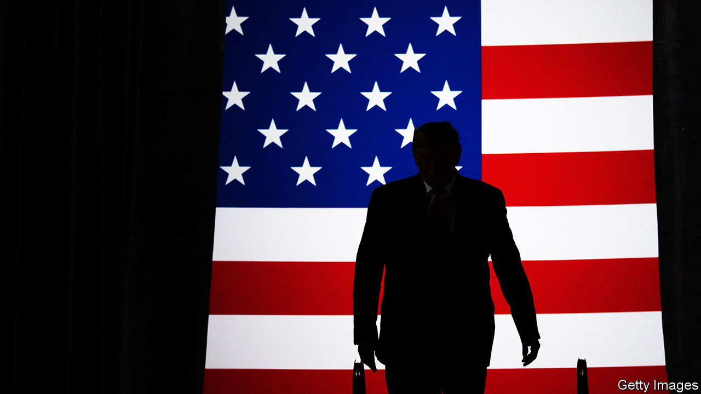

## Orange warning

# Donald Trump is not like other presidents, argues Masha Gessen

> “Surviving Autocracy” chronicles his tussles with America’s institutions

> Jul 2nd 2020

Surviving Autocracy. By Masha Gessen.Riverhead Books; 288 pages; $26. Granta; £12.

TWO DAYS after Donald Trump was elected, Masha Gessen argued in the New York Review of Books that he was “the first candidate in memory who ran not for president, but for autocrat—and won.” The piece offered advice, such as “Do not be taken in by small signs of normality.”

The years since have testified to Mr Trump’s autocratic instincts. He has been more hostile to oversight and dissent, and more demanding of personal loyalty and displays of adulation, than any American president in memory. He has spurned allies and fawned over dictators. In a pithy but overstated new book, Gessen (who prefers to be referred to that way) updates and expands on that early warning. Mr Trump, Gessen writes, is qualitatively different from any of his predecessors, given as he is to “ignoring and destroying all institutions of accountability”.

The author, who was born in the Soviet Union and has written acutely about Vladimir Putin’s Russia, chronicles Mr Trump’s tussles with those institutions. The determination of the press to appear objective and balanced, Gessen argues, as well as its weakness for hope, have prevented it from accurately describing Mr Trump’s predations—even as it hyped his normal-seeming moments. Pillars of the state, such as the Office of Government Ethics, were accustomed to compliance from the White House and ill-equipped to counter open defiance. Congress was riven and cowed.

Civil society and the judiciary have each mounted resistance where they can; but, Gessen maintains, they “function on the assumption that they are partners in an ongoing negotiation”, whereas Mr Trump “sees any attempt at negotiation as an affront to his power—something that needs to be quashed at any cost.” On this view, Democrats have too often let him dictate the terms of political battle. For instance, Gessen derides Chuck Schumer, the Senate minority leader, for saying he had a “policy difference” with Mr Trump over the border wall, rather than straightforwardly calling the scheme “immoral”.

According to the book, ordinary Americans, too, are ill-equipped to grapple with the president’s brazenness. Ever since Watergate, they have been primed to sniff out political conspiracy. But Mr Trump lacks the attention span and managerial skills to run a conspiracy. Faced with pressure to reveal who received $500bn in taxpayer-funded emergency loans, his administration did not manufacture a false paper trail. His treasury secretary simply refused to say. It wasn’t muckraking journalists who informed the public that Mr Trump had sacked James Comey, a former director of the FBI, because of its probes into his campaign’s links with Russia. As Gessen relates, the president said so on television.

Borrowing a phrase from Balint Magyar, a Hungarian writer and politician, Gessen now characterises Mr Trump’s overall project as “an autocratic attempt”, rather than the thing itself; he is said to be testing America’s defences and laying the groundwork for further power grabs. The country can still fend off this bid—notably by voting him out of office. But more will be required, Gessen urges, to repair the damage and see off the danger. Ideals have receded from politics in favour of an uninspiring technocracy; America will have to reinvent, or at least rediscover, its “moral aspiration”, in particular “the belief that this can be a country of all its people”.

Bracing as it is, though, this book underplays the robustness of some of the institutions it frets over. The Supreme Court, for instance, has recently issued a string of rulings that enraged the president; though Republican senators preserved him in office, occasionally even some of them have disappointed him. And it misses the extent to which the fightback Gessen craves is already happening. Mr Trump has led Republicans towards nativism, but also to three years of electoral defeats—including the loss of the House of Representatives. Should Democrats win the presidency and both chambers of Congress in November, he may inspire a raft of ethics legislation.

Mr Trump may be a sign of decadence in American democracy, as Gessen implies. He could also prove its renewer. ■

## URL

https://www.economist.com/books-and-arts/2020/07/02/donald-trump-is-not-like-other-presidents-argues-masha-gessen
