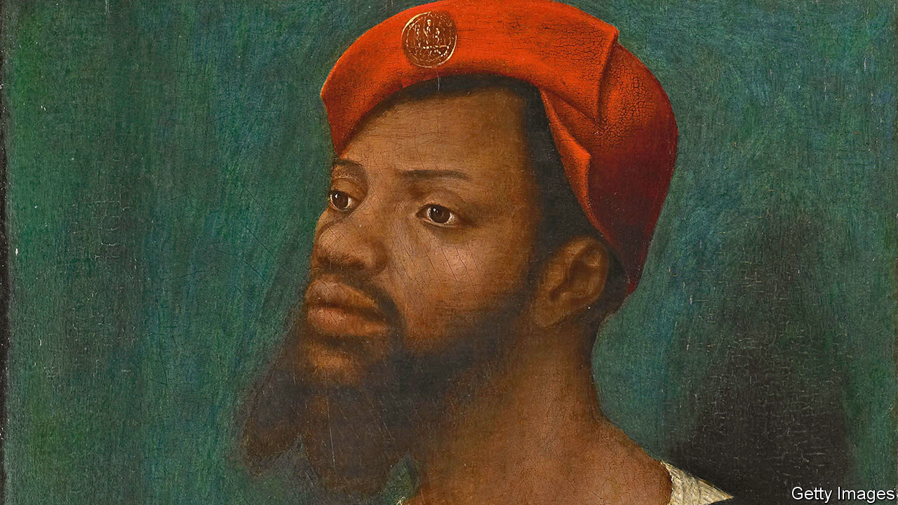

## Schools

# Changing history teaching

> Campaigners want history to be taught differently. It already is

> Jul 2nd 2020

IN HIS FOUR years as education secretary, Michael Gove learned that no subject on the curriculum was as contentious as history. As he acknowledged in a speech in 2013, it can be an “ideological battleground” for “contending armies”. “There may, for all I know, be rival Whig and Marxist schools fighting a war of interpretation in chemistry or food technology, but their partisans don’t tend to command much column space in the broadsheets”.

In the past few months, the history wars have spilled onto the streets. Revisionism has required toppling statues rather than hosting seminars; the worth of classics of literature and television is being radically reappraised. Campaigners want the curriculum “decolonised” and the history of black Britons made compulsory in schools.

Partly in reaction to such demands, Policy Exchange, a think-tank close to the government, launched a “History Matters” project on June 29th, to “address the rewriting of history as it happens”. But right-wingers are equally keen on disseminating the right kind of history. Mr Gove’s first attempt to rewrite the history curriculum to give “a connected sense of the narrative of our islands” was widely criticised as narrow and triumphalist. Referring to a comic take on English history, Simon Schama, a historian, damned the proposals as “‘1066 and All That’, but without the jokes”.

Yet demands to add or remove pet topics from the national curriculum are largely pointless. Most children attend academy or free schools or private schools, none of which are bound by the curriculum. In any case, it only applies until children turn 14, when the subject becomes optional, and provides vague menus of suggested topics that leave teachers plenty of choice. “The power is really with history teachers and schools,” says Michael Riley of University College London. “They have the freedom to devise the curriculum they want.”

Many are beginning to do just that. According to a survey in 2019 by the Historical Association, an educational charity, about four in ten state schools have altered their lessons in the last two years to include a broader range of history. Contrary to the beliefs of some campaigners, Britain’s role in the transatlantic slave trade was already widely covered. “I’m not aware of any department that doesn’t teach slavery,” says Will Bailey-Watson, who trains history teachers. The more current debate among teachers, he says, is how to broaden their teaching of other topics so that children learn other aspects of black history.

Take Jaspreet Kaur, a history teacher who likes to ask “who am I ignoring?” when planning lessons. That has meant educating her pupils about Sophia Duleep Singh, an Indian suffragette, as well as Emmeline Pankhurst. She argues that teaching topics in a way that allows all her students to identify with the protagonists makes for “more passionate historians”. Hannah Cusworth, head of history at a school with a sizeable minority of black pupils, teaches children about Miranda Kaufmann’s book, “Black Tudors”, in part to demonstrate “there was a history before slavery”.

There are constraints on such innovation. Flora Wilson, another teacher, points out that many pupils only have two hours’ history teaching a week. Adding too many topics risks reducing history to a mere list of facts, “one fucking thing after another” in the words of a character in Alan Bennett’s “The History Boys”. “What do you leave out in order to make sense of the important things you’re leaving in?” And teachers do not always have the time or the confidence to research a topic they do not know well. One suggests campaigners emulate the model of the Holocaust Educational Trust, a charity that provides teaching resources and arranges for survivors to give talks in schools.

In the end, change is likely to come organically. Teachers are most comfortable talking about topics they themselves were taught. As university curriculums evolve, so will the classroom. And as academics like Ms Kaufmann unearth more neglected stories from the past, teachers like Ms Cusworth will be excited to pass them on. History may be a battlefield, but its terrain is always shifting.■

## URL

https://www.economist.com/britain/2020/07/02/changing-history-teaching
