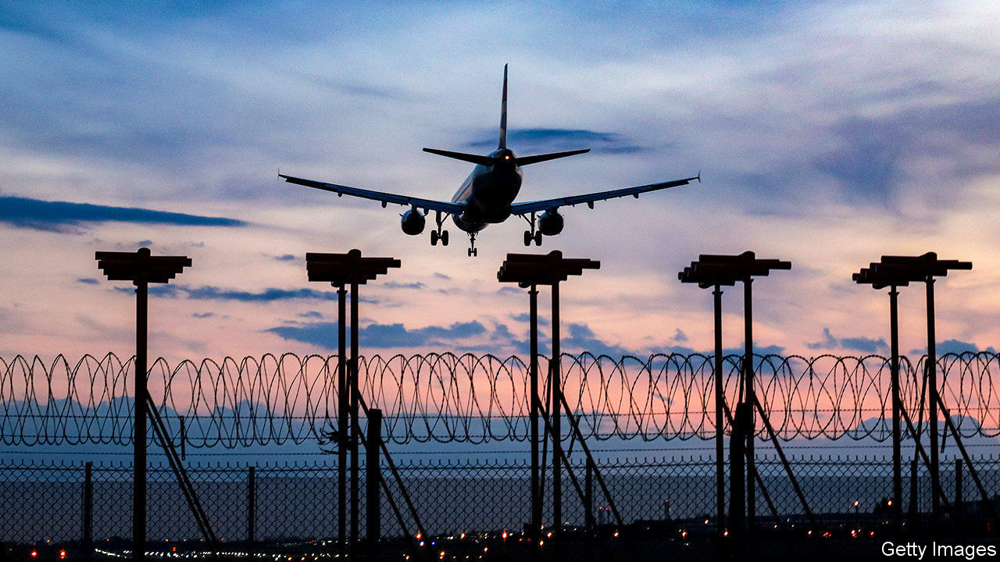
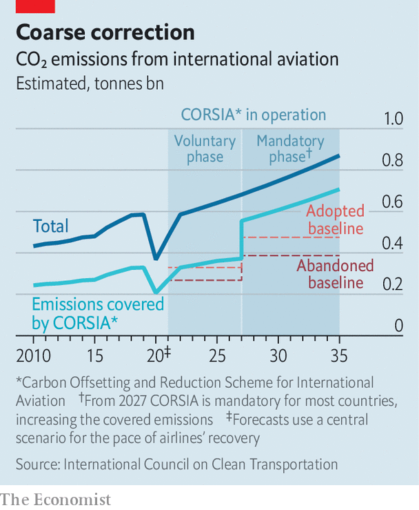

## Setting a new CORSIA

# Airlines blame covid-19 for rowing back climate commitments

> The industry defangs an already mostly toothless carbon-offsetting scheme

> Jul 4th 2020

“THE WORST year in the history of aviation” is how the International Air Transport Association (IATA) describes 2020. The global airline-industry body expects carriers’ revenues to fall by half and debt to swell by $120bn to $550bn. To cut costs airlines have grounded planes and put staff on unpaid leave.

Another slashed expense is that of climate action. Aviation emits 3% of man-made carbon dioxide. That share could rise to 5-9% by 2050, according to the International Energy Agency, a forecaster. To curb these emissions, in 2013 the European Union tried to add international aviation to its emissions-trading programme, including flights connecting EU airports to those outside the bloc. The industry cried foul. In a compromise the International Civil Aviation Organisation (ICAO), an agency of the UN, devised the Carbon Offsetting and Reduction Scheme for International Aviation. CORSIA, as it is known for short, is due to start next year. It compels airlines to buy offsets for any additional CO2 produced by international flights above a baseline.

That baseline has become hotly contested. It was originally set at the industry’s average emissions for 2019 and 2020. Now emissions are forecast to fall by 37% this year, which would mean a lower baseline—and so, in time, higher offsetting costs. So IATA proposed using just emissions from just 2019 instead. On June 30th ICAO’s 36-member council agreed, at least for CORSIA’s first three years (see chart).

Environmental groups are up in arms. The scheme already lacked bite, since it is voluntary until 2027 and does not include domestic flights, about a third of the industry’s emissions. Countries representing three-quarters of aviation’s carbon footprint have signed up but flights between those which have opted in and those which have not are excluded. Dan Rutherford of the International Council on Clean Transportation, an NGO, calculates that on pre-pandemic trends the original plan would have covered only 9% of aviation emissions from 2021 to 2035 (when the scheme is scheduled to end).

In fact, the two-year average was expressly designed to account for low-emission years—a lesson learned from an early attempt to set the baseline in 2010, which was thwarted by the eruption of Eyjafjallajökull, an Icelandic volcano which grounded flights in Europe.

Another complaint is that many of the offsets airlines can buy are ineffective. A report in November last year by the NewClimate Institute and the Stockholm Environment Institute, two think-tanks, found that 80% of CORSIA’s potential offsets are unlikely to have any additional benefit to the climate. Since then ICAO has, to its credit, limited the availability of junk offsets in the scheme, though green campaigners say it has not gone far enough.

Offsets’ bargain prices also suggest something is amiss. In 2018 the average price in the “voluntary market” (outside of mandated schemes) was $3 per tonne of CO2, about a sixth of the carbon price in the EU emissions-trading scheme. Last year EasyJet, a British low-cost carrier, announced plans to offset all its annual emissions. This will cost it a footling $32m. New offest projects created in anticipation of CORSIA boosted supply, which is expected to be four times higher than demand.

Industry executives claim that the original baseline would have imposed crippling costs. That seems overblown. Sparse coverage and the cheap offsets mean the cost to the industry is low. Assuming an offset price of $5 per tonne of CO2, Mr Rutherford estimates the change in the baseline will save airlines $350m a year. That is less than 1% of the forecast operating cashflow in 2021 for a panel of 37 listed airlines.

Forgoing those savings would have been a small price to pay for burnishing airlines’ reputations as they seek billions in government bail-outs. Accusations of greenwashing will make calls to attach potentially much costlier green strings to the rescue packages grow louder. ■

For more coverage of climate change, register for The Climate Issue, our fortnightly [newsletter](https://www.economist.com//theclimateissue/), or visit our [climate-change hub](https://www.economist.com//news/2020/04/24/the-economists-coverage-of-climate-change)