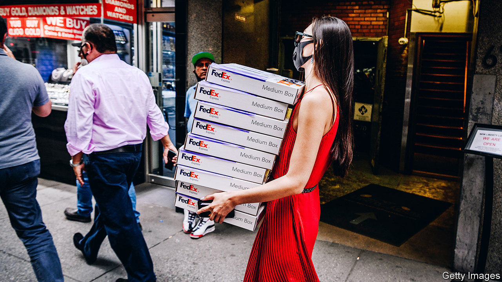
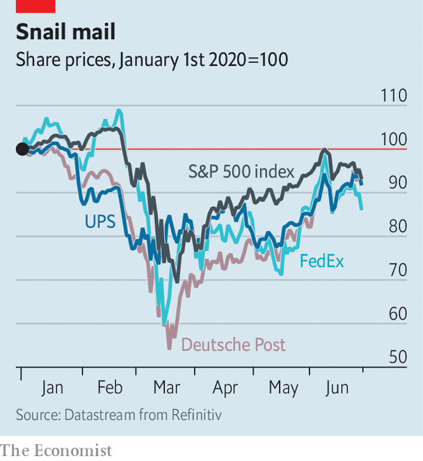

## Seeking deliverance

# FedEx tries to think beyond the pandemic

> Lockdowns have been less of a bonanza for parcel-handlers than you might expect

> Jul 2nd 2020

YOU WOULD have thought that lockdowns were a bonanza for courier services like FedEx. Not so much, it turns out. On June 30th the American pioneer of express delivery reported that operating profits fell by 64%, year on year, in the three months to May. Although demand from locked-down consumers has ballooned, so have coronavirus-related costs, from extra staff to deeper cleaning of facilities and vehicles. At the same time, a collapse in bulk air cargo pummelled FedEx’s more lucrative line of business.

FedEx is not the only company in its industry to feel the pain. In April UPS, an American rival, also announced lacklustre quarterly results, likewise largely owing to diminished bulk deliveries. Both firms have been forced to suspend guarantees of timely deliveries and to impose surcharges to prevent their networks from becoming overloaded. DHL, a German shipping giant owned by Deutsche Post, Germany’s biggest mail-carrier, has also seen its network and earnings come under pressure.

Aside from crushed profits, thousands of the companies’ delivery workers have become infected with covid-19 in America alone. Dozens have died. Some employees have negotiated extra protections and paid leave. Those who continue to work contend with stress and fatigue over continuing to avoid the virus as they fulfil additional shipments. In such circumstances productivity cannot help but suffer.

FedEx has not, then, had a great pandemic. But most of its problems predate the crisis. The main one has been indecision over whether to focus on bulk deliveries or the consumer market. Despite cutting ties with Amazon a year ago, apparently out of frustration with the slim margins offered by the e-commerce giant on its voluminous deliveries, it has maintained partnerships with Walmart and Target, America’s second- and eighth-largest online retailers, respectively. The result was a muddle.

In January FedEx finally extended home deliveries from six days a week to seven and strengthened its business-to-consumer operation. But its earlier dithering left it with a ground network for home deliveries that was a work in progress when the pandemic hit. UPS in particular had leaned earlier and more heavily into that growth business before covid-19. It too has experienced problems as a result of pandemic demand—but fewer than FedEx has.

FedEx may yet get its act together. Its latest results were considerably better than analysts had been expecting. Its share price soared by 12% the following day, returning to pre-pandemic levels. When the global economy recovers the company may find itself with a high-margin air-cargo business and a solid home-delivery one.

Even then, problems would not go away entirely. The biggest of these—for FedEx and its industry rivals alike—looms in the shape of Amazon. The technology giant has just announced the purchase of an autonomous-driving startup (see [article](https://www.economist.com//business/2020/07/04/the-pandemic-is-giving-unmanned-deliveries-a-fillip)). More threatening in the short-term is its fast-growing conventional delivery fleet, which already boasts 30,000 trucks and 80 aircraft. That is still some way off FedEx’s 40,000 trucks and 600 aeroplanes. But Amazon’s gargantuan size—on July 1st its share price rose by 5%, accruing more than FedEx’s $41bn market capitalisation in a day—and deep pockets mean the gap may be bridged before long.■

Editor’s note: Some of our covid-19 coverage is free for readers of The Economist Today, our daily [newsletter](https://www.economist.com/https://my.economist.com/user#newsletter). For more stories and our pandemic tracker, see our [coronavirus hub](https://www.economist.com//news/2020/03/11/the-economists-coverage-of-the-coronavirus)

## URL

https://www.economist.com/business/2020/07/02/fedex-tries-to-think-beyond-the-pandemic
