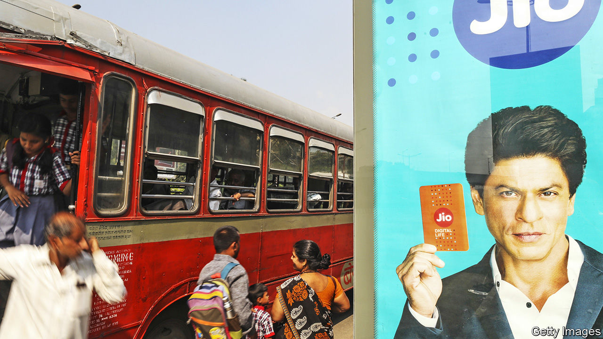
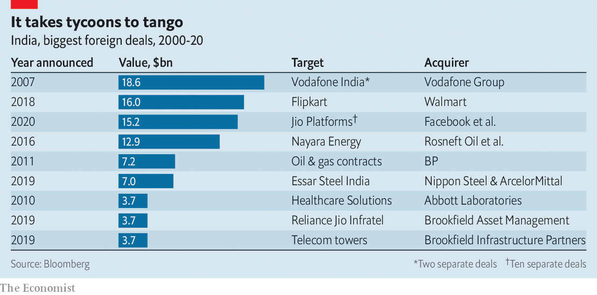
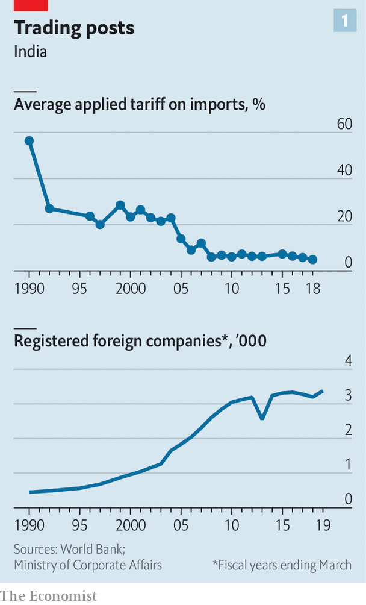
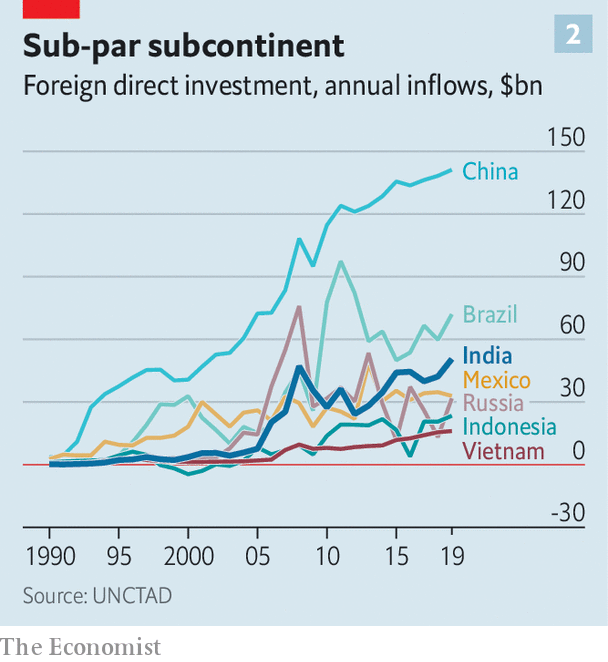

## Groupthink

# India Inc’s inward turn

> Foreign investors are rediscovering that the road to riches in India runs through powerful local partners

> Jul 4th 2020DELHI AND NEW YORK

FACEBOOK WAS first to open its wallet. In April the social network said it would spend $5.7bn on a 9.9% stake in Jio Platforms, the digital arm of Reliance Industries, India’s biggest firm. The investment was followed in short order by nine other entities, including global private-equity (PE) giants such as KKR, as well as Saudi and Emirati sovereign-wealth funds. Collectively, this year foreigners have poured or pledged to pour $15.2bn into Jio. That would give them a combined stake of 25%. Microsoft is rumoured to be next in line.

For Reliance, the bonanza is a way to manage the huge debts it has taken out to bankroll Jio’s vaulting ambitions. For the foreigners, the appeal rests in part on its promise to tap into India’s underserved legions of digital consumers. Since its launch in 2016 Jio has become the country’s pre-eminent technology platform, with nearly 400m mobile subscribers, a broadband network, as well as entertainment, retail and finance businesses.

The investments were hailed by the local press and security analysts as an endorsement of a new digital champion—and of India itself. A recent flurry of dealmaking seems to corroborate this rosy view (see table). In February the Adani Group, another conglomerate, completed a $450m sale of 25% of its Mumbai power operations to Qatar’s government and received a $900m investment in a 37% stake in its gas operations by Total, a French oil giant. Talk of more deals abounds, notably one possibly involving Lockheed Martin that could enable the local production of jets for India’s air force at a time of rising tensions with China. (In May Chinese soldiers engaged in a brief but deadly skirmish with Indian border forces.)

Look closer, though, and the apparent thumbs-up from foreign investors is not quite what it seems. After years of trying to make it on their own with mixed results, some foreigners appear to have concluded that getting ahead in India requires a powerful local partner. Mukesh Ambani, Reliance’s boss and India’s richest man, or Gautam Adani, the industrialist behind Adani Group, fit the bill to a tee.

In recent months this vision of India as a place where foreign money may be welcome but foreign competition is not has been more volubly embraced by the government of Narendra Modi. In a speech in May about India’s response to covid-19, which has hit India particularly hard, the prime minister referred to “self-reliance” 17 times. “We must”, he summed up, “make the Local the mantra of our life.”

That is a long way from the pro-business, investor-friendly posture which first got Mr Modi elected in 2014. But to seasoned observers of India Inc it shares some parallels with a more insular past.

After independence from Britain in 1947 the main way for most outsiders to partake in India’s economy was through joint ventures with domestic partners or some other form of local ownership. Some Indian partners were chosen on the basis of access to the levers of power rather than managerial acuity. India’s largest carmaker, Maruti Suzuki, created in 1982, was the brainchild of Sanjay Gandhi. His mother, Indira, was prime minister at the time. The Gandhis took care of the politics; Suzuki of Japan brought the cash and built the cars.

Things began to change after 1991, when India emerged from decades of self-imposed isolation and interventionism of the so-called “Licence Raj”. A series of liberalising governments cut tariffs and opened industries up to competition (see chart 1). But many stifling rules remained in place. Some were newly imposed. Shops were limited to a certain size and certain prices, for instance of drugs, remained controlled. By 2001 so many multinationals in industries from petrol (Caltex) to pharmaceuticals (Astra, Roche, Rhône-Poulenc) were once again fleeing red tape and other foibles that the Times of India, a leading daily, bewailed “second Quit India movement”.

In the 2000s a new generation of firms had another go at conquering the Indian market. Foreign direct investment poured in (see chart 2). Marks & Spencer, a British retailer, plotted its entry in 2001, followed by Starbucks in 2007. Both have since allied with local powerhouses (Reliance and Tata, another conglomerate, respectively).

The dilemma lives on. Last year Ford announced that it would become a minority shareholder in a carmaking joint venture with Mahindra, a large industrial group. Firms that have resisted such tie-ups can struggle. General Motors threw in the towel in 2019, as part of a shift to focus on its American and European operations. Amazon, which has ploughed $6.5bn into its Indian operations, has yet to make money in the country. Walmart’s $16bn purchase in 2018 of a controlling stake in Flipkart, an Indian e-commerce firm, has been similarly hard work. As foreign entities, Amazon and Walmart must contend with a tax on transactions, limits on the size of their inventory and on sales of their own brands, as well as frequent visits from competition authorities.

A popular alternative is to operate a listed Indian subsidiary, like Suzuki or a number of big Western corporations, from consumer-goods titans (Unilever, ColgatePalmolive and Nestlé) to industrial giants (Bosch and Siemens). Even that does not guarantee peace of mind, however. After a protracted legal battle with India’s taxman, first over a capital-gains levy related to its $11bn purchase of an Indian mobile business, then over allegedly unpaid fees related to its spectrum rights, Vodafone Idea, India’s third-largest wireless carrier, was ordered by a court to pay $6.8bn in back taxes and fees. In an epic tale of value-destruction, the company now teeters on the brink of bankruptcy, weighing on Vodafone Group, its British corporate parent.

The contrast with Jio is stark. The Indian champion has managed to snap up mobile spectrum at low prices and extend promotional rates. Given Facebook’s fruitless efforts to gain regulatory approval for a payment feature in its ubiquitous WhatsApp messaging service, the social network may have quite reasonably decided that teaming up with Jio is a better bet.

Perhaps the best that can be said of the revival of collaborations between Western and Indian firms is that the deals are happening at all. Chinese companies face tougher times. Even before the latest border flare-up Mr Modi had made it clear China is less welcome. In April his government issued a rule subjecting “opportunistic takeovers” of Indian companies by “any entity of a country which shares land border with India” to a special review. India’s other, poorer neighbours—Bangladesh, Bhutan, Myanmar, Nepal and Pakistan—are unlikely to be the rule’s main target. On June 29th Delhi banned 59 mobile apps including TikTok, a hit Chinese-owned short-video platform (see [article](https://www.economist.com//asia/2020/07/02/indias-ban-on-tiktok-deprives-the-country-of-a-favourite-pastime)). Media reports warn of impending restrictions on 1,172 items, from toasters to lifts, made in whole or part in China.

Time will tell if Western investors’ latest dalliances of convenience pay off. The lot of Reliance businesses’ partners has not always been easy. India’s securities regulator has ordered Reliance Industries to compensate minority shareholders in Reliance Petroleum, an affiliate for a series of transactions between the two entities that, the regulator says, disadvantaged the outside investors. The case is pending. Reliance Industries denies any wrongdoing.

As good as Jio looks on paper, it must still show it has what it takes to run a modern tech behemoth. Ventures such as Jiomart (e-commerce) and JioMoney (finance) have yet to live up to the hype. Until they do, Jio’s nationality may remain its chief attraction.■

## URL

https://www.economist.com/business/2020/07/04/india-incs-inward-turn
