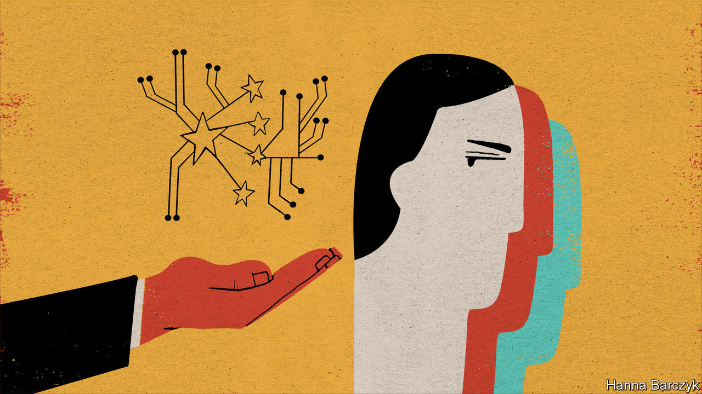

## Chaguan

# The West cannot force China to read its interests differently

> But democracies can work together to build defences against China’s predatory behaviour

> Jul 2nd 2020

IN RECENT DAYS, as China prepared to turn Hong Kong into a cowed simulacrum of a world city—a shiny stage-set of modernity, run from the shadows by the mainland’s hard men—Chaguan asked Western envoys in Beijing how their countries might respond. Several chose to hear and answer a different question, namely, how might their government make China change course?

Be realistic, such diplomats sighed. China will impose this national-security law on Hong Kong. What would you have us do? Other well-placed foreigners in China are still more fatalistic about the West’s ability to influence China. That is true whether they are being asked about repression in Hong Kong or about Xinjiang, the far-western region that China has turned into a police state. It is shocking enough that over 1m members of Xinjiang’s mostly Muslim Uighur minority have been locked in re-education camps in recent years, suspected of extremism for praying or even wearing beards. On June 30th the Associated Press reported on an official campaign to force abortions and sterilisations on Uighur women, causing birth rates to plunge 24% in Xinjiang last year. Ask Westerners in Beijing about such painful subjects, and they cite forecasts that in coming years China will account for 30% of global economic growth. In a pandemic-induced recession, when millions of workers are losing their jobs, they reason, what government will sacrifice livelihoods on the altar of Hong Kong’s freedoms or Chinese human rights?

That maximalist framing of the China debate—pretending that any criticism of Chinese actions amounts to a futile call for changing China’s worldview, or even its political system—is in reality a cop-out, a convenient way to rationalise impotence. Chinese officials try a similar trick. They have spent decades accusing the West of plotting regime change, whenever democratic leaders object to any Chinese action. Actually, far from trying to contain China, for 40 years Americans and Europeans ignored endless provocations and broken promises in the hope that as the country grew richer it would open, and be more willing to co-operate on tackling climate change, nuclear non-proliferation or other global public goods.

Now America has a president, Donald Trump, who shows no interest in Chinese repression and scorns global goods, but whose administration does include true China hawks who regard Communist Party rule as inherently immoral. That has led to policies of unprecedented toughness, delivered with never-seen-before incoherence. Mr Trump mostly wants China to buy more American stuff, notably farm goods grown by Trump voters. To prise open Chinese wallets, Mr Trump has imposed punitive tariffs on Chinese goods and allowed hawkish underlings to enact offensive policies aimed at constraining China’s rise. America has banned exports of semiconductors and other sensitive goods to China, and formally declared such technology giants as Huawei to be a threat to national security. Visas for Chinese students and journalists have been limited and sanctions promised on Chinese officials responsible for abuses in Hong Kong and Xinjiang.

Bluster from Trump administration hawks, undercut by a president who cares little for principles, did nothing to slow China’s rush to impose authoritarian rule by law on Hong Kong. Fatalistic Westerners may feel vindicated, muttering that nothing can be done to change China’s ways. But changing China is not the only marker of success. A new paper by François Godemont of the Institut Montaigne in Paris describes Europe and America’s poor record of agreeing on, let alone imposing, policies that force China to do things. Mr Godemont is pitilessly clear-eyed about how China has fobbed Europe off with unkept promises and empty dialogues.

Yet if Europe is bad at offensive moves, it is doing better at defence. No player matters more than Germany. It accounts for almost 43% of the European Union’s exports to China, and is duly wary of confrontation (German officials shun EU language calling China a “systemic rival”). Still, Germany has joined EU institutions, France and others in tightening investment rules to shield covid-battered tech firms from being snapped up. New EU rules on procurement and scientific co-operation stress transparency and the protection of intellectual property. The European Commission is to ask EU countries to approve curbs on foreign subsidies. Such defences against Chinese predations give the EU leverage.

A second reason to eschew fatalism is that next year America may have a new president, Joe Biden, committed to repairing transatlantic relations. Though Mr Biden spent years engaging with China, as a senator and vice-president, America has changed. Both parties see China as a strategic competitor. Highlighting their differences with Mr Trump, Democrats are keen to challenge autocrats and speak up for political freedoms.

Shared concerns about China could be a catalyst for renewed transatlantic co-operation, argues a new paper, “Dealing with the Dragon, China as a Transatlantic Challenge”, produced by the Asia Society Centre on US-China relations, the Bertelsmann Foundation in Germany and George Washington University. Differences remain. Broadly, Europeans see China’s rise as an economic threat, while Americans see a national-security challenge. Europeans are wary of offensive policies like export controls on high-tech goods. The Trump era has left a legacy of deep distrust. Still, the paper notes, America and Europe would gain by co-ordinating defences. A joint agenda could include sharing intelligence about cyber-security, Chinese investments and technological standard-setting, as well as about tireless Chinese attempts to co-opt or control international organisations, from the UN to the Arctic Council.

China is convinced that its interests are served by iron-fisted repression at home and bullying abroad. The West will not browbeat China into reading its interests differently. But democracies can build joint defences. That is already a worthy goal.■

## URL

https://www.economist.com/china/2020/07/02/the-west-cannot-force-china-to-read-its-interests-differently
