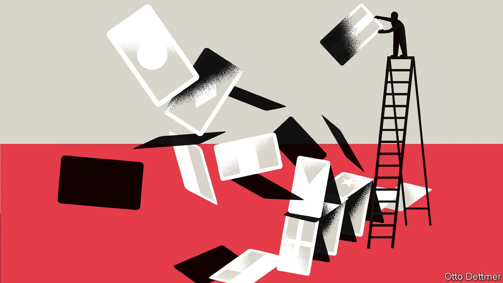
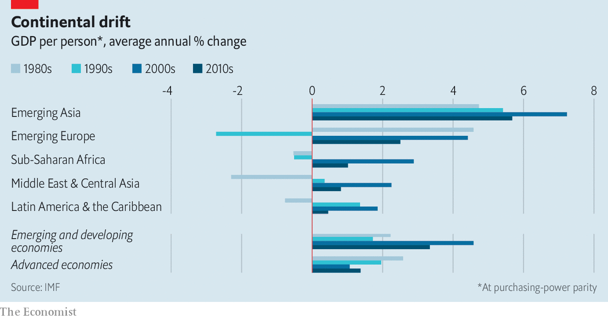

## Free exchange

# A Latin American economic tragedy

> The region’s latest woes fit a long-standing pattern

> Jul 2nd 2020

Editor’s note: Some of our covid-19 coverage is free for readers of The Economist Today, our daily [newsletter](https://www.economist.com/https://my.economist.com/user#newsletter). For more stories and our pandemic tracker, see our [coronavirus hub](https://www.economist.com//news/2020/03/11/the-economists-coverage-of-the-coronavirus)

WHERE COVID-19 strikes, it reveals hard truths. In recent weeks Latin America has become the centre of the pandemic, responsible for over half of daily deaths. The region’s acute health crisis is accompanied by an economic decline unrivalled in the developing world. The IMF forecasts that output in the region will shrink by 9.4% in 2020, more than three times the contraction of 3% projected for emerging economies as a whole. The economic and social devastation wreaked by the pandemic is all the more painful for coming on the heels of two underwhelming decades. Investors had waxed enthusiastic about Latin America’s prospects during the great emerging-market boom of the 2000s and the 2010s, only to be disappointed. The few gains that were made seem almost certain to be reversed.

The economies of Latin America are far from homogeneous. Many share characteristics, however, that have conspired to make the region among the hardest hit in the world. In some places lockdowns have been stringent: Peru, for example, took the extraordinary step of closing its mines, the foundation of its economy, contributing to the IMF’s grim forecast of a decline in output of 14% this year. But big and dense cities, with high rates of poverty and substantial segments of the population in informal work, have limited the effectiveness of lockdowns. The large informal sector, together with weak state capacity, has also undermined the reach of government relief and exacerbated the economic collapse. Populist blowhards with little time for experts govern the region’s biggest economies, compounding its problems.

The bleakness of 2020 in Latin America also owes much to the condition of its economies before the coronavirus spread. Many limped into the new decade. Growth across the continent—even excluding Venezuela, whose economy collapsed catastrophically in recent years—was just 1.8% in 2018 and 0.8% in 2019. By the start of this year, Argentina and Mexico were already in recession; many other countries were stagnating—including Brazil, which enjoyed only the briefest of respites after a serious political and economic crisis in 2015 and 2016.

These woes fit a longer-running pattern of Latin America falling behind. The turn of the millennium marked the start of a great surge in the fortunes of the emerging world, and a departure from the usual state of affairs, in which poorer countries only rarely caught up to rich-world incomes in sustained fashion. Trade grew explosively, commodity prices boomed and the developing world asserted itself more confidently on the world stage. In the 2000s real output per person across the emerging world (on a purchasing-power-parity basis) rose at an astonishing clip of 4.6% per year, or four times the pace achieved by rich economies. The great gaps in income between advanced countries and the rest that opened during the 20th century seemed destined to narrow and close in the 21st.

Latin America, however, proved a laggard. It managed an average growth rate in real per person incomes of just 1.9% in the 2000s: faster than in rich economies but the lowest of the emerging world (see chart). In the 2010s growth in the region ground to a near-halt, at just 0.5% per year, behind both the emerging-country average and the rich world. Latin America’s relatively high incomes—its larger economies are nearly all middle-income—may have contributed to slower growth: the richer you are, the less scope to grow by borrowing established technologies from other places. Its isolation mattered, too. The fastest growing emerging economies of the era were industrialising countries in Europe and Asia, which could latch on to the manufacturing supply chains of advanced neighbours. Few Latin American economies, apart from Mexico, enjoyed similar opportunities. And although the quality of governance—and of macroeconomic policy in particular—has improved markedly since the debt crises and inflations of the 1980s and 1990s, corruption, crime and volatile politics have made Latin America a less hospitable place for investors than it might have been.

Latin America has averted a debt crisis—so far. The Federal Reserve dollar-swap lines enjoyed by Mexico and Brazil have shielded them against troubles sparked by dollar shortages. IMF credit lines available to Chile, Colombia, Mexico and Peru have eased market pressure on the region. Central banks have been able to cut interest rates to provide something of a cushion against the pandemic’s economic damage, without provoking capital flight.

Still, there is no escaping the fact that even the healthiest of Latin American economies faces a punishing road back to normality. The IMF’s forecasts for growth in 2021 are decidedly tepid: GDP in the region is expected to expand by 3.7% next year, compared with 5.9% for the emerging world as a whole. Unless the growth in covid-19 infections falls rapidly, even those meagre projections will prove too optimistic. The reduction in inequality and poverty that was achieved in the past two decades is now at risk. The World Bank warns that poverty in the region could rise by as much as 23m this year. Government policy seems unlikely to alleviate these hardships. Mass protests erupted in Bolivia, Chile, Colombia and Ecuador last year. Political systems may be strained further.

It matters too that Latin America’s three largest economies are among its most troubled. Argentina has defaulted on its debt—again—and faces a risk of runaway inflation. Brazil’s epidemic rivals America’s as the worst in the world; it may need help from the IMF to avoid a debt crisis, or turn instead to inflationary finance. Mexico suffers from threats to the rule of law, a president seemingly determined to scare off private investment, and an unpredictable northern neighbour, which is also its biggest export market.

For Latin America covid-19 is a double shock: a brutally painful tragedy in its own right, and the definitive end of a growth opportunity that the region largely failed to exploit. The future of its economies and its societies depends on whether Latin Americans can be persuaded that there will be other chances in the future—and that next time its governments will do more to seize them. ■