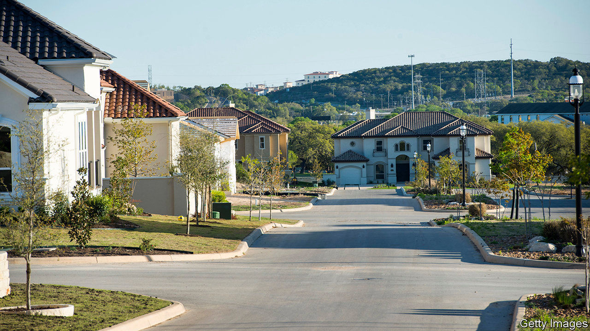

## The house wins

# America’s housing market is so far unfazed by recession

> The property market seems strangely oblivious to the economic carnage around it

> Jul 2nd 2020

AMERICA’S HOUSING market is behaving oddly. Residential property—worth $35trn, slightly more than America’s stockmarket—seems strangely oblivious to the economic carnage around it. House prices in May were 4.3% higher than a year earlier. That rate of growth is only marginally below the average since the end of the housing crash a decade ago. Prices in even the costliest places, such as San Francisco, where the average pad sets you back $1.1m, continue to march upwards. Many economists still expect house prices to fall over the whole of 2020—but such forecasts are looking increasingly shaky.

At first glance this is surprising. House prices typically nosedive during recessions. A rising number of mortgage defaults leads to more properties being put up for sale. Falling household incomes reduce buyers’ purchasing power. In the recession of the early 1990s house prices dropped by 10% in real terms; they fell by three times that in the downturn that followed the financial crisis of 2007-09. The fall in GDP associated with the coronavirus pandemic, and the rise in unemployment, is unprecedented. Despite that, there is little sign so far that America’s housing market is about to subside.

The rate of foreclosures looks unlikely to reach the heights hit during the last recession. Housing debt, relative to incomes, is lower. The share of mortgages lent to borrowers with very low credit scores is less than half what it was in 2007, in part a consequence of tighter financial regulation. Meanwhile, fiscal help has come a lot faster than it did a decade ago.

During the last crash, schemes to help homeowners did not arrive until millions of families had already seen loans foreclosed. This time the government’s stimulus package has made requesting up to a year’s pause in mortgage payments easier: homeowners can get this without having to do very much to prove they need it. All that casts a different light on the apparently alarming increase in the share of mortgages on payment holidays, from practically zero just before the pandemic to close to 10% in May. Analysts at Capital Economics, a consultancy, reckon that many requests for forbearance have been made by borrowers who are in fact able to keep up their mortgage payments, but are “requesting assistance...as an insurance policy”.

Cash handouts from the government have also been generous—so much so that, in stark contrast to the usual declines seen during recessions, Americans’ aggregate household income is forecast to rise in 2020 by about as much as it did in 2019. That will help borrowers keep up with their mortgage payments. Indeed, a fifth of Americans receiving a stimulus cheque from the federal government have put it towards their mortgage. Looser monetary policy has also helped. Since the beginning of the year the interest rate on 30-year mortgages has fallen by about half a percentage point, to an all-time low of just over 3%. Mortgage companies are overrun with applications from people seeking to refinance. House-hunters, including those seeking to escape city centres after the pandemic, can now afford more expensive properties. As lockdowns were lifted, pent-up demand for housing led to a 20% year-on-year rise in mortgage applications in June.

What happens to the housing market next depends on the evolution of the covid-19 outbreak and, in turn, that of the overall economy. Yet when the fog does eventually clear, a period of even stronger price growth might not be a surprise. A raft of academic evidence draws a strong link between loose monetary policy and bubbly housing markets. Other researchers noted before the pandemic that the supply of new housing in America was failing to keep up with demand—owing in part to increasingly complex land regulations and reduced competition in house-building. Social-distancing requirements are also likely to hold construction back in the coming months. With supply constrained and demand boosted, house prices seem to rest on solid foundations. ■

Editor’s note: Some of our covid-19 coverage is free for readers of The Economist Today, our daily [newsletter](https://www.economist.com/https://my.economist.com/user#newsletter). For more stories and our pandemic tracker, see our [coronavirus hub](https://www.economist.com//news/2020/03/11/the-economists-coverage-of-the-coronavirus)

## URL

https://www.economist.com/finance-and-economics/2020/07/02/americas-housing-market-is-so-far-unfazed-by-recession
