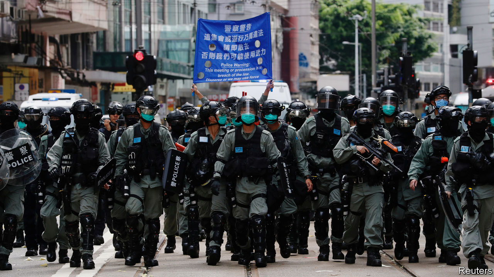

## A harbour no more

# China’s draconian security law for Hong Kong buries one country, two systems

> The regime in Beijing would rather be feared than admired

> Jul 2nd 2020

THE CHINESE government is spreading fear in Hong Kong. The first shock came in May, when it announced plans to impose a sweeping national-security law on the territory, without the say-so of its legislature. Then it drafted the bill behind closed doors, keeping details secret even from Hong Kong’s administration. After the law was passed on June 30th by China’s rubber-stamp parliament, hours passed before it was published at close to midnight. The 18-page bill, which took effect that day, was harsher than the gloomiest analysts had predicted. It is one of the biggest assaults on a liberal society since the second world war (see [article](https://www.economist.com//china/2020/07/02/a-new-national-security-bill-to-intimidate-hong-kong)).

Chinese officials argue that they are doing nothing wrong: national-security laws are common around the world, even in democracies. But that is disingenuous. This one allows China’s Communist Party to rip up its promise of one country, two systems and send its secret agents into Hong Kong to impose order as it pleases. Its spooks will not be subject to local law. Most national-security cases, supposedly, will be tried in Hong Kong’s own courts. But the judges will be government-appointed. They will be allowed to dispense with juries and try cases in secret. Most worrying is that “complex” or “serious” crimes may be tried on the mainland. The past year of unrest in Hong Kong was sparked by fears of just such a possibility—that a now-shelved extradition law might let dissidents be whisked away to face the mainland’s brutal justice. That is what the new law allows. Officials do not rule out that those convicted by mainland courts could be executed.

But wait, surely this law is about crimes that threaten China’s security? Lambasting its authoritarian politics or quixotically suggesting that Hong Kong should be independent would hardly cause the ground to shake in Beijing. The party, however, takes a different view. The bill’s definitions of sedition, subversion, terrorism and collusion with foreign powers could be applied even to petty, non-violent activity. The first arrest under the new law, on July 1st, was of a man who was merely carrying a banner calling for an independent Hong Kong. The bill could be invoked to arrest someone who uses “unlawful means” to undermine China’s communist system. Could that include taking part in a banned rally commemorating the Tiananmen Square protests of 1989? The party will be the judge. It errs on the side of severity.

The law also applies to activities abroad, by anyone. The wording of the bill suggests that a foreign firm which co-operated with, say, the American government in applying sanctions on China would have no defence if the party moved against it.

The world is entitled to be shocked by these developments, but not surprised. The crushing of the Tiananmen protests showed the party’s ruthless determination to destroy opposition no matter what the cost to its global reputation. The world’s horror at that bloodshed, and the sanctions the West imposed on China in 1989, did not change the party’s views. And China was a minnow back then, its economy smaller than Spain’s. It is even less likely to pay heed to foreign critics today.

But the West must respond. Britain was right to say on July 1st that it would make it easier for about 3m holders of “British national overseas” passports in Hong Kong to settle in Britain and eventually qualify for citizenship (see [article](https://www.economist.com//britain/2020/07/02/britain-gives-3m-hong-kongers-the-right-to-live-and-work)). America should impose sanctions on Chinese officials who violate human rights in Hong Kong. It would be more effective if it abandoned its go-it-alone approach to foreign affairs and worked with other democracies to resist China’s efforts to subvert global human rights (see [article](https://www.economist.com//china/2020/07/02/the-west-cannot-force-china-to-read-its-interests-differently)).

Hong Kong’s suffering holds a lesson for the world. China’s rulers cannot be trusted to keep their promises and they will stop at nothing to suppress dissent. This calls for heightened vigilance about China’s rise, especially as it affects Taiwan. The party has shown that it would rather be feared than admired. ■