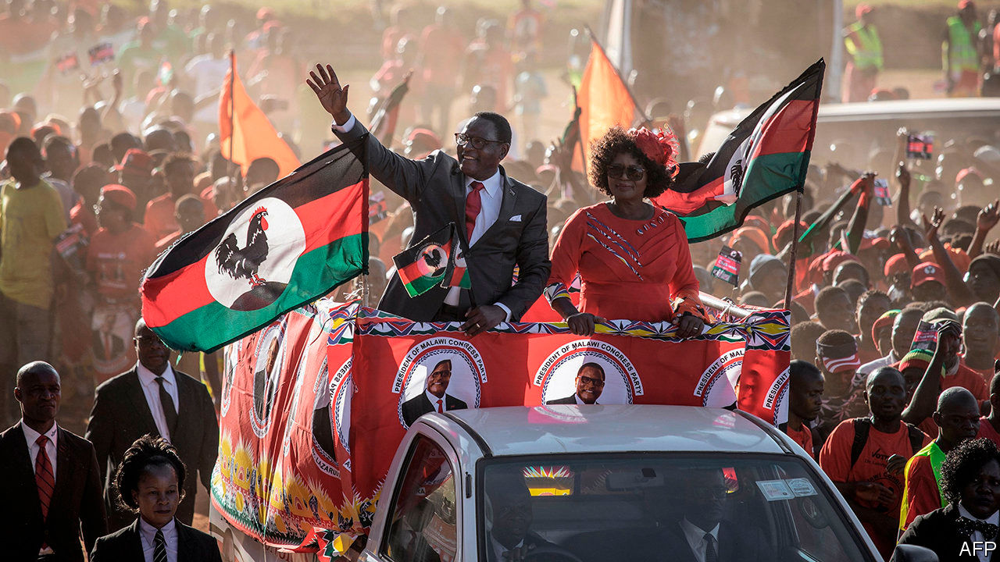

## Second time lucky

# Malawi’s re-run election is a victory for democracy

> Brave judges, a feisty press and plucky civil society boost a hopeful trend in Africa

> Jul 2nd 2020JOHANNESBURG

THERE IS A blueprint for presidents keen to rig elections. First, use state resources to bribe, fool and bully people before the poll. Once voting starts, stuff the ballot boxes or fiddle the tallies. Afterwards, make sure the army and judges are on your side in case opponents take their case to the streets or to the courts.

When Peter Mutharika, the incumbent, was declared the winner of Malawi’s presidential election in May 2019, it seemed a textbook case of rigging. Voting sheets had been altered with Tipp-Ex, a correction fluid. International observers complained only half-heartedly. But Malawians fought back. Activists organised peaceful protests. Opposition parties went to the Constitutional Court. In February its judges, apparently after turning down bribes, granted a re-run, which was held on June 23rd.

The result, announced on June 27th, was a victory for Lazarus Chakwera of the Malawi Congress Party (MCP) and his opposition alliance. He won 59% of the 4.4m votes cast; Mr Mutharika took just 40%. The margin of defeat was such that the now former president had no grounds to question the outcome.

Lazarus is a deliciously appropriate name for a politician whose career seemed to have died a year ago. It also marks his religiosity, since his father, a subsistence farmer who had already seen two sons perish in infancy, named the future president after a man whom Jesus is said to have raised from the dead. Mr Chakwera became a theologian, leading the Malawian branch of the Assemblies of God church, part of a global Pentecostal network. In 2013 he swapped the cloth for the campaign trail. He became head of the MCP, which had struggled to shake off its legacy as the political vehicle of Hastings Banda, the dictator who ruled Malawi from 1964 to 1994.

Malawi is one of the most devout countries in Africa. Fully 81% of Malawians say they trust religious leaders, compared with an average of 69% in the 34 countries recently surveyed by Afrobarometer, a pan-African pollster. That made it easier for Mr Chakwera to present himself as a clean alternative to Mr Mutharika, whose regime was widely seen as filthy.

It will, however, take more than preaching to improve Malawians’ lot. Mr Chakwera has promised 1m new jobs and a universal subsidy for fertiliser—a tempting pledge in a mostly agrarian economy. But it will be hard to pay for these promises. The country is one of the poorest in the world: 70% of its people live on less than $1.90 a day (at purchasing-power parity). Many public services depend on foreign aid. GDP per person is forecast to fall this year and next, thanks to covid-19.

In any event, Malawi deserves to savour its victory. It has shown the importance of strong institutions in fragile democracies. Independent judges, a vibrant civil society, a feisty press, a strong parliament—they all make it harder for a dodgy incumbent to cling to power. Their steady if uneven rise across the continent is one reason why there have been 32 peaceful changes of power in Africa since 2015—and why 19 of these have involved an incumbent having to stand aside. Malawi is a sign that African politics is becoming more competitive. And politicians and parties that have to compete have more of an incentive to deliver improvements to voters’ lives, in Africa as anywhere else. ■

## URL

https://www.economist.com/middle-east-and-africa/2020/07/02/malawis-re-run-election-is-a-victory-for-democracy
