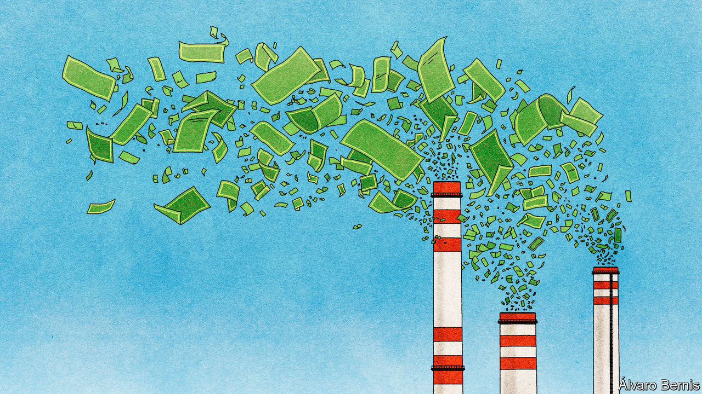
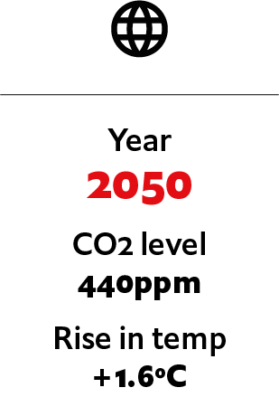

## If carbon removal became the new Big Oil

# What if carbon removal becomes the new Big Oil?

> One giant industry emerges as another declines. An imagined scenario from 2050

> Jul 4th 2020

Editor’s note: Each of these climate-change articles is fiction, but grounded in historical fact and real science. The year, concentration of carbon dioxide and average temperature rise (above pre-industrial average) are shown for each one. The scenarios do not present a unified narrative but are set in different worlds, with a range of climate sensitivities, on different emissions pathways

IT IS HARD to envisage now, but the Permian basin in Texas and New Mexico used to be America’s biggest source of crude oil. At its peak it accounted for more than half of national production. Today the steel pumpjacks have been replaced by direct-air capture (DAC) units. Powered by the sun, the machines suck carbon dioxide from the atmosphere and pump it into the sedimentary rock formations below. There is an elegant symmetry in the way the carbon is being pumped back into the ground. Big Oil has given way to Big Suck.

The transformation of the Permian region illustrates an industrial shift that began in the early 2020s. The once-mighty oil industry, in its old form, has withered. From its husk a thriving new industry has emerged. Carbon-removal firms now number among the world’s biggest. Alongside big cuts in emissions, their technology has helped stabilise the climate and reduce emissions to net-zero. The atmospheric concentration of carbon dioxide is even beginning to drop as carbon-removal efforts are expanded. At the same time, the industry has reshaped geopolitics—and is creating its own set of environmental impacts.

The trouble for Big Oil started in 2014, when booming American production helped spur a plunge in prices. The covid-19 pandemic of 2020 triggered a short, sharp contraction in demand. Longer-term decline was unavoidable. Internal combustion engines in road vehicles, which made up more than two-fifths of oil use in 2020, were starting to give way to electric motors. Further pressure came from the rise in carbon taxes, as governments, cash-strapped after covid-19 bail-outs, sought new streams of revenue. The oil-price spike of the late 2020s simply reinforced the trend towards other forms of energy.

Firms that built the kit used in oil production, such as refineries and pipelines, were the first to go bust as investments in new assets ground to a halt. Next up were companies that struggled to divest themselves of pricey oilfields. As oil-producing firms fought for survival, one strategy was consolidation through mergers. In the end, some supermajors ran down their reserves, halted oil investment and were run for cash. By contrast, national oil companies with low production costs, such as Saudi Aramco, kept pumping. But the most innovative giants, sensing an existential threat, realised that if they were to continue supplying oil and gas, they would need to capture and store the carbon emissions they produced, too.

By the late 2020s, two methods had emerged as the most effective ways to do this. One was DAC, which involves trapping carbon dioxide from the atmosphere by sucking air through an absorbent material. The other was “bioenergy with carbon capture and storage” (BECCS), where the absorption is done by trees and crops as they grow. That biomass is then burned for energy and the resulting carbon dioxide is captured. Either way, it is stored underground, permanently removing it from the atmosphere.

Before it was brought into being, carbon-capture technology was assumed to be very expensive—one early study of DAC suggested costs of $600 a tonne or more. When entrepreneurial start-ups tried it out in the early 2020s, though, it came in at about a third of that. The costs of BECCS were never as high, because capturing carbon dioxide from a power-station chimney, where the concentration is about 10%, is inherently more efficient that capturing it from ambient air, where the concentration is just 0.045%. That said, cost estimates for BECCS were—and to some extent remain—vexed by the question of how to account for the opportunity cost of the vast plantations it requires.

Oil companies already had expertise in putting fluids back underground as well as taking them out: it is how fracking is done. They also had experience in mounting operations on truly large scales—which, when applied to carbon-capture, brought costs down yet further. Increasing the size of an industry by a factor of 50, as happened in the 2020s, gets you a lot of learning by doing. Most important, carbon removal allowed them to continue pumping oil. Their new business model was selling fuels in markets in which there was no feasible alternative, such as long-haul air travel, at “net-zero” prices which included the certified capture of an amount of carbon equivalent to that given off by the fuel’s combustion. It was called “carbon leasing”: the oil company lent the customer fresh new carbon and took old, used carbon back in return.

International politics helped. At the COP27 climate conference, in 2022, world leaders finally managed to agree on the creation of an international carbon market in which carbon-removal credits could be traded. This let companies sell removal capacity they did not need for carbon-leasing deals and buy spare capacity when their removal systems let them down. At the same time, the Organisation for Carbon Accounting (OCA), a global monitoring body, was spun out of the Intergovernmental Panel on Climate Change. Its real-time audits of carbon-removal facilities gave the industry credibility.

The astonishingly rapid scale-up in production—outpacing the construction of railways or power grids in previous eras—was due in part to smart industrial design. Equipment for DAC was tailored to existing industrial know-how: that used in car plants, gas-turbine factories, and mining and water-treatment. The BECCS industry, for its part, got a boost from genetic modification, in the form of new strains of trees and crops that absorb more carbon dioxide as they grow. The giant carbon-removal utilities which emerged now pull around ten gigatonnes of carbon dioxide out of the skies each year; along with their carbon-leasing businesses and the electricity generated by their BECCS plants, that gives carbon-removal companies a collective turnover of more than $1trn.

The emergence of this new industry has had far-reaching ramifications, as some locations are better suited to carbon removal than others. Three conditions are needed: storage, space and low-cost power. Storage was the easiest to crack. Many countries have locations suitable for burying carbon dioxide, such as sedimentary or basaltic rock formations. For DAC a more important factor was the continuous availability of cheap energy. In some cases this meant building DAC plants by geothermal power stations, such as in Iceland. But most large-scale DAC facilities depend on solar power, the cheapest energy source.

DAC plants also need a lot of space. An early estimate, made in 2019 by Howard J. Herzog of the Massachusetts Institute of Technology, was that removing 1m tonnes of carbon dioxide a year from the air would require a facility ten metres high, 3-5 metres wide and 5km long. The technology has become more compact since then, but it is still land-hungry. So today most DAC plants are in deserts, where sun and space are plentiful. North Africa is one hotspot, along with Australia and America’s southern states. Space is needed to grow fuel for BECCS too, as are weather conditions ripe for growing biomass. Countries in the tropics, notably Indonesia and Tanzania, emerged as big BECCS hubs.

All this has tilted the scales of geopolitics. Some oil-rich countries, such as Venezuela, have suffered, as oil that is costly and dirty to extract remains below ground. China established a national giant, Sinodac, and solidified its role as the world’s manufacturing hub for batteries and solar panels. Other countries, such as Brazil, Indonesia and Tanzania, gained political clout as their carbon-removal sectors boomed.

Carbon removal affected the corporate world, too. Even though the planet has now achieved net-zero emissions, individual companies still emit carbon dioxide and buy carbon credits, in the form of negative emissions, from carbon-removal firms. Unexpected price increases can hit profits in the still-carbonised sectors. That was the case in 2047 when a forest fire near a BECCS plant in Kalimantan, Indonesia’s slice of Borneo, destroyed a huge number of trees, which act like temporary storage units for carbon dioxide until it is captured at a BECCS plant. The resulting release of carbon dioxide made a big dent in the world’s carbonremoval capacity. Prices shot up and some companies were badly stung (at least those that had failed to hedge in the removals futures market). DeltaAmericanBlueCircle went bankrupt.

The removal industry also finds itself under close scrutiny from environmental groups. One concern is just how securely carbon dioxide is stored underground. The role of the industry in the Memphis earthquake of 2042 remains hotly contested. Carbonremoval bosses dismiss these criticisms as nitpicking. Now that the climate has stabilised, they grumble, some environmental NGOs are overstaffed, overfunded and have little else to do.

A larger headache for bosses is navigating the long-term future of their industry. Large-scale carbon removal will be needed for a few decades yet, after world leaders pledged at COP50 in 2045 to bring atmospheric carbon-dioxide levels down further. But no agreement has been made as to how far. If and when governments agree they are happy for the concentration of carbon-dioxide to remain stable, the growth of the carbonremovals industry will stall and may go into reverse.

One route for expansion is cannibalisation. Rivalry between the BECCS and DAC camps is growing. Both are spending more on marketing and lobbyists. They want to persuade consumers and politicians that their technology is superior, and that humanity’s aim should be to return the atmosphere to pre-industrial levels of carbon dioxide. Despite these efforts, analysts expect the sector to shrink and consolidate in the coming years. That may favour the largest carbon-removal outfits, several of which are also oil producers. The very firms that prospered by taking carbon out of the ground may profit the most from putting it back. ■

For more coverage of climate change, register for The Climate Issue, our fortnightly [newsletter](https://www.economist.com//theclimateissue/), or visit our [climate-change hub](https://www.economist.com//news/2020/04/24/the-economists-coverage-of-climate-change)

## URL

https://www.economist.com/the-world-if/2020/07/04/what-if-carbon-removal-becomes-the-new-big-oil
