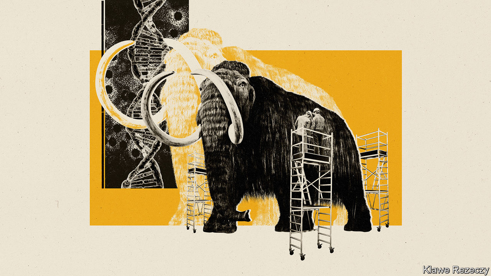

## If mammoths were recreated

# What if mammoths are brought back from extinction?

> Could recreating mammoths help curb global warming?

> Jul 4th 2020

Editor’s note: Each of these climate-change articles is fiction, but grounded in historical fact and real science. The year, concentration of carbon dioxide and average temperature rise (above pre-industrial average) are shown for each one. The scenarios do not present a unified narrative but are set in different worlds, with a range of climate sensitivities, on different emissions pathways

IN THE LATE 1980s Michael Crichton, a novelist and filmmaker, had a lucrative idea. He picked up on the work of Allan Wilson, a geneticist at the University of California, Berkeley, and let his imagination run riot. Wilson had extracted DNA from an extinct type of zebra called a quagga. The DNA in question was fragmented, and the extinction of the quagga only a century in the past, but that did not matter. Crichton speculated about recovering far older DNA than the quagga’s by looking in the guts of bloodsucking insects preserved in amber that had formed millions of years ago, during the age of the dinosaurs. If the insects had been feasting on dinosaurs, he mused, they might have preserved those creatures’ DNA. And if you have something’s DNA you could, perhaps, recreate it. The result was “Jurassic Park”.

Sadly, there is no sign of any real DNA having been preserved from that far back in the past. But be a bit less ambitious in your time-travelling, and apply the three decades’ worth of biotechnological advances that have happened since “Jurassic Park” was published to the question of how you might go forward from here, and the aspiration of recreating at least some prehistoric creatures no longer seems completely fanciful. It may, moreover, be of practical importance, because one animal the de-extinctionists have in their sights is the woolly mammoth. And some people believe that reintroducing mammoths into the wild would make a change to the ecology of Earth’s northern reaches sufficiently large as to help curb global warming.

This, then, is the idea behind the Harvard Woolly Mammoth Revival Project, run by George Church. Unlike the long-dead dinosaurs in “Jurassic Park”, mammoths were present on Earth as recently as 4,000 years ago. That, and the fact that many of the parts of the world in which they lived are still pretty chilly, means quite a lot of mammoth DNA remains reasonably intact in frozen corpses recovered from the tundra—enough for palaeogeneticists to have reconstructed the animal’s genome. And with a genome, as Crichton mused, you can aspire to produce an animal.

Mammoths are a species of elephant. This helps because two (or, according to some taxonomists, three) other species of these animals remain alive today to provide assistance to the mammoth-revivers. Though African elephants (one species, or possibly two) are closer in size to mammoths than their Asian cousins are, genetics show that the Asian variety are mammoths’ closest living relatives, so it is they that are the focus of Dr Church’s research.

People once fantasised about cloning a mammoth directly, from cells or cell nuclei somehow revived from a fossil specimen. Dr Church’s approach is less ambitious and more realistic. It is to engineer the crucial elements of mammothness into Asian-elephant cells and then use these modified cells to create beasts which have the characteristics of mammoths, even if they are not strictly the real thing.

The technology that may make this possible is CRISPR-Cas9 gene editing, which permits precise changes to be made at particular places in an existing genome. In the case of mammoths the task does not, at first sight, seem too hard. An Asian elephant’s genome is 99.96% similar to a mammoth’s. Unfortunately, the 0.04% of difference amounts to about 1.4m places in the genome where the genetic “letters” of the DNA message differ between the species. Most of these differences are, admittedly, in places where they probably do not matter. But there are 2,020 exceptions which, collectively, change the nature of 1,642 genes—about 6.5% of the total. It is these differences that make mammoths and Asian elephants distinct.

Dr Church’s team are therefore concentrating on “mammothising” what they perceive to be the most pertinent of these genomic locations. They are tweaking the genes of laboratory-grown Asian-elephant skin cells one at a time, focusing on changes they hope will promote mammoths’ famed hairiness, their propensity to store layers of fat beneath their skin, their cold-adapted haemoglobin and even the protein molecules in their cell membranes that act as channels for the passage of sodium ions, and which are also adapted to the cold. Whether they also tinker with genes for size is, for now at least, undecided.

The team’s hope, once enough mammothness has been engendered into these cells, is that they can then be induced, by what is now a well-established laboratory procedure, to turn from being skin cells into stem cells. A stem cell is one that has the developmental plasticity needed to give rise to all sorts of other cells as it multiplies. In the short term, this approach will let Dr Church and his colleagues grow tissues such as blood, for further study. In the longer term, perhaps using an artificial womb, a stem cell of this sort might be grown into an embryo that can be brought to term. Not quite a true mammoth. But not a bad imitation.

That is all a huge technical challenge. But it is not completely fanciful. And success would usher in the second part of the plan: to liberate groups of newly created mammothoids into the wild, and let them multiply and change the Earth. This is the long-held dream of another group of researchers, led by Sergey Zimov, who runs the Russian Academy of Science’s Northeast Scientific Station, near Cherskii. Not only is it an attractive idea in its own right—for who could resist the idea of mammoths once again thundering over Siberia?—but it might also alter the climate for the better.

Dr Zimov’s plan is a grand project of biogeoengineering. Recreated mammoths are the boldest part of his aspiration to revive the grassland-steppe ecosystem that dominated Siberia until the arrival there of human beings, about 30,000 years ago. It had more or less disappeared by about 10,000 years ago, the end of the Pleistocene epoch, to be replaced by the modern tundra, which is dominated by moss and small trees.

This shift in vegetation was, Dr Zimov and his colleagues believe, a result of the extinction or near-extinction at that time of most of the area’s large herbivore species. This was almost certainly a consequence of hunting by human beings. Where once there were woolly rhinoceros, musk ox, bison, saiga, yaks, wild horses and mammoths, there now remain only reindeer and elk. The hooves of those vast herds of herbivores were, he believes, the crucial factor stopping the spread of moss at the expense of grass. And the crashing bulk and appetites of the largest species—mammoths in particular—would have dealt with young trees before they could grow up, as is still the case for elephants in what remains of Africa’s savannah. The loss of the grassland, climate modelling suggests, propelled an increase in temperature.

One factor driving this change was that forest and moss are darker than grassland. Their spread has therefore increased the amount of sunlight absorbed by the area they are growing in, causing warming.

A second factor was that large animals helped maintain the soil in the perpetually frozen state known as permafrost, by churning up the winter snowfall and thus bringing the soil into contact with the freezing winter air. But without them, the snow instead forms an insulating blanket that allows the soil beneath to warm up. And when permafrost melts, the organic matter in it breaks down, releasing methane and carbon dioxide—both greenhouse gases.

The third pertinent effect is that grass sequesters carbon in the soil in its roots. In Arctic habitats it would do this better than the small, sparse trees now present, and much better than moss, a type of plant that has no roots. Carbon stored this way is thus kept out of the atmosphere where, in the form of carbon dioxide, it would contribute to global warming. When the grass disappeared, the storage capacity did, too.

All these things point to the idea that restoring the Siberian grasslands at the expense of the tundra would be a good thing to do. And Dr Zimov has indeed made a start at doing so, in an area of tundra, covering 160 square kilometres (62 square miles), near his research station. In 1988 he enclosed part of this area and has gradually populated it with reindeer, Yakutian horses, elk, bison, musk ox, yaks, Kalmykian cows and sheep. These coexist with several species of predator, including lynx, wolverines and brown bears. He calls this rewilding project “Pleistocene Park”, and thinks it would benefit greatly from having a few mammoths, or even mammoth substitutes, in it as well.

Pleistocene Park is an experiment, but it seems to be working. Grasses now dominate large parts of it, carbon storage in the soil is going up and the rate of nutrient turnover is increasing, too. This last point is important because a faster turnover of nutrients means more animals can be supported by a given area—a prerequisite for re-establishing large herds.

Clearly, for Dr Zimov’s project to have any effect on the climate it would have to be carried out on a grand scale. The Northeast Siberian coastal tundra, to give the area of habitat in which Pleistocene Park is located its proper name, covers about 850,000 square kilometres, so the park is, at the moment, a mere pinprick. It would also take many decades, even without the complication of introducing as-yet-imaginary mammothoids into the mix.

Expansive though the tundra is, however, whether that effect will be large enough to weigh in the scales of a planet-sized problem is a matter of debate. The models suggest that the global temperature rise brought about by the shift from steppe to tundra was a bit over 0.1ºC. Reversing this shift would, presumably, push the temperature down by a similar amount. That, as Chris Field of Stanford University, in California, who was one of the modellers, points out, would help stabilise the climate, provided global temperature rises above preindustrial levels can be kept, by other means, below 1.5-2ºC, the objective agreed in Paris in 2015. But if the rise were much greater than this, he thinks the permafrost would melt anyway—mammoths or no. ■

For more coverage of climate change, register for The Climate Issue, our fortnightly [newsletter](https://www.economist.com//theclimateissue/), or visit our [climate-change hub](https://www.economist.com//news/2020/04/24/the-economists-coverage-of-climate-change)