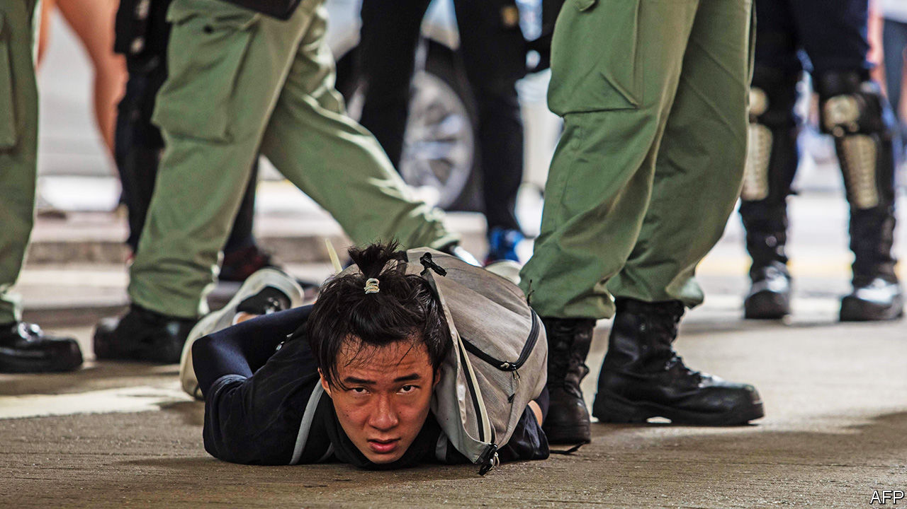
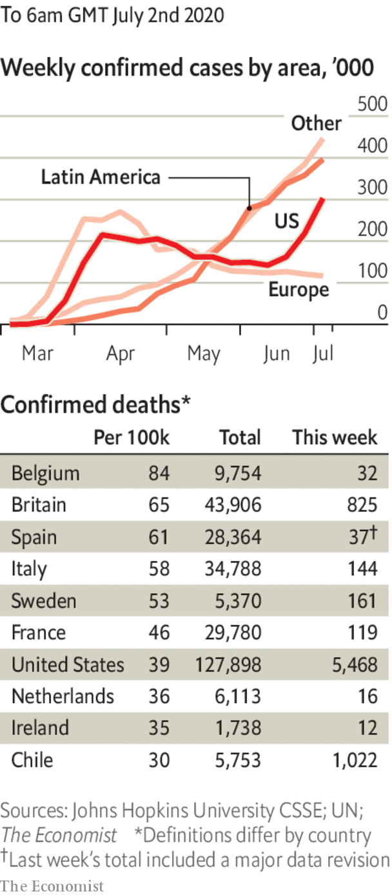

# Politics this week

> Jul 4th 2020

Police in Hong Kong made the first arrests under a draconian national-security law imposed from Beijing. Hong Kongers can now be jailed for life for vaguely defined crimes such as “subversion” or “conspiring” with anyone abroad to provoke “hatred” of the communist regime. Mainland secret police can now operate in Hong Kong. America’s House of Representatives unanimously passed a bill to put sanctions on banks that do business with Chinese officials who implement the crackdown. See [article](https://www.economist.com//node/21788898).

Boris Johnson reiterated his promise that Hong Kongers who were born before 1997, when the territory was handed back to China, could settle in Britain. The handover agreement back then stipulated that the city would retain its basic freedoms until at least 2047. See [article](https://www.economist.com//britain/2020/07/02/britain-gives-3m-hong-kongers-the-right-to-live-and-work).

Following months of talks, the UN Security Council passed a resolution calling for a 90-day global ceasefire to allow war-torn areas to battle covid-19.

India banned 59 apps developed by China’s tech giants, including TikTok, accusing them of threatening the country’s security. The apps have hundreds of millions of users in India. See [article](https://www.economist.com//asia/2020/07/02/india-has-few-good-ways-to-punish-china-for-its-himalayan-land-grab).

A terrorist outfit seeking independence for Balochistan, Pakistan’s largest province, claimed responsibility for an attack on the stock exchange in Karachi. The assailants killed three people before they were shot dead by police.

Iran issued an arrest warrant for Donald Trump. It asked Interpol for help in detaining him and 35 others it accuses of involvement in the drone strike that killed Qassem Suleimani in January. Suleimani was an Iranian general who oversaw Shia militias that carried out attacks all over the Middle East. Interpol dismissed Iran’s request.

Scores of people were killed during demonstrations in Ethiopia that erupted after the killing of Hachalu Hundessa, a prominent Oromo musician. His songs helped inspire a protest movement that led to the appointment of Abiy Ahmed as prime minister in 2018.

The leaders of Niger, Burkina Faso, Chad, Mali and Mauritania met to discuss ways of strengthening security to stop a jihadist insurgency in the Sahel. They were joined by Emmanuel Macron, the president of France, and Pedro Sánchez, the prime minister of Spain. France has more than 5,000 troops in the region.

Zimbabwe froze most mobile-money transactions to defend its ailing currency. It also suspended trading on the stock exchange, where traders had been observing share prices to estimate how much the currency is really worth.

Nearly 30 people, thought to be from the New Generation Jalisco drug gang, attacked the armoured car in which Mexico City’s police chief was riding. Two bodyguards and a passerby were killed. In the town of Irapuato, 24 people were slain by gunmen at a drug-rehabilitation centre. One of the government’s central pledges is to reduce gang violence.

Mexican police arrested a new suspect for the murder of 43 students in the southern state of Guerrero in 2014. An earlier report by the government contended that police had handed over the students to a gang, which killed the students and burned their bodies. The report was widely seen as flawed.

The United States-Mexico-Canada Agreement, which replaces the North American Free Trade Agreement (NAFTA), came into force. See [article](https://www.economist.com//the-americas/2020/07/04/amlo-and-trump-plan-a-frenemies-get-together).

Mississippi’s legislature voted to remove the Confederate battle flag from the state flag, which has flown outside the Capitol building since 1894. It is the last state to unstitch the emblem of the Confederacy from official regalia. See [article](https://www.economist.com//united-states/2020/07/04/mississippi-changes-its-state-flag).

Russians voted in a plebiscite on constitutional reforms. According to the electoral commission, 78% approved a package that includes inflation-proof pensions, a high minimum wage and a ban on gay marriage. It also allows Vladimir Putin to run twice more for president, and to sack judges. Voters had to say yes or no to the whole package. See [article](https://www.economist.com//europe/2020/07/04/a-phoney-referendum-shows-putins-legitimacy-is-fading).

In France Emmanuel Macron’s party was hammered in the second round of local elections. The Greens won the mayor’s office in a number of big cities; the Socialists handily hung on to Paris. Mr Macron is now under pressure to relaunch his presidency with an extensive reshuffle. See [article](https://www.economist.com//europe/2020/07/02/after-hearing-birdsong-during-lockdown-french-cities-vote-green).

The first round in Poland’s presidential election was inconclusive, a rebuke to the incumbent Andrzej Duda, who is backed by the ruling Law and Justice party. Polls show him running neck and neck with the liberal mayor of Warsaw in the next round.

Ireland got its first-ever coalition government between its two historic main parties, Fianna Fail and Fine Gael. The new prime minister, Micheal Martin, replaced Leo Varadkar, who will return to the office in two years’ time if the coalition lasts that long. See [article](https://www.economist.com//europe/2020/07/04/irelands-two-oldest-rival-parties-get-together).

Britain’s prime minister, Boris Johnson, invoked the spirit of Franklin Roosevelt when he announced a “new deal” to rebuild the economy. Many of the “new” projects are already in the pipeline. Mr Johnson has urged his countrymen to go to their local for a pint when pubs reopen on July 4th. See [article](https://www.economist.com//node/21788924).

More states in America reimposed lockdowns amid a surge in covid-19. The number of daily cases nationally passed 50,000 for the first time. In California, which had been considered an early success, restaurants and other businesses in 19 counties were ordered to shut. In Arizona, where infections have doubled in the past two weeks, the governor ordered gyms, bars and cinemas to close again for at least a month. See [article](https://www.economist.com//united-states/2020/07/04/its-messing-with-texas).

Leicester, a city in Britain, was put back under lockdown as cases there continued to rise, to three times that of the city with the next-highest rate. See [article](https://www.economist.com//britain/2020/07/02/leicester-shuts-up-shop).

The European Union reopened its borders to residents from 14 countries where the virus is under control, such as Canada and New Zealand. The list does not include Brazil, Russia or the United States. China will be added if it reciprocates.