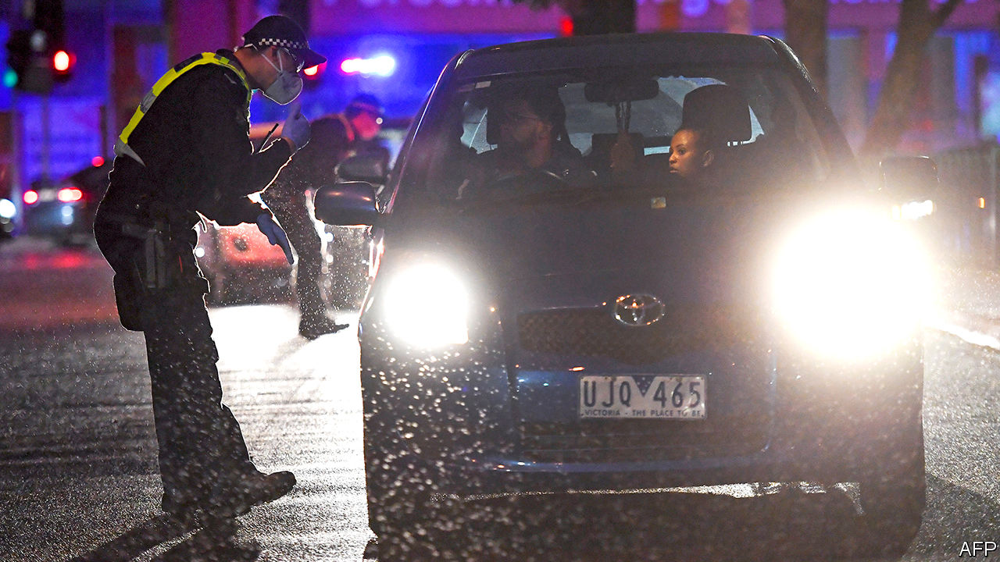

## Lock, unlock, repeat

# Australia’s second city faces a new wave of contagion

> This time, a targeted lockdown will be even tighter than before

> Jul 9th 2020SYDNEY

IT WOULD BE “the very worst thing” to have to impose a second lockdown, warned Daniel Andrews, the premier of Victoria, when he started easing the state’s restrictions in May. On July 8th he was forced to do just that to 5m residents of Melbourne, the state’s capital, plus a district to its north, where a second wave of covid-19 has been rolling in. Active cases almost tripled in the first nine days of the month, to more than 930. Contact-tracers are overwhelmed, Mr Andrews conceded, as he shut restaurants and bars for another six weeks. “To do anything else”, he sighed, “would have deadly consequences.”

The new wave threatens to undo Australia’s good work containing the virus. Locally acquired cases were virtually stamped out a month ago, largely because of stay-at-home rules and the quarantining in bleak hotels of the few people still allowed into the country. Victoria’s problems started with breaches of the mandatory two-week isolation for those arriving from abroad.

Blame has been levelled at poorly trained private security guards who were supposed to keep travellers in their rooms. They had not been using protective gear properly and have been accused of breaching social-distancing rules by sharing cigarettes and car-pooling to work. Local papers report that some had sex with the people they were supposed to be keeping in strict isolation. Several of the guards contracted the virus and passed it on to friends and family just as Victoria’s first lockdown, the toughest in Australia, was being lifted.

“This is what happens when you think you’ve got it under control,” says Peter Collignon, an expert on infectious diseases at the Australian National University: “apathy and complacency”. The seal would never have been broken if the army or police had overseen the private guards, as they do in New South Wales, argues Michael O’Brien, the leader of the opposition in the state. Businesses are dismayed. Victoria accounts for a quarter of Australia’s GDP. The new restrictions will do “untold damage to the economy and employment”, complains a business lobby group.

The state government has launched an investigation into what went wrong in its quarantine hotels. A testing blitz is now under way. Nationwide, infections are well below their peak in March, but in some ways this spike looks more threatening. Most of Australia’s early cases came from travellers who were intercepted on arrival from abroad. This time the virus has moved through the community, making carriers harder to identify. Whereas the first patients were mostly wealthy, returning from holidays in places such as Italy, poor multi-ethnic suburbs in Melbourne’s north and west are the worst-affected now.

Many of the residents of these areas suffer from the kind of ill health that makes them especially vulnerable to coronavirus. Nine public-housing towers in the suburb of Flemington were put on what authorities call a “hard lockdown” on July 4th, meaning that tenants were banned from so much as setting foot outside their flats until they had all been tested. With crowded lifts and airless lobbies, the government feared the buildings had become “vertical cruise ships” for contagion. On July 9th the government lifted the police cordon around eight of the buildings after detecting 158 cases—although residents are still subject to the city’s new lockdown.

Allowing life to return to normal in other parts of the country would be folly, warns the national medical association. The whole of Australia should “rethink the pace of easing”, it advises. Other jurisdictions seem to agree. The Australian Capital Territory paused plans to unwind its restrictions after it uncovered a handful of cases linked to the outbreak in Melbourne. Several more infections have trickled across the border from Victoria into New South Wales. It has now been shut for the first time since the flu pandemic of 1918-19. Soldiers and police have been called in to enforce the closure. They will use drones to hunt for scofflaws trying to sneak across via bush tracks or along rivers. All this is especially galling given Victoria’s long-standing rivalry with New South Wales. No need to patrol the border, sniffs an MP from Victoria, the coffee in Melbourne is far better than anything on the other side. ■

Editor’s note: Some of our covid-19 coverage is free for readers of The Economist Today, our daily [newsletter](https://www.economist.com/https://my.economist.com/user#newsletter). For more stories and our pandemic tracker, see our [hub](https://www.economist.com//news/2020/03/11/the-economists-coverage-of-the-coronavirus)