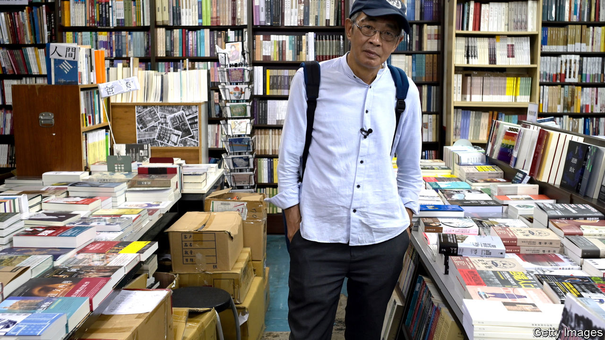

## A whispered welcome

# Democracy activists fleeing Hong Kong present a dilemma for Taiwan

> The government sympathises with their cause, but is wary of helping them too openly

> Jul 11th 2020TAIPEI

LAM WING-KEE runs a tiny bookshop on the tenth floor of an unremarkable building in Taiwan’s capital, Taipei. He is also the country’s most famous exile from Hong Kong. His shop is a replica of his former business in Hong Kong, Causeway Bay Books, which until 2015 sold material the Chinese government considered subversive. That year Mr Lam was kidnapped by Chinese agents and held without charge for eight months. He fled to Taiwan early last year, fearing that an extradition bill under consideration by Hong Kong’s legislature might see him sent back to the mainland—legally this time.

Now Mr Lam sleeps in a bed in the shop. Above a pile of books criticising the Chinese Communist Party hangs a banner calling for Hong Kong’s liberation from China. But when asked if Taiwan will be a haven for democracy activists from Hong Kong, he hums and haws. He himself wants to stay in a Chinese-speaking country, since he sells Chinese books. Others, he says, may prefer to flee to Western countries, farther from the long arm of the Chinese authorities. The Taiwanese government has treated him well, he adds. “They want to help Hong Kong but it is natural for them to be cautious,” he says.

Like most of her compatriots, Taiwan’s president, Tsai Ing-wen, is proud of her country’s democracy and sympathetic to Hong Kong’s activists. The day before China imposed a ferocious security law on Hong Kong last month, her government amended its covid-related border closure to make it easier for people from Hong Kong to enter. The day after the law took effect, it opened an office in the city to help locals visit or emigrate to Taiwan.

But Ms Tsai is indeed cautious: her government has not issued any sweeping offer of asylum. Instead, requests to resettle are considered case by case, and residency is often granted for mundane reasons, at least on paper. Mr Lam, for instance, is classified as an investor, since he set up a business in Taiwan.

Even this muted assistance has provoked outrage from the Chinese Communist Party. It considers Taiwan to be part of its territory and has threatened to take control by force, if necessary. Chinese officials rail about a “conspiracy between Hong Kong independence activists and Taiwan independence activists”.

Many Taiwanese, meanwhile, complain that the government’s help for activists from Hong Kong is half-hearted. Chen Yu-jie of Academia Sinica, a research institution, says the vague wording of immigration rules means asylum-seekers know neither whether they meet the criteria nor how long they will have to wait to find out. They also cannot appeal against a rejection. Should a government that is friendlier to China come to power, it could interpret the law much less generously. Yet the ruling Democratic Progressive Party (DPP) has sidelined a proposal from a small opposition party to clarify and enhance the rights of asylum-seekers from Hong Kong.

Ms Tsai’s hesitation probably stems in part from a reluctance to provoke an already aggressive China. Taiwanese officials are also always worried about Chinese attempts at infiltration. Wang Ting-yu, a DPP MP, argues that it is helpful for the government to have some discretion to park asylum cases at moments of high tension with China. Were applications to be subject to appeal, moreover, the government might have to reveal details about the informal intelligence networks in Hong Kong and elsewhere that it uses to help determine applicants’ bona fides.

Huang Chun-sheng, pastor of a church that has orchestrated shipments of gas-masks and helmets to protesters in Hong Kong and has been helping those who wish to emigrate, approves of Ms Tsai’s discreet approach. “The government really has goodwill,” he insists. Instituting a formal system of asylum would draw unhelpful scrutiny, he says: better for an activist to come into Taiwan quietly, enroll in a university and switch to a student visa. 

Whatever the rules, a growing number of people are moving from Hong Kong to Taiwan. Residency permits were handed to 2,383 of them in the first four months of the year—up by 150% compared with the same period last year. ■

Correction (July 16th 2020): A previous version of this article misnamed the Democratic Progressive Party. Apologies.

## URL

https://www.economist.com/asia/2020/07/11/democracy-activists-fleeing-hong-kong-present-a-dilemma-for-taiwan
