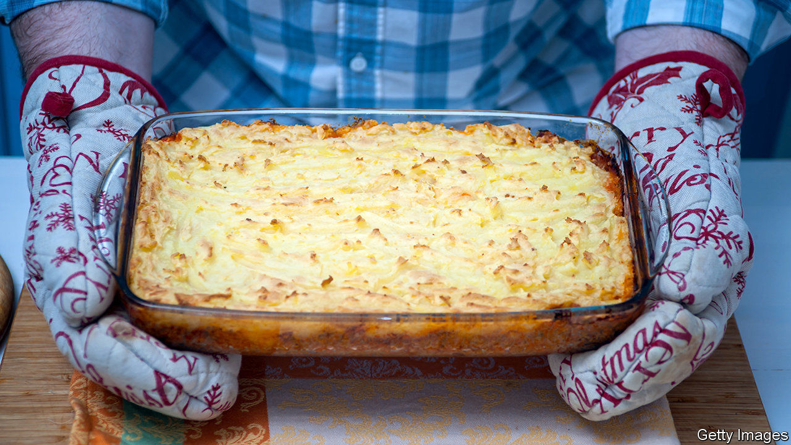
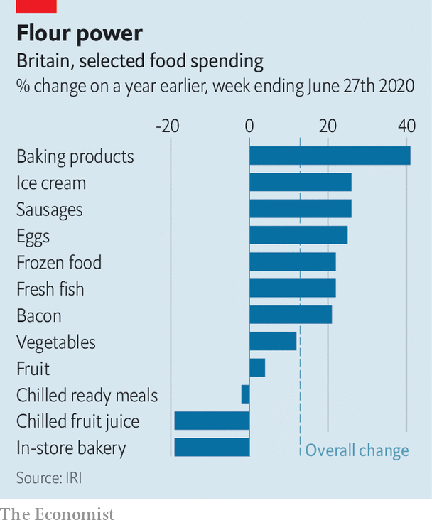

## Food

# Britons are defrosting decades-old diets

> Fruit is out; fry-ups are in

> Jul 11th 2020WELWYN GARDEN CITY

FIRST CAME the panic-buying and the stockpiling. As soon as it became clear that covid-19 was spreading through Britain, shoppers hit the grocery stores. Everything with a long shelf life was swept into trolleys—pasta, tinned beans, bottled water. People even cleared the shelves of pickled onions, recalls Peter Batt, who oversees the Co-Op’s convenience stores in southern England. “They were thinking a wartime sort of scenario,” he says.

In the end people had plenty to eat: in late May 48% told Ipsos MORI, a pollster, that they had gained weight. Sixteen weeks after the lockdown began, though, diets remain disrupted. If British eating patterns have not returned to those of the second world war, nor are they much like those of 2019. Instead, they have regressed roughly to a mid-point between those times.

With many offices only half-open and most children off school, more meals are being eaten at home. Spending on groceries in the week to June 27th was 13% higher than a year ago, according to IRI, a research firm. Because fewer people are commuting, mealtimes have changed. “Evening meals will be earlier, breakfast will be later,” says Giles Quick of Kantar, another research outfit. Family meals are more frequent and more orderly—a main course followed by a dessert. Mr Quick, who is 61, says it reminds him of his childhood.

Old-fashioned foods are back. Over the past few decades the Family Food Survey has tracked a gradual decline in the eating of eggs and bacon. Britons are now consuming more of both, presumably in leisurely breakfast fry-ups. Sausages are selling well, too (see chart). Ready meals, the rise of which had come to seem inexorable, have not kept up with the general rise in grocery sales. They were often bought on the way home from the office.

As sharp-elbowed supermarket shoppers can attest, nothing has been so in demand as flour. In both April and May, all top ten most-viewed recipes on the BBC Good Food website were for bread or baking. The new army of amateur bakers may tell themselves that home-cooked bread tastes better. But a more likely explanation is that people have time on their hands, and that worries about food hygiene have sharpened, says Krishnakumar Davey of IRI.

Nick Robinson, the chief executive of Kerry Foods, an Irish firm that makes spreads, flour and sausages, thinks that the same concern for safety helps to explain the popularity of frozen food. Unlike tinned food, which flew off shelves in the panic-buying days before returning to more normal levels, frozen food has continued to sell well. Iceland, a supermarket that specialises in it, is exceptionally busy. Its sales rose by 31% in the 12 weeks to mid-June, according to Kantar.

There seems to be a limit to how much time Britons will spend cooking, though. Although sales of mince and burgers have shot up, joints of beef and lamb are less popular than a year ago. It may be that Britons associate joints with large, slow meals with their extended families. Those have not been happening.

“I’ve had a joint sitting in the freezer for months,” says Mandy Walker, who is shopping with her family at the Sainsbury’s supermarket in Welwyn Garden City, a commuter town north of London. She is buying more mince and chicken than before lockdown. That is because she has to prepare many more meals than usual for children, who do not object too violently to those foods. “And less fruit and veg,” she adds. “That’s the terrible thing”.

As pubs, restaurants and offices reopen, some of these trends will reverse. But probably not all of them. Even in New Zealand, which eradicated covid-19 a month ago, sales of flour and baking mixes are a tenth higher than a year ago, according to IRI, and the restaurant trade is not back to normal. The changes in Britain are caused not just by new living patterns, but also by recession. Andre Burger, who oversees Unilever’s food brands in the country, says that a shrinking economy affects people’s eating habits in odd ways. They try to economise by cooking from scratch and in bulk. They also indulge in more sweet treats. To the many signs that consumer confidence is slumping, add this: for each of the past ten weeks, sales of ice-cream and frozen desserts have been at least 16% above last year’s levels.■