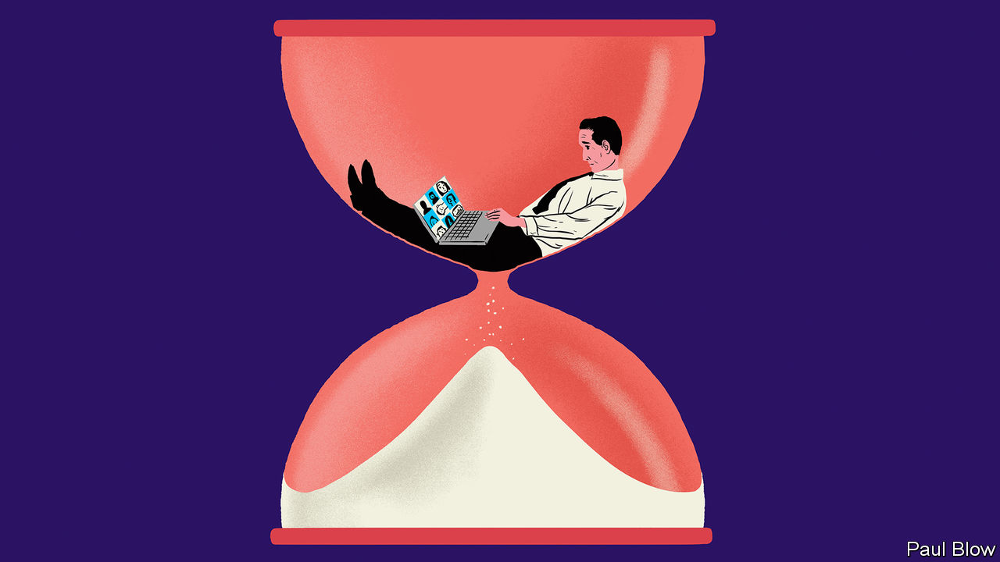

## Bartleby

# Slackers and Stakhanovites

> How the lockdown has affected a classic dictum about work

> Jul 11th 2020

AS LAWS GO, the dictum devised by C. Northcote Parkinson, a naval historian, was admirably succinct: “Work expands so as to fill the time available for its completion.” His essay, [first published in The Economist in 1955](https://www.economist.com//news/1955/11/19/parkinsons-law), has stood the test of time, in the sense that people still refer to “Parkinson’s law”. But the experience of working life during the pandemic means that Bartleby would now like to suggest three corollaries to the theorem.

At the start of his essay, Parkinson cited the case of an elderly lady requiring a day to send a postcard to her niece. The process involved time spent searching for spectacles, postcard and umbrella, as well as composing the message. The details may be dated but the idea is still resonant—faced with a task, people procrastinate.

When it comes to office work, the incentives to dawdle are pretty clear. Finish an assignment quickly, and the employee will just be given another. That second task may be even more unpleasant than the first. Workers may end up like a hamster on a treadmill, stuck in an endless cycle of needless effort.

Office workers know, however, that the mission itself is not the only thing. It is important to be seen to be working. This leads to “presenteeism”—being at your desk for long enough to impress the boss (and even turning up while sick). In the pre-internet era this would involve endless redrafting of memos, long phone calls, or staring meaningfully at documents. Thanks to the pioneering work of Tim Berners-Lee, presenteeism now requires less effort: many hours can be wasted on the world wide web.

When working at home, the boss is out of sight but not out of mind. Broadly speaking, the result is to divide workers into two factions. The first group, the slackers, has spent the lockdown working out the minimum level of effort they can get away with. They have no need to drag out each task; they do what is required and spend the rest of the day at leisure, submitting the work just before deadline. For this group, Parkinson’s law can be amended as follows: “For the unconcerned, when unobserved, work shrinks to fill the time required.”

The second group takes the opposite approach. Consumed by guilt, anxiety about their job security or ambition, they work even harder than before. Being at home, they find no clear demarcation between work time and leisure time. This group is the Stakhanovites (named after a heroically productive miner in the Soviet Union). They require their own amendment: “For anxious home workers, work expands to fill all their waking hours.”

But Parkinson was making a much broader point than people’s tendency to be dilatory. The bulk of his essay was concerned with the growth of bureaucracy in government. He warned that hiring more civil servants did not necessarily lead to more effective work.

This tendency resulted from two factors. First, officials want to multiply subordinates, not rivals. Second, officials tend to make work for each other. Any official who feels overworked will ask to be given two subordinates (asking for just one would create a rival). The senior official will then spend lots of time checking their subordinates’ work.

How does this process apply in the lockdown? Like their staff, managers also want to appear useful. In the office, they can seem busy by walking around and talking to their teams. At home, this is more difficult; a phone call is more intrusive than a casual chat. The answer is to organise more Zoom meetings.

Bartleby has heard from a number of contacts in recent weeks that they spend their day going from one Zoom meeting to another. Just as Parkinson suggested, managers are making more work for each other. Hence the third amendment to his law: “In lockdown, Zoom expands to fill all of the manager’s available time.”

To the extent that these meetings are voluntary, this creates another divide between slackers and Stakhanovites. The first group will avoid such meetings and the latter group will sign up for all of them. Furthermore, in the pre-lockdown days, staff could earn brownie points by turning up for such gatherings, provided they caught the boss’s eye. Mere attendance is insufficient for a Zoom meeting; one must be seen and heard. In turn, that makes Zoom meetings longer, further using up the time of managers and their Stakhanovite subordinates (many slackers have yet to learn how to use the “raise hand” button). It is a digital version of the paperwork shuffling described by Parkinson 65 years ago.

Editor’s note: Some of our covid-19 coverage is free for readers of The Economist Today, our daily [newsletter](https://www.economist.com/https://my.economist.com/user#newsletter). For more stories and our pandemic tracker, see our [hub](https://www.economist.com//news/2020/03/11/the-economists-coverage-of-the-coronavirus)

## URL

https://www.economist.com/business/2020/07/11/slackers-and-stakhanovites
