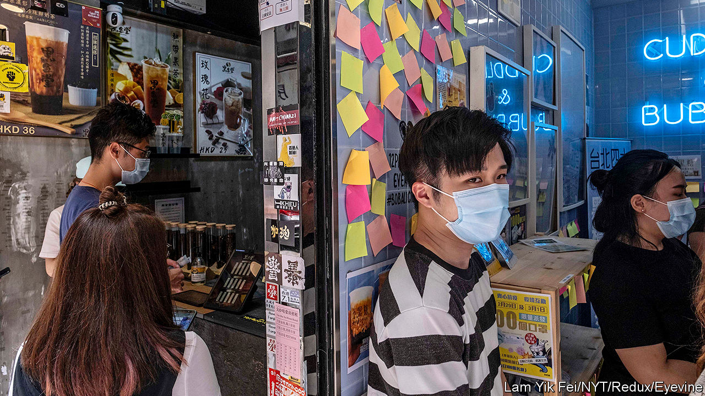

## The party’s grip

# Under a new national-security law, Hong Kong is already a changed city

> Residents have long feared that it might turn into just another Chinese city. That is happening, fast

> Jul 11th 2020HONG KONG

HONG KONGERS had long worried that the Communist Party would transform the territory by stealth into just another Chinese city. In the past few days, armed with a new national-security law which it imposed on Hong Kong on June 30th, it has been doing so brazenly. From the appointment of a party commissar to work with the chief executive, to the pulling of politically sensitive books from library shelves, Hong Kong is changing fast. The stockmarket has leapt, but many hearts have sunk.

On July 8th the central government opened a new outpost in Hong Kong called the Office for Safeguarding National Security. It occupies a luxury hotel, pending a move to permanent quarters. The director is Zheng Yanxiong, a hardline official from the neighbouring province of Guangdong (in 2011 he helped to suppress an outbreak of pro-democracy unrest in Wukan village that had grabbed global headlines). His two deputies are from the mainland’s Ministry of Public Security and secret police. In “complex” or “serious” cases, the office will enjoy sweeping powers to investigate and detain people for crimes covered by the new law: subversion, sedition, secession and collusion with foreign countries.

From his headquarters a few kilometres to the west, the mainland’s most senior official in Hong Kong, Luo Huining, has been wielding power more overtly than before. He is now an “adviser” on a newly established body chaired by the chief executive, Carrie Lam, known as the Committee for Safeguarding National Security. This brings Mr Luo—hitherto a shadowy figure—into the heart of local policymaking.

The committee has already granted extensive new powers to Hong Kong’s police, including the right in some situations to conduct searches without warrants and to freeze the assets of people suspected of national-security crimes. The police can now demand that any message posted on the internet that is deemed a threat to national security be removed and that its author be banned from the host platform. Tech firms such as Facebook, Google, Microsoft and Twitter have said that they will not co-operate (see [article](https://www.economist.com//business/2020/07/11/why-smic-is-surging)). TikTok, a Chinese-owned video-sharing service, has announced that, “in light of recent events”, it will stop providing its app in Hong Kong.

Mrs Lam has begun picking judges to try national-security cases. The first one involving the new law relates to Tong Ying-kit, who is accused of separatism and terrorism for allegedly riding a motorcycle on July 1st towards a group of policemen while flying a flag reading “Liberate Hong Kong, revolution of our times”. This has been a popular slogan during recent anti-government unrest in the territory. The government now says it “connotes” secession.

Censorship is spreading. Public libraries have removed books by politicians who have called for greater autonomy for Hong Kong. Schools have been “recommended” to do the same. The education bureau has ordered pupils not to sing the protest anthem “Glory to Hong Kong” or otherwise “express their political stance”. Mrs Lam has told foreign journalists that their freedom to report is conditional on a “100% guarantee” that they abide by the new law. Among the hundreds of people who have taken to the streets to demonstrate against it, some have used the first line of the national anthem, “Arise ye who refuse to be slaves”, as a protest slogan. Cafés have been replacing pro-democracy Post-it notes with blank ones (see picture).

Mrs Lam insists that, as such laws go, Hong Kong’s is “relatively mild”. She says she has seen no sign of “widespread fears”. The stockmarket’s rally, she says, shows an “increasing appreciation of the positive effect” of the new law. If it means fewer people clogging streets and paralysing transport with protests, as often happened last year, then some companies may be happy. But many firms are deeply anxious. ■