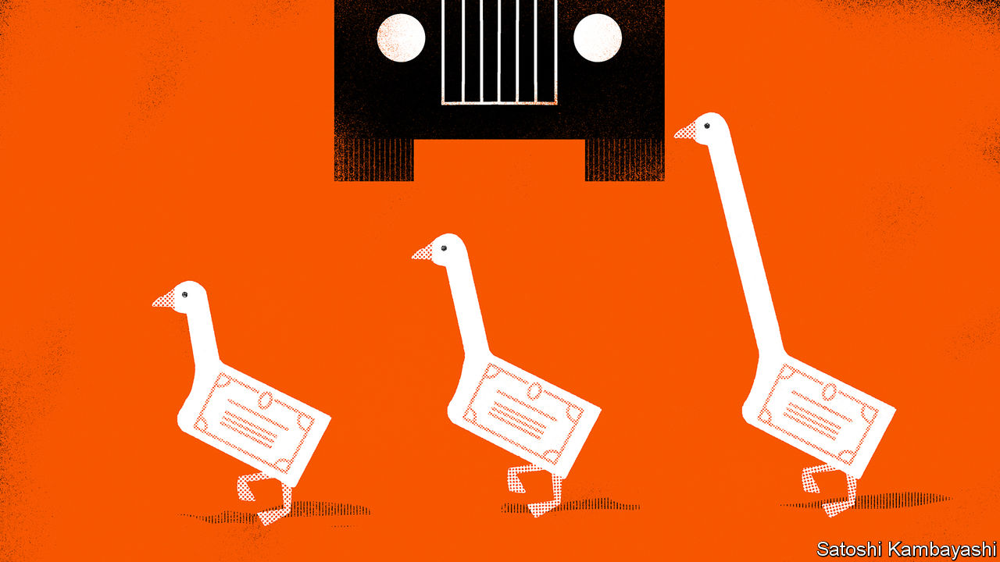
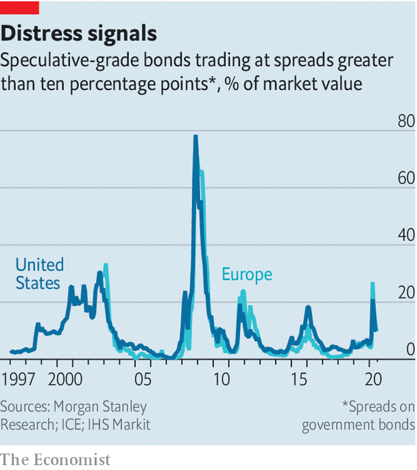

## Buttonwood

# More corporate defaults seem to be on the way

> Despite a mini-boom in the bond market, defaults are priced in

> Jul 9th 2020

IT WAS A company revered by business-school gurus and investors alike. British consumers cherished it for its value-for-money clothing. Its own-brand biscuits were unrivalled. But the glory days of Marks & Spencer are long gone. As if to underscore this, it recently became a “fallen angel”: its bonds were demoted to speculative-grade (or “junk”) status by S&P, a rating agency. Many other once-admired companies have been similarly humbled. Ford, Renault and Kraft Heinz are among the bigger angels to have fallen in recent months.

Companies are mercilessly sorted by recessions. The strongest credits grow stronger. The weakest investment-grade firms descend into junk territory. And the most frail speculative-grade firms go into default. Just a few months ago there was a real concern that the sorting would be too brutal. Good companies might go under for a want of cash to see them through the covid-19 shutdown. But governments and central banks acted decisively to support the economy. Stockmarkets fell, and then rallied. Corporate-bond issuance surged.

Now you hear a different concern: not that some worthy firms might die, but that too many unworthy firms will live on in a zombie-like state. That is a testament to the dramatic change in market mood. This does not mean that the angelic and diabolical are treated exactly the same, though. This particular turning-point in the business cycle has its own peculiarities, but in some important respects it mirrors the past. And the general pattern after recessions is for corporate-bond markets to rally months before defaults reach a peak.

Begin, though, with the peculiarities. Even before the recession struck there was a widespread concern about an overhang of debt rated BBB, a notch above junk. The fear was that a deluge of falling angels would overwhelm the speculative-grade market. That this didn’t happen is in large part down to America’s Federal Reserve, which has backstopped the corporate-bond market. Since March 23rd, when the Fed first announced it stood ready to buy corporate bonds, companies have issued more than $1trn-worth.

Yields on the best investment-grade credits—low-debt firms in defensive sectors like technology or health-care products—have fallen ever closer to those on government bonds. These are far from default. But not every issuer has been saved. Corporate defaults have already picked up. S&P expects the trailing 12-month default rate for junk bonds to rise to 12.5% in America and 8.5% in Europe by March. Many debt-laden firms in America opt for the protection of Chapter 11 bankruptcy, which allows them to keep operating as they settle their debts. In some cases, the trigger for default is a “distressed exchange”, where a company buys back its own bonds, or swaps them for new ones, when they are trading at a price much below their par value. And there is still a sizeable rump of bonds that trade at distressed prices—defined as yields that are ten percentage points above those of government bonds (see chart).

This default cycle will be more industry-specific than the one following the recession in 2008-09, says Mark Kiesel of PIMCO, a big bond house. One lot of vulnerable firms had cloudy long-term prospects even before the pandemic—think carmakers, oil firms and retailers. Another lot, including airlines and hotels, may be permanently scarred by changing consumer behaviour.

A bounce-back in economic activity seems assured. But there is still much uncertainty about what comes after that. Even a smooth recovery will leave some firms insolvent. And setbacks are likely. Investors seem willing to take a punt on risky credits all the same. In part this is a desperate search for yield when the safest bonds yield next to nothing. But there are other considerations. When the Fed buys corporate bonds, investors feel invited to follow its lead. And if a firm has access to cash, it has a chance to stay alive—and perhaps eventually to repay its debts. “Liquidity allows companies to extend their lives so you’ll have more survivors,” says Robert Tipp of PGIM, an asset manager.

History says you get the rally first, and then defaults peak: 2009 was a great year for corporate-bond returns even though plenty of firms stopped paying their creditors. Soon attention will move on. The next phase of the cycle is one of balance-sheet repair, says Max Blass of Morgan Stanley, a bank. Firms will pay down debt to lower their cost of credit—to avoid becoming a fallen angel, or perhaps even to become a rising star.

Editor’s note: Some of our covid-19 coverage is free for readers of The Economist Today, our daily [newsletter](https://www.economist.com/https://my.economist.com/user#newsletter). For more stories and our pandemic tracker, see our [hub](https://www.economist.com//news/2020/03/11/the-economists-coverage-of-the-coronavirus)

## URL

https://www.economist.com/finance-and-economics/2020/07/09/more-corporate-defaults-seem-to-be-on-the-way
