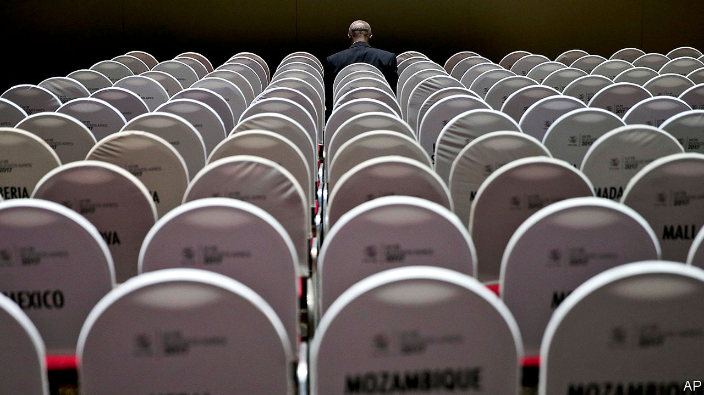

## Global trade

# The race to lead the WTO begins

> Picking a winner could get messy

> Jul 9th 2020

AND THEY’RE off! On July 8th the window for members to nominate the next director-general of the World Trade Organisation (WTO) closed. Over the next few months members will try to pick between eight candidates, each hoping to rescue the institution from its present sorry state. The process will highlight some of the WTO’s best features—but will also show why the organisation is in such a mess.

Fans of the multilateral trading system boast about its openness. In line with that principle, the top job at the WTO is not sewn up for a European or an American, unlike those at the IMF or the World Bank. In fact, there are no candidates from America, China, the European Union, India or Japan. Nominations range from Egypt and Moldova to Mexico and South Korea.

Members have several credible candidates to choose from. (Britain’s nominee, Liam Fox, is not one of them.) Nigeria’s candidate, Ngozi Okonjo-Iweala, is a political heavyweight: she is a former finance minister and has years of managing operations at the World Bank under her belt. Kenya’s pick, Amina Mohamed, is a trade heavyweight: she chaired the WTO’s ministerial conference in 2015.

From July 15th onwards, candidates will receive a grilling from members. Then the WTO’s consensus-building skills come into play: all 164 members will have to agree on the winner. The process will be a little like therapy, says Hosuk Lee-Makiyama of the European Centre for International Political Economy, a think-tank. “They don’t really understand what they want until they’ve sat and talked about it.”

At this point, the messy reality of trade negotiations will kick in. Just as the quest for consensus can sap ambition from trade talks, the search for a new director-general could end with members plumping for whoever gives the least offence. Robert Lighthizer, the United States Trade Representative, has already said that “any whiff” of anti-Americanism could lead him to use his veto.

The race will probably also highlight the tendency of the WTO’s constituents to talk past each other. A new survey of government officials, academics, NGOs and business groups published by the European University Institute (EUI) finds that many Geneva-based national representatives want a new chief to prioritise restoring the Appellate Body, a sort of supreme court for trade disputes, which the Americans nixed. But they are less interested in reforming the dispute-settlement system, without which the Americans will not get on board.

Expect the months ahead to reveal the disconnect between candidates’ ambitions and what the institution can achieve. Ms Okonjo-Iweala has pledged to mediate between America and China. Good luck with that. Egypt’s Abdel-Hamid Mamdouh has promised to “reboot” the WTO’s ability to negotiate new rules. But the director-general can only move as far as the members want—and members do not want to make the concessions needed.

The victor would therefore inherit a difficult job—if, that is, one is eventually chosen. In today’s fraught circumstances, consensus may not be reachable. The bar is low enough that the appointment of any director-general would count as a success. ■