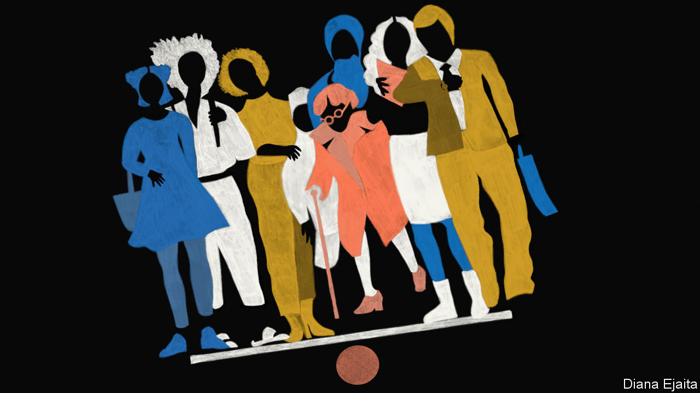
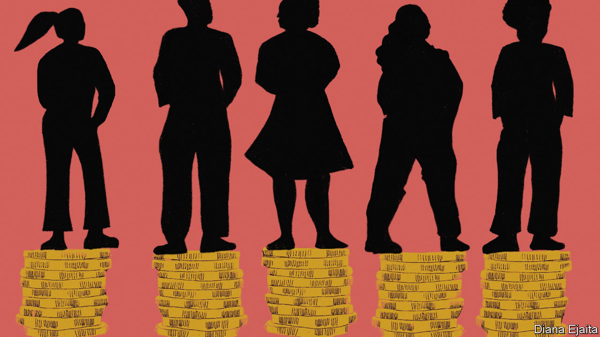

## In the balance

# Enlightenment liberalism is losing ground in the debate about race

> A new ideology is emerging

> Jul 9th 2020

LIBERALISM—the Enlightenment philosophy, not the American left—starts with the assertion that all human beings have equal moral worth. From that stem equal rights for all. Libertarians see those principles as paramount. For left-leaning liberals, equal moral worth also brings an entitlement to the resources necessary for an individual to flourish.

Yet when it comes to race many liberals have failed to live up to their own values. “We hold these truths to be self-evident,” wrote Thomas Jefferson in America’s Declaration of Independence in 1776, “that all men are created equal.” More than a decade later the Founding Fathers would write into the country’s constitution that a slave was in fact to be considered three-fifths of a person. In Europe many liberals opposed slavery but supported despotic imperial rule overseas. “Perhaps liberal theory and liberal history are ships passing in the night,” speculated Uday Singh Mehta of the City University of New York in 1999.

What lies behind this failure? That question is especially important today. Norms are shifting fast. The global protests that sprang up after the killing of George Floyd denounced racism throughout society. Companies, often pressed by their own employees, are in a panic about their lack of diversity, particularly at the top. Television stations and the press are rewriting the rules about how news should be covered and by whom. There is a fight over statuary and heritage, just as there is over people forced out of their jobs or publicly shamed for words or deeds deemed racist.

It is a defining moment. At Mr Floyd’s funeral, the Rev Al Sharpton declared: “It’s time to stand up in George’s name and say, ‘Get your knee off our necks.’” At Mount Rushmore on July 3rd, President Donald Trump condemned “a new far-left fascism”. To understand all this, it is worth going back to the battle of ideas. In one corner is liberalism, with its tarnished record, and in the other the anti-liberal theories emerging from the campus to challenge it.

During the past two centuries life in the broadest terms has been transformed. Life expectancy, material wealth, poverty, literacy, civil rights and the rule of law have changed beyond recognition. Though that is not all thanks to Enlightenment liberals, obviously, liberalism has prospered as Marxism and fascism have failed.

But its poor record on race, especially with regard to African-Americans, stands out. Income, wealth, education and incarceration remain correlated with ethnicity to a staggering degree. True, great steps have been taken against overt racial animus. But the lack of progress means liberals must have either tried and failed to create a society in which people of all races can flourish, or failed to try at all.

America’s founding depended on two racist endeavours. One was slavery, which lasted for almost 250 years and was followed by nearly a century of institutionalised white supremacy. Of the seven most important Founding Fathers, only John Adams and Alexander Hamilton did not at some point own slaves. Nine early American presidents were slaveholders. And although slavery is a near-universal feature of pre-Enlightenment societies, the Atlantic slave trade is notable for having been tied to notions of racial superiority.

The other was imperialism, when British colonialists violently displaced existing people. Many 18th-century European liberals criticised the search for empire. Adam Smith viewed colonies as expensive failures of monopoly and mercantilism that benefited neither side, calling Britain’s East India Company “plunderers”. Edmund Burke (a liberal in the broadest sense) decried the “outrageous” injustices in British colonies, including “systematick iniquity and oppression” in India, which resulted from power that was unaccountable to those over whom it was exercised.

But, argues Jennifer Pitts of the University of Chicago in her book “A Turn to Empire”, in the 19th century the most famous European liberals gravitated towards “imperial liberalism”. The shift was grounded in the growing triumphalism of France and Britain, which saw themselves as qualified by virtue of their economic and technological success to disseminate universal moral and cultural values. John Stuart Mill abhorred slavery, writing during the American civil war in 1863 that “I cannot look forward with satisfaction to any settlement but complete emancipation.” But of empire he wrote that “Despotism is a legitimate mode of government in dealing with barbarians, provided the end be their improvement, and the means justified by actually effecting that end.” (Mill worked for the East India Company for 35 years.) Alexis de Tocqueville championed the French empire, in particular the violent conquest and settlement of Algeria.

A belief in the basic similarity of human beings, and of their march towards progress, led these thinkers to the belief that it was possible to accelerate development at the barrel of a gun. Even at the time, this paternalism should have been tempered by scepticism about whether it can be just for one people to impose government on another. Although Mill criticised the British empire’s atrocities, he did not see them, as Burke had, as the inevitable consequence of an unaccountable regime.

The turn in liberal thought was reflected in the pages of The Economist. From its founding in 1843 the newspaper opposed slavery, and early in its existence it criticised imperialism. But we later backed the Second Opium War against China, the brutal suppression of the 1857 Indian mutiny and even the invasion of Mexico by France in 1861. We wrote that Indians were “helpless...to restrain their own superstitions and their own passions”. Walter Bagehot, editor from 1861 to 1877, wrote that the British were “the most enterprising, the most successful, and in most respects the best, colonists on the face of the earth”. Although the newspaper never ceased to oppose slavery, it claimed, bizarrely, that abolition would be more likely were the Confederacy to win America’s civil war. It was not until the early 20th century that The Economist regained some of its scepticism regarding empire, as liberalism at home evolved into a force for social reform.

In America the big liberal shift took place in the mid-1960s. To deal with the legacy of slavery, liberals began to concede that you need to treat the descendants of slaves as members of a group, not only as individuals. Sandra Day O’Connor, the first woman to serve on the Supreme Court, argued that affirmative action, though a breach of liberal individualism that must eventually be dispensed with, had to stay until there was reasonable equality of opportunity between groups.

Plenty of thinkers grappled with affirmative action, including Daniel Patrick Moynihan, a politician, sociologist and diplomat, and Ronald Dworkin, a philosopher and jurist. However, the most famous left-liberal work of the 20th century, written in 1971, was notably silent on race. The key idea of John Rawls’s “A Theory of Justice” is the “veil of ignorance”, behind which people are supposed to think about the design of a fair society without knowing their own talents, class, sex or indeed race. Detached from such arbitrary factors people would discover principles of justice. But what is the point, modern critics ask, of working out what a perfectly just society looks like without considering how the actual world is ravaged by injustice?

Liberalism as it is theorised “abstracts away from social oppression”, writes Charles Mills, also of the City University of New York. The “Cambridge Companion to Rawls”, a roughly 600-page book published in 2002, has no chapter, section or subsection dealing with race. “The central debates in the field as presented”, writes Mr Mills, “exclude any reference to the modern global history of racism versus anti-racism.”

As the gains of the civil-rights era failed to translate into sustained progress for African-Americans, dissatisfaction with liberalism set in. One of the first to respond was Derrick Bell, a legal scholar working at Harvard in the 1970s. “Critical race theory”, which fused French post-modernism with the insights of African-Americans like Frederick Douglass, an abolitionist and former slave, and W.E.B. Du Bois, a sociologist, then emerged.

Critical race theory first focused on the material conditions of black Americans and on developing tools to help them win a fair hearing in the courtroom. One is “intersectionality”, set out in a defining paper in 1991 by Kimberlé Crenshaw, another legal scholar and civil-rights campaigner. A black woman could lose a case of discrimination against an employer who could show that he did not discriminate against black men or white women, she explains. The liberal, supposedly universalist, legal system failed to grasp the unique intersection of being both a woman and black.

In the three decades since that paper was written, critical race theory has flourished, spreading to education, political science, gender studies, history and beyond. HR departments use its terminology. Allusions to “white privilege” and “unconscious bias” are commonplace. Over 1,000 CEOs, including those of firms such as JPMorgan Chase, Pfizer and Walmart, have joined an anti-racism coalition and promised that their staff will undertake unconscious-bias training (the evidence on its efficacy is limited). Critical race theory informs the claim that the aim of journalism is not “objectivity” but “moral clarity”.

Yet as critical race theory has grown, a focus on discourse and power has tended to supersede the practicalities. That has made it illiberal, even revolutionary.

The philosophical mechanics that bolt together critical race theory can be obscure. But the approach is elegantly engineered into bestselling books such as “How To Be An Antiracist” by Ibram X. Kendi and “White Fragility” by Robin DiAngelo.

One thing that the popular synthesis preserves is its contempt for the liberal view of how to bring about social and moral progress. To understand why, you need to start with how ordinary words take on extraordinary meanings. “Racism” is not bigotry based on the colour of your skin. Races, Mr Kendi writes, “are fundamentally power identities” and racism is the social and institutional system that sustains whites as the most powerful group. That is why “white supremacy” alludes not to skinheads and the Ku Klux Klan, but, as Ms DiAngelo explains, the centrality and superiority of whites in society.

Some acts also have an unfamiliar significance. Talking to someone becomes a question of power. The identity of the speaker matters because speech is not neutral. It is either bad (ie, asserting white supremacy, and thus shoring up today’s racist institutions), or it is good (ie, offering solidarity to victims of oppression or subverting white power). The techniques of subversion, called criticism, unpack speech to reveal how it is “problematic”—that is, the ways in which it is racist.

Speech is unfamiliar in another way, too. When you say something, what counts is not what you mean but how you are heard. A privileged person sees the world from their own viewpoint alone. Whites cannot fully understand the harm they cause. By contrast, the standpoint of someone who is oppressed gives them insight into both their own plight and the oppressor’s world-view, too. “To say that whiteness is a standpoint”, Ms DiAngelo writes, “is to say that a significant aspect of white identity is to see oneself as an individual, outside or innocent of race—‘just human’.”

Black people can also find themselves in the wrong. What if two black people hear a white person differently and disagree over whether he was racist? Critical race theorists might point out that there are many sorts of oppression. In 1990 Angela Harris, a legal scholar, complained that feminism treated black and white women as if their experience were the same. By being straight and male, say, the listener belongs to groups that are dominant along some axis other than race. The way out of oppression is through the recognition and empowerment of these group identities, not their neglect. Or one of them may have failed to grasp the underlying truth of how racism is perpetuated by society. If so, that person needs to be educated out of their ignorance. “The heartbeat of racism is denial,” Mr Kendi writes, “the heartbeat of anti-racism is confession.”

These ideas have revolutionary implications. One result of seeing racism embedded all around you is a tendency towards a pessimistic attitude to progress. Bell concluded that reform happens only when it suits powerful white interests. In 1991 he wrote: “Even those Herculean efforts we hail as successful will produce no more than temporary ‘peaks of progress’, short-lived victories that slide into irrelevance as practical patterns adapt in ways that maintain white dominance.”

The second implication is that well-meaning white people are often enemies. Colour-blind whites deny society’s structural racism. Ms DiAngelo complains that “White people’s moral objection to racism increases their resistance to acknowledging their complicity in it.” Integrationists—Mr Kendi’s term for those who want black culture and society to integrate with white—rob black people of the identity they need to fight racism. He accuses them of “lynching black cultures”.

Where does this leave liberalism? “Cynical Theories”, a forthcoming book by Helen Pluckrose and James Lindsay, two writers, argues that the two systems of thought are incompatible. One reason is that the constellation of postmodern thinking dealing with race, gender, sexuality and disability, which they call “Theory”, disempowers the individual in favour of group identities, claiming that these alignments are necessary to end oppression. Another is Theorists’ belief that power is what forces out entrenched interests. But this carries the risk that the weak will not prevail, or that if they do, one dominant group will be replaced by another. By contrast, liberals rely on evidence, argument and the rule of law to arm the weak against the strong. A third reason is that Theory stalls liberal progress. Without the machinery of individual equality fired up by continual debate, the engine will not work.

But what will? The appeal of critical race theory—or at least its manifestation in popular writing—is partly that it confidently prescribes what should be done to fight injustice. It provides a degree of absolution for those who want to help. White people may never be able to rid themselves of their racism, but they can dedicate themselves to the cause of anti-racism.

Liberals have no such simple prescription. They have always struggled with the idea of power as a lens through which to view the world, notes Michael Freeden of Oxford University. They often deny that groups (rather than individuals) can be legitimate political entities. And so liberal responses to critical race theory can seem like conservative apathy, or even denial.

Tommie Shelby of Harvard University, who sees himself as both a critical race theorist and a liberal, argues that scepticism regarding liberalism’s power to redress racial inequality is “rooted in the mistaken idea that liberalism isn’t compatible with an egalitarian commitment to economic justice.” Mr Shelby has argued that the Rawlsian principle of “fair equality of opportunity” can mean taking great strides towards a racially just society. That includes not just making sure that formal procedures, such as hiring practices, are non-discriminatory. It also includes ensuring that people of equal talent who make comparable efforts end up with similar life prospects, eventually eradicating the legacy of past racial injustices.

This would be a huge programme that might involve curbing housing segregation, making schooling more equal and giving tax credits (see [Briefing](https://www.economist.com//node/21789102)). That is not enough for Mr Mills, another liberal and critical race theorist. He wants liberal thinkers to produce theories of “rectificatory justice”—say, a version of the veil of ignorance behind which people are aware of discrimination and the legacy of racial hierarchy. Liberals might then be more willing to tolerate compensation for past violations. They might also demand a reckoning with their past failures.

The problem is thorniest for libertarians who resist redistributive egalitarian schemes, regardless of the intention behind them. But even some of the most committed, such as Robert Nozick, concede that their elevation of property rights makes sense only if the initial conditions under which property was acquired were just. Countries in which the legacy of racial oppression lives on in the distribution of wealth patently fail to meet that test. Putting right that failure, Mr Mills says, “should be supported in principle by liberals across the spectrum”.

Plenty of people are trying to work out what that entails, but the practicalities are formidable. Having failed adequately to grapple with racial issues, liberals find themselves in a political moment that demands an agenda which is both practically and politically feasible. The risk is that they do not find one. ■