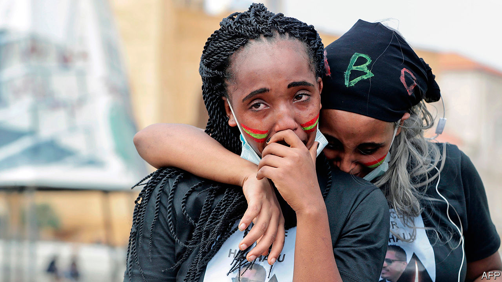

## The fragile federation

# A musician’s murder sparks mayhem in Ethiopia

> The country’s transition to democracy is at risk of being derailed

> Jul 9th 2020ADDIS ABABA

FOR TWO nights the sharp report of gunfire crackled through the pitter-patter of summer rain. Across the Ethiopian capital, Addis Ababa, cars and petrol stations were burnt, shops and businesses looted. At least ten people were killed in clashes between rioters and the police in the city. Similar confrontations took place in towns throughout Oromia, the largest of Ethiopia’s nine ethnically based regions and one that has been the site of repeated bouts of violence in recent years. In the country as a whole at least 166 people were killed, making this one of the deadliest episodes in Ethiopia’s already bloody transition from authoritarian rule.

The spark was the murder in Addis Ababa on June 29th of Hachalu Hundessa, a popular Oromo musician and activist. Oromos make up about a third of the country’s population of 115m. They are the largest and recently the most rebellious of Ethiopia’s many ethnic groups.

Violence escalated after a dispute with officials over where the singer’s body should be buried. “We are dead twice,” said Gelana Abeba, a protester. “First we lost our hero, then his funeral was disrespected.”

The unrest that raged over the next few days highlighted the three main faultlines in Ethiopian life. The first is distrust of the state by many young Oromos. They argue it has long been dominated by smaller groups such as Tigrayans and Amharas.

The second problem is a state that readily turns to violence and repression in response to protest. Although Abiy Ahmed, the prime minister, has promised to open up politics, old habits die hard. When violence started, the security forces cut off the internet and arrested some 1,200 people, including journalists accused of inciting violence as well as leading opposition figures. Among them was Jawar Mohammed, the most prominent Oromo leader.

The third fissure is along ethnic lines. Groups of young Oromo men attacked members of other ethnicities, notably Amharas, the second-largest group. “We all came out with sticks to protect ourselves,” says a resident whose housing estate was surrounded by a mob. The tensions also reflect a simmering dispute over the status of Addis Ababa, which is surrounded by Oromia. Oromo nationalists claim it forms part of their “homeland” and demand a greater say in its governance.

Many Ethiopians started this year optimistic that, with elections scheduled for August, the country would take a big step from authoritarianism towards democracy. But with voting postponed indefinitely because of covid-19, many now worry that the transition is at risk of being derailed altogether. It will take an almighty heave to put it back on track. ■

## URL

https://www.economist.com/middle-east-and-africa/2020/07/09/a-musicians-murder-sparks-mayhem-in-ethiopia
