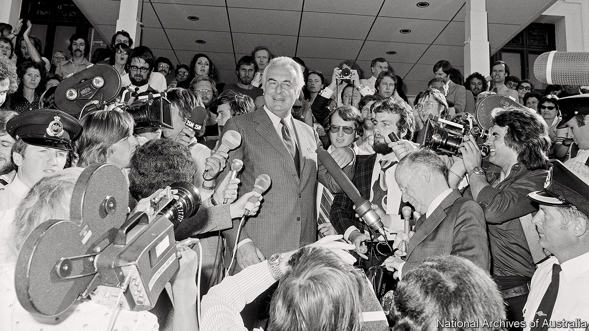

## Crown duels

# Did Queen Elizabeth approve the toppling of Australia’s government?

> No, but newly released papers from 1975 raise awkward questions

> Jul 18th 2020SYDNEY

LIKE A TIME-BOMB, they have rested in Australia’s national archives for 42 years. On July 14th the “palace letters” were at last made public, revealing secrets about one of Australia’s most explosive days: November 11th 1975, when the prime minister of the day, Gough Whitlam, was dismissed by the governor-general, Sir John Kerr.

Kerr asserted the power to do so as the constitutional representative of Queen Elizabeth, who is the head of state of Australia and many other countries in the Commonwealth, as well as Britain. No one had expected the largely vestigial power to be exercised. Outraged Australians—especially those of a republican bent—wanted to know whether the queen had been warned of Kerr’s plans or had encouraged him. That mystery is now solved, but the broader question that the episode raised about Australia’s ties with its former colonial power remains as vexing as ever.

Kerr’s official secretary deposited his correspondence with Buckingham Palace in the Australian archives in 1978, calling it “personal and confidential”. The queen wanted it kept secret until 2037. Jenny Hocking, an Australian historian, embarked on a legal battle four years ago to have the letters made public. On May 29th the High Court agreed that they were public records and ordered their release.

It turns out that Kerr never informed the queen directly of his plan. But he did have extensive correspondence with Sir Martin Charteris, her private secretary at the time, who showed Kerr’s letters to the queen and replied on her behalf. The two men discussed “reserve powers”, an unwritten and disputed form of viceregal authority that Kerr used to sack Whitlam. A week before he did so, Charteris, who later admitted he was “not very well versed in the Australian constitution”, assured Kerr that such powers existed and could be used “at the very end when there is demonstrably no other course”. Buckingham Palace says the letters confirm that neither the queen nor the royal household “had any part to play in Kerr’s decision to dismiss Whitlam”. Ms Hocking disagrees. To her, they reveal “clearly and unavoidably” that the palace “did play a part”.

For almost 50 years, the dismissal has been a reference point for debate about the role of Britain and its monarchy in Australian affairs. Britain is still a big investor in Australia, but only the seventh-largest trading partner and currently the third-biggest source of immigrants after India and China. The monarchy is the last constitutional link between the countries.

John Howard, a conservative prime minister, called a referendum on becoming a republic 21 years ago and then helped to defeat it by campaigning for a No vote. Mr Howard succeeded in seeing off the republicans in part because they were divided about how a new head of state should be chosen, not because Australians had an ardent desire to retain the monarchy. Greg Barns, who headed the campaign for a republic, says the referendum is “unfinished business”. A poll two days before the letters’ release found that 62% of Australians would like an Australian head of state. The ambiguous letters will continue to provide ammunition for both sides of the debate. ■

## URL

https://www.economist.com/asia/2020/07/18/did-queen-elizabeth-approve-the-toppling-of-australias-government
