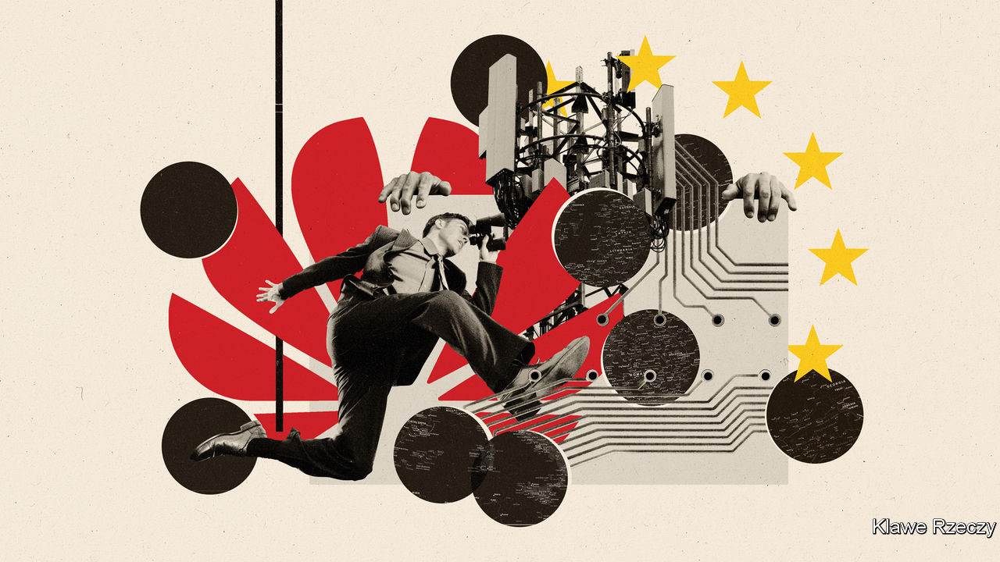
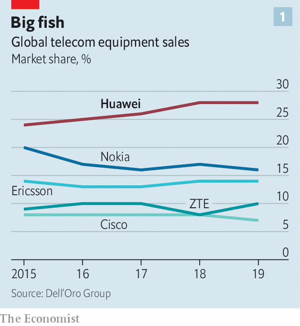
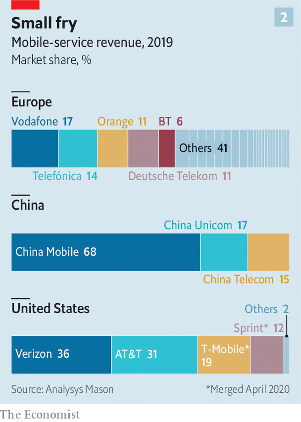
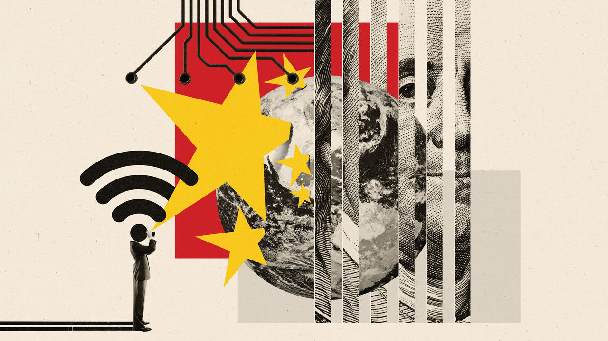

## The geopolitics of 5G

# America’s war on Huawei nears its endgame

> In Europe, however, there exists a mixed response to the Chinese telecoms-equipment giant

> Jul 16th 2020

Editor’s note: Sign up and listen to Checks and Balance, our [weekly newsletter](https://www.economist.com//checksandbalance/) and [podcast](https://www.economist.com//podcasts/2020/07/17/checks-and-balance-our-weekly-podcast-on-american-politics) on American politics, and explore our [presidential election forecast](https://www.economist.com/https://projects.economist.com/us-2020-forecast/president)

ON MAY 15TH the American government announced a startling escalation in its campaign against Huawei, a Chinese company which is the largest provider of telecoms equipment in the world. American politicians and officials have long expressed concerns that mobile networks which rely on Huawei could allow snooping and sabotage by China. In May 2019, citing alleged violations of sanctions against Iran—charges Huawei denies—America used powers designed to stop the transfer of military technology to bar the company from receiving American components vital to the systems it sells.

Those measures had loopholes: suppliers could keep on selling Huawei many components as long as they were made in facilities outside America. So this year America targeted the whole supply chain: as of September it will be seeking to stop companies around the world from using software or hardware that originally comes from America to manufacture components based on Huawei’s designs.

The move was a serious blow to the company. It may well have brought a sigh of relief in Britain. In January Boris Johnson, the British prime minister, had approved a substantial if clearly demarcated role for Huawei in Britain’s 5G telecoms infrastructure. Its promise of a faster, more commodious type of mobile broadband that allows completely new internet applications and might prove necessary for self-driving cars has made 5G a touchstone for seers scrying the next big thing and for politicians who pay heed to them. Infrastructure spending stamped with such a hallmark of futurity is right up Mr Johnson’s alley. If Britain’s existing procedures for overseeing Huawei’s role in telecoms infrastructure were applied, the government argued at the time, Huawei’s equipment could be used in “non core” parts of the network, and Britain could get its 5G systems up and running considerably sooner, and cheaper, than would otherwise be possible.

This decision was unpopular both with the White House and with a significant faction within Mr Johnson’s Conservative Party, with the opposition happily backing the rebels. Dismay over China’s imposition of new security laws on Hong Kong, in breach of the agreement under which the territory was handed back to it, heightened feelings further. America’s new salvo of sanctions provided a plausible reason for changing course. The inevitable dislocation to Huawei’s supply chains, the government said, would make relying on the company riskier. The new measures also meant that the vaunted system whereby British spooks vetted Huawei equipment would no longer be able to do its job: it would itself fall foul of the American sanctions.

On July 14th the government said it will ban mobile-network operators in Britain from buying Huawei equipment for their 5G networks, and told them to remove equipment already installed by 2027. Well before that—by the time of the next election, in 2024—the country would be on an “irreversible path” to expunging the Chinese firm from its networks, said Oliver Dowden, the culture secretary.

Mr Trump immediately took credit for having “convinced many countries” not to use Huawei. While some have been on board for a while—Australia banned Huawei 5G equipment in 2018—others have moved more recently. In June telecoms companies in Canada and Singapore announced plans for 5G networks built around equipment provided by Huawei’s main rivals, Ericsson, a Swedish firm, and Nokia, a Finnish one (see chart 1). In both cases Huawei had previously been a possible provider. On July 6th the head of the French cyber-security agency advised network operators which do not currently use Huawei not to plump for it in future.

Now all eyes are on Germany, which has said it will decide on the matter in the autumn. If it follows America’s urging and Britain’s example then the rest of the EU will probably go the same way, and a significant corner will have been turned. Western communications systems will be a bit less insecure. America will have used its sovereign might to humble one of China’s national champions, and China will doubtless be responding. The technophilic imperative that has made 5G a totem of the fully networked future will have had its momentum checked, at least a little, by a mixture of countries not wanting to upset America and being willing to upset a China they find increasingly disturbing.

Perhaps most profoundly, such a change may leave behind it a world where governments are less willing to depend on companies from countries with divergent interests to supply capacities they deem strategic. “At the heart of this is a dilemma which the West has not faced before: how to cope with a technology superpower whose values are fundamentally opposed to our own,” in the words of Robert Hannigan, a former boss of GCHQ, the British signals-intelligence agency.

Germany’s decision is not a done deal. Deutsche Telekom (DT), a 32%-state-owned company, is the country’s largest mobile provider and already relies heavily on Huawei equipment. It has lobbied strongly against any action that would make it harder for it to roll out 5G. The Ministry of Economic Affairs, often eager to defend the interests of German industry, has backed the firm. Angela Merkel, the chancellor, has not wanted any trouble with China (see [article](https://www.economist.com//europe/2020/07/16/angela-merkels-soft-china-stance-is-challenged-at-home)).

Yet, like the British Conservatives, Mrs Merkel’s Christian Democrats have split on the issue. As Norbert Röttgen, a conservative member of parliament and one of the leaders of the anti-Huawei faction, has put it, “We cannot trust the Chinese state and the Chinese Communist Party with our 5G network.” The Social Democrats, who are part of the governing grand coalition, and the opposition Greens are also opposed to letting Huawei play. “If there were a vote in parliament today, Huawei would lose,” says Thorsten Benner of Global Public Policy Institute, a think-tank based in Berlin.

Mrs Merkel, who will make the final decision, has so far been circumspect. She says she does not want to exclude a company on the basis of its nationality and that any firm that complies with certain security standards should be allowed to sell its wares in Germany. In late 2019 China’s ambassador in Berlin threatened retaliation against German companies should the government exclude Huawei from its 5G plans, and insiders say it is a threat the chancellor takes seriously. Meanwhile, DT is busily creating the aura of a done deal. It intends to provide basic 5G services to 40m Germans by the end of this month using equipment from both Huawei and Ericsson, though users will see little benefit at this stage. The company has also decided to intensify its co-operation with the Chinese firm in cloud computing and other areas.

There are many reasons for Europeans to be uncomfortable siding with America. Having missed the boat on the rise of consumer tech—Europe still bemoans the lack of the home-grown Google or Amazon—European politicians fear falling further behind if they delay 5G and the various wonders it is held to enable, such as an “internet of things”. Mobile-network operators play up these fears, with an eye to either keeping their ties to Huawei or receiving some form of compensation if it were to be proscribed. By combining direct costs with estimates of lost GDP they argue that ditching Huawei will cost the continent tens of billions of euros.

Regulators and independent observers are not convinced. Mr Dowden, admittedly an interested party, put the impact of Britain’s volte-face at two or three years’ delay and £2bn or so. A study by Strand Consult, a research outfit, thinks that the cost of eschewing Huawei would be quite modest for Europe as a whole, given that its ageing 4G kit would soon have to be replaced anyway. It estimates a total of around $3.5bn, no more than $7 per mobile customer.

That said, not all European mobile-phone customers will get the same deal. The EU has failed to create a single digital market; an operator in Poland cannot sell services to a customer in Sweden in the same way New York-based Verizon sells to Californians. So where China and America have three network operators each, Europe has more than 100 (see chart 2). In some markets, such as Belgium, Germany and Poland, the local companies are highly reliant on Huawei; companies in Finland, Ireland and Spain would face much lower costs if forced to make the switch.

The multiplicity of operators is a function of EU policy. Denied a continent-wide framework that would let them compete in far-off markets, telecoms companies are also kept from consolidating at home; the EU commission likes there to be four providers in each market. The resultant competition provides a stonking deal for customers. In Europe the average revenue per mobile-phone user is less than €15 ($17) a month. The average American user pays more than twice that. Rewheel, a data company, says that the cheapest unlimited-data plan in America costs €74 a month. In Germany the figure is €40, in Britain €22.

For network operators this fierce level of competition, coupled with the high costs of comparatively small, unconsolidated markets, constitutes a serious drag. Some carriers, including DT and Vodafone, a British operator, have returns on capital lower than their costs of capital: not the kind of business model that will find willing shareholders in the long term. Emmet Kelly of Morgan Stanley, a bank, points out that the market capitalisation of Europe’s major operators has shrunk from over €1trn in June 2000 to €258bn this June—a loss of 81% in real terms. Telefónica of Spain and Orange in France, once giants, are now not much more than minnows.

Mobile-network operators have long complained to the commission that the thin margins which scare away investors leave them unable to splash out on upgrades such as 5G, and that as a result Europe will fall behind its peers. China is investing massively in 5G and America is intent on keeping up; Mr Trump has called 5G “a race America must win”. The GSMA, which represents mobile-network operators, says that by 2025 half of all mobile users in America and the richer bits of Asia (including China) will be on 5G, compared with just one-third of Europeans.

In the past, Brussels has turned a deaf ear to such griping. The EU’s download speeds have remained comparable to those in America; the price of data services has fallen even faster than usage has grown: what’s the problem? But it is possible that a ban on Huawei could catalyse the “new deal” on regulation that the operators crave. Governments which realise that their actions are delaying 5G and driving up its costs might see their way to easing merger restrictions. The spectrum needed for mobile services, which in Europe is often sold through auctions designed to maximise revenue, might be given away instead, as happens in China and Japan. The lobbyists’ list is long. The industry takes courage from last year’s appointment of Thierry Breton, who was once boss of France Télécom (now Orange), as commissioner for the internal market.

Pending such a deal things might just slow down. There is already agreement among analysts that despite the hoopla 5G networks will be rolled out more slowly than the previous 4G ones were. This year’s 5G-spectrum auctions in France, Spain and Poland have been delayed by the covid-19 pandemic, which may quietly suit some operators. The equipment needed for 5G is only going to get cheaper and more reliable, as all chip-based kit does.

To the extent that there is indeed a race, it will not necessarily be won by those who get off to the fastest start. The services on offer so far are mostly just a faster version of 4G, and sometimes in practice the speed is not all that great. The most revolutionary aspect of 5G technology—the way in which it allows the workings of a network to be reconfigured through software and thus tailored to specific needs—will need years to come into its own. Profitable business models will take time to emerge.

A slower roll-out might also ease pressure on Ericsson and Nokia. The two Nordic companies will plainly benefit from countries turning away from Huawei, even if, as looks likely, they lose sales in China. They are precisely the kinds of industrial champion Europe is trying to promote these days, but there are worries about whether they can seize the moment. They now enjoy a duopoly in America (for a while there was talk of an American company taking a stake in one of them, but this idea seems to have been put aside). Some operators question whether, given those commitments, they can meet the needs of a Huawei-free full-speed-ahead Europe too. There is also the awkward fact that, supply chains for electronics being as they are, using European system integrators still means that much of the equipment comes from China.

The difficulties of having only a few suppliers will subside in time. Samsung of South Korea, a country very committed to 5G, is a growing presence. On July 15th Reliance Industries, an Indian conglomerate, announced that its Jio network, which uses a Samsung 4G network, will be building its own 5G infrastructure and selling it to others. Jio is likely to follow in the steps of some other carriers, most notably Rakuten Mobile in Japan, which are betting on networks based on advanced software, off-the-shelf hardware and open standards, thus side-stepping the need for systems integrators like Ericsson, Huawei or Nokia. Widespread implementations are still several years away, though.

Chinese reprisals against countries chucking out Huawei can be expected to come around a great deal sooner. China buys a lot from Europe, with Germany its largest trading partner in the bloc. It also invests quite heavily in the continent, having been courted by many of its leaders. Some of that may now be at risk. On the day of Britain’s U-turn the Chinese ambassador to London, Liu Xiaoming, tweeted that it was “disappointing and wrong”. China is painting the decision as a groundless capitulation to anti-Chinese pressure from America, and saying it calls into question the safety of Chinese investments in Britain, which are many and various.

But Europe does not see China exclusively through a commercial lens. Last year EU leaders designated it a “systemic rival”. The EU has since been working to limit Chinese state-backed groups’ operations in Europe. Its treatment of the Uighur minority, its reluctance to see word of covid-19 spread to the world and its move on Hong Kong have all raised hackles.

That does not mean Germany, or Europe as a whole, will necessarily ditch Huawei. Europe’s China links matter, and it does not like being pushed around by America. Policymakers on the continent have long fumed at the financial muscle that allows American administrations to punish European firms it sees as miscreants by squeezing the banks those firms deal with. But that does not mean it wants its internet infrastructure under the control of a third power that might, in time, aspire to use that control against it. A continental security official points out the underlying irony: “America wants to prevent China being able to do what America currently does to the rest of the world by controlling the financial system.”

The irony, though, does not invalidate the argument. Europe has sometimes acted to maintain its technological autonomy with respect to America in areas where national-security needs and civil infrastructure overlap, such as satellite launchers and navigation systems. In an interview with The Economist last November Emmanuel Macron, the French president, complained about European reliance on American tech platforms. At the same time he called development of 5G “a sovereign matter” and went on to say that “Some elements [of the 5G network] must only be European.” That did not in itself rule out any role for Huawei. But subsequent developments have pushed the continent further in that direction. American pressure may end up seeing Europe take a more assertive view of its “digital sovereignty”.■

Dig deeper:Sign up and listen to Checks and Balance, our [weekly newsletter](https://www.economist.com//checksandbalance/) and [podcast](https://www.economist.com//podcasts/2020/07/17/checks-and-balance-our-weekly-podcast-on-american-politics) on American politics, and explore our [presidential election forecast](https://www.economist.com/https://projects.economist.com/us-2020-forecast/president)

## URL

https://www.economist.com/briefing/2020/07/16/americas-war-on-huawei-nears-its-endgame
