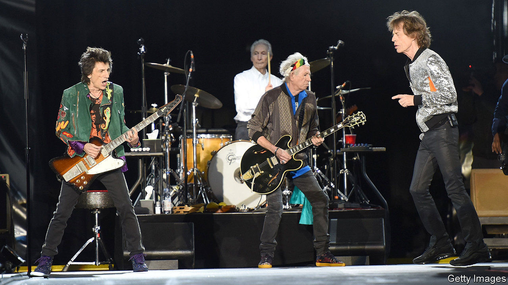

## Off his rocker?

# CTS Eventim is plotting a post-pandemic comeback tour

> Europe’s live-music giant is unfazed by the coronavirus slump

> Jul 18th 2020BERLIN

“WE WERE MEDIOCRE,” confesses Klaus-Peter Schulenberg about Free, the rock band he played guitar for in his youth. He was, though, excellent at landing attractive gigs. So much so that other bands asked him to help them do the same. It became his job in 1971, before he was old enough to sign a contract to manage Bernd Clüver, who went on to become a chart-topping pop star (Mr Schulenberg’s father did so on his behalf). Today he is the billionaire boss of CTS Eventim, Europe’s biggest organiser of live entertainment.

Mr Schulenberg developed Computer Ticket Service, a struggling ticket-seller he bought in 1996, into one of the world’s biggest events groups. It has had ups and downs, but social-distancing measures imposed by governments to contain the covid-19 pandemic are by far the biggest challenge in the 69-year-old’s career. Live shows stopped cold in March across most of Europe. Sales of tickets—his firm shifts 250m in a normal year—collapsed by 90%. Only a vaccine against covid-19 would enable the return of perennial crowd-pleasers like the Rolling Stones, who rocked an audience of 85,000 in Hamburg in 2017.

The slump comes after a year of record earnings for CTS Eventim, which enjoys a near-monopoly in Germany and controls big chunks of the market in Austria, Switzerland and Italy. The global live-music boom pushed its revenue up by 16% year on year, to €1.4bn ($1.6bn). It expanded further in Austria and Switzerland, bought a 48% stake in France Billet, France’s top ticketing firm, and set up a partnership with Michael Cohl, a Canadian concert promoter and erstwhile chairman of Live Nation, a bigger American rival. CTS Eventim’s share price rose by 72% in the course of 2019.

Now the shares are back down where they were 18 months ago. But Mr Schulenberg is unfazed. Kurzarbeit, a scheme under which the state pays most of the wages of workers whose hours have been cut, helps contain costs. He hopes to start staging smaller events in September, for instance at the Waldbühne, an open-air amphitheatre in Berlin (where gatherings of more than 5,000 are banned until October 24th). And he has successfully lobbied the federal government to pass a new law that lets organisers offer concert-goers vouchers in exchange for tickets bought before March 8th rather than their money back (vouchers unused by the end of 2021 would be refunded). Without the law, Mr Schulenberg says, two-thirds of smaller impresarios would have been out of business by the autumn.

Now some of them may instead be swallowed by CTS Eventim, which has a history of aggressive takeovers. In 2015 Germany’s competition watchdog investigated it after a series of acquisitions. The firm was cleared, but two years later regulators blocked its purchase of Four Artists, a Berlin-based concert promoter. Today trustbusters may be more lenient if a takeover is seen as a way for smaller fry to survive the corona-crisis. CTS Eventim has tolerable debt and enough cash to withstand two years of current lockdown restrictions. In the meantime, lenders would probably help bankroll acquisitions by a firm that analysts describe as, ehem, “rock solid”. ■

To keep up with our coverage of the pandemic, visit our coronavirus [hub](https://www.economist.com//news/2020/03/11/the-economists-coverage-of-the-coronavirus). Some of our covid-19 coverage is free for readers of The Economist Today, our daily [newsletter](https://www.economist.com/https://my.economist.com/user#newsletter).

## URL

https://www.economist.com/business/2020/07/18/cts-eventim-is-plotting-a-post-pandemic-comeback-tour
