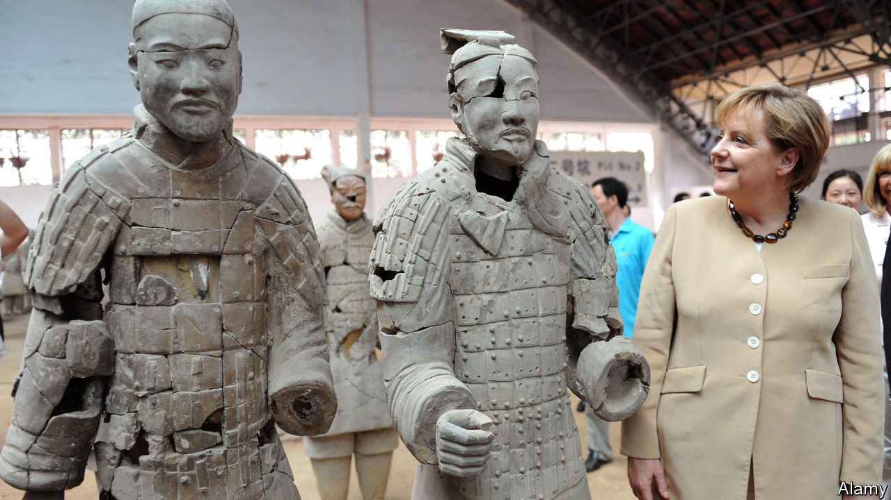
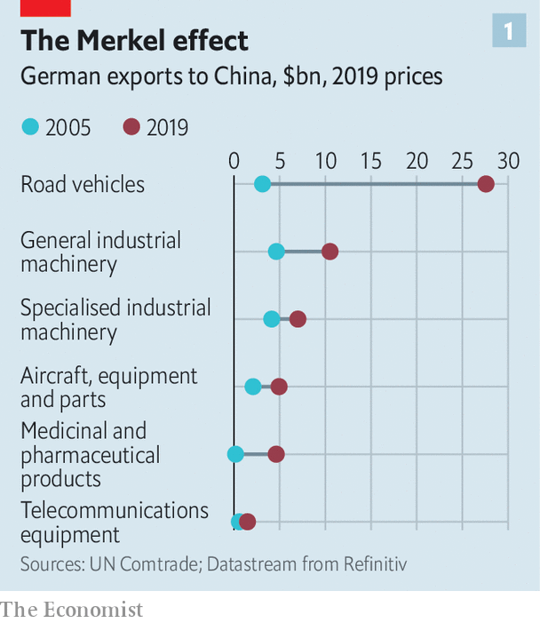
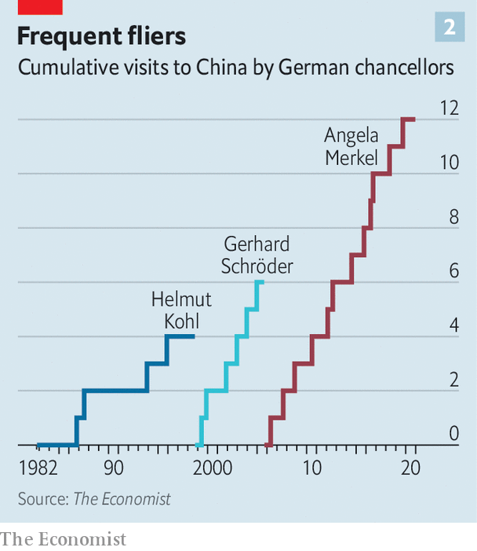

## Mittelstand v Middle Kingdom

# Angela Merkel’s soft China stance is challenged at home

> German businesses have had enough of being nice

> Jul 16th 2020BERLIN

ANGELA MERKEL has always had Germany’s economic ties with China in mind while conducting bilateral diplomacy with the Asian giant. In the 15 years since she took over as chancellor in 2005, German exports to China have quintupled, to just under €100bn ($110bn), about 3% of GDP. Last year China was easily Germany’s largest trade partner, to the particular benefit of big firms such as Volkswagen, BMW and Siemens. To avoid antagonising China’s ruling Communist Party, Mrs Merkel was careful not to take the side of the hawks in the heated debate last year and this over whether to let Huawei, a Chinese telecoms giant, bid for contracts to build Germany’s 5G networks (see [article](https://www.economist.com//briefing/2020/07/16/americas-war-on-huawei-nears-its-endgame)).

Her caution goes wider. Mrs Merkel has also been circumspect in her comments on China’s recent clampdown in Hong Kong. She emphasised the need to “seek dialogue” with the Chinese government on the basis of a “relationship of trust”. But that means that she is increasingly out of step with the rest of Germany’s political establishment. Leading figures in her Christian Democratic Union (CDU) object to her refusal to criticise the Chinese government directly. Norbert Röttgen, head of the Bundestag’s foreign-affairs committee and a contender for the CDU leadership, condemned as “self-censorship” the German foreign office’s recent advice to be “particularly careful” about posting China-critical comments on social media. For Nils Schmid, foreign-policy spokesman for the Social Democrats, the CDU’s junior coalition partner, Germany’s China policy is “behind the times”.

Mr Schmid speaks not only for the political elite but also for many business leaders who used to be relentlessly gung-ho about China’s potential but have long since tempered their enthusiasm. Some 5,500 German companies with production sites in China face hurdles ranging from forced technology transfer to being required to set up joint ventures. Many have lost faith in the possibility of change. “I would now advise any Mittelstand company to stay away from China,” says Frank Klix, who used to represent the Panjin Economic Development Zone in Germany but became frustrated by the lack of a level playing-field.

In early 2019 such concerns culminated in a head-turning paper issued by the Federation of German Industries (BDI), which declared that its hopes of convergence on the rules of doing business with China had faded. In January the VDMA, an association of German machinery manufacturers, said the “imbalance” in doing business with China had become unacceptable. Last year the German Chamber of Commerce in China found that nearly a quarter of German firms operating in China were planning to remove all or part of their businesses.

Challenges at home compound such difficulties abroad. When Midea, a Chinese appliance-maker, bought Kuka, a German robotics firm, in 2016, German industry and politicians realised that China had become a lot more than a loyal customer for its exports. Its “Made in China 2025” strategy represents a clear challenge to Germany’s high-value-added export model. China is now second only to Germany in global machinery exports.

Germany’s government is responding to this new rivalry by edging towards an industrial policy that looks more French. It has tightened its rules on foreign investment and flirted with the idea of protecting “strategic” companies by taking equity stakes. This shift has moved the European Union’s centre of gravity, too. The club, which now describes China as a “systemic rival”, is granting governments more power to screen foreign investments. Germany will push to tighten the EU’s state-aid regime under its presidency of the European Council, which started on July 1st.

In any event, the idea of German dependence on the Chinese market can be overdone. China overtook America as Germany’s single biggest trading partner in 2016, and it is true that Germany is more exposed to China than other large European economies. Yet Germany’s trade with China, at around €200bn last year, is just 8% of its total trade. It does more business with the four central European “Visegrad” countries alone. Barely 2.5% of German jobs depend directly or indirectly on Chinese exports, reckons Jürgen Matthes of the German Economic Institute in Cologne.

However, high-value-added products that Germany excels in, such as cars, machinery, electrical components and chemicals, account for 70% of German exports to China. Their makers include mid-size firms but also blue-chips that traditionally enjoy a hearing in Germany’s ministries. Take Volkswagen, which along with Daimler and BMW has a huge office in Beijing. VW entered China in 1985 through a joint venture, and now runs 33 factories in the country. Global carmakers cannot ignore the gargantuan Chinese market, says Stephan Wöllenstein, vw’s boss in China, which accounts for fully 40% of his firm’s sales. Other parts of German industry remain as keen as VW to tap Chinese growth.

This helps to explain Mrs Merkel’s apparent soft-pedalling on policy to China. Despite fierce pressure from America, government colleagues, intelligence agencies and from MPs across the spectrum, including her own CDU, she still refuses to bar Huawei from building Germany’s 5G network. She may fear that Chinese retribution exacted on German carmakers—a threat dangled by Beijing’s ambassador in Berlin—would be too much for a fragile economy crawling out of recession amid transatlantic trade tensions.

Mrs Merkel also carries a “political conviction” that trying to contain China carries more risks than rewards, argues Thorsten Benner at the Global Public Policy Institute in Berlin. How to accommodate China’s rise is a leitmotif of the speeches she made during her 12 trips to the country’s capital and hinterland in past years (see chart 2). She wants China to help shape rules on artificial intelligence and genetics to avoid cleaving the world into competing technological hemispheres.

Echoing the EU’s new position, Mrs Merkel has largely ditched talk of China as a “strategic partner”, describing it as a “competitor” with which Germany has “profound differences”. But she still hoped to find areas of partnership, notably on climate change and development in Africa, at an EU-China summit in Leipzig in September to be attended by all 27 European heads of government. In June the summit was postponed, ostensibly due to the pandemic. Mrs Merkel hopes to revive it.

However, the chancellor’s hopes of docking China into the multilateral system have started to look a little forlorn. A new generation of analysts and politicians in Germany casts a more sceptical eye on China than its old-school sinologists. “The chancellor is brilliant, but perhaps still thinking in a pre-Xi world,” says Johannes Vogel, an MP for the liberal Free Democratic Party. Mrs Merkel will leave office next year.

None of this signals “decoupling” of the sort Mike Pompeo, America’s secretary of state, has urged on Europe. But Germany needs a “significant rebalancing”, says Mr Benner, who suggests it should nurture European capabilities in critical infrastructure like 5G, tell companies that have bet on China they will no longer enjoy political cover, and assemble alliances with like-minded countries at risk of Chinese economic coercion, such as Australia and South Korea. In German business and politics alike, the winds are changing. ■

Correction (July 17th 2020): A previous version of this article misnamed the German Economic Institute. A figure has also been corrected.

## URL

https://www.economist.com/europe/2020/07/16/angela-merkels-soft-china-stance-is-challenged-at-home
