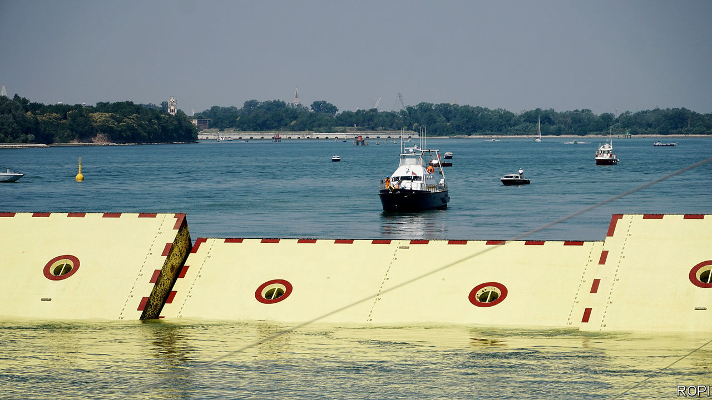
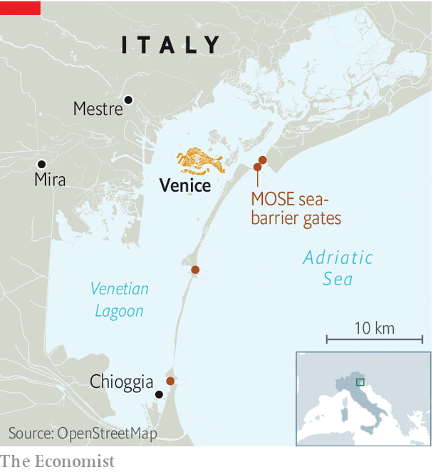

## Parting the waters

# Venice tests its mighty flood defences

> A success—up to a point

> Jul 16th 2020VENICE

AT 12.25PM ON July 10th, something happened that had never happened before. Venice was cut off from the Adriatic Sea it dominated for centuries. Watched by Italy’s prime minister, Giuseppe Conte, and a bevy of ministers and officials, all 78 movable sluice gates of the MOSE sea barrier reared up, blocking the inlets to the lagoon that surrounds the city.

All present stressed that this was not an inauguration. MOSE, an acronym for Experimental Electromechanical Module, will not be fully functional until the end of 2021. But now that it has been operated in its entirety (only sections had been tested previously), there is a chance that the barrier could be used this winter if Venice were threatened by a sea surge like the one that swamped it in November 2019.

As an opening—or closing?—ceremony, this one was pretty bizarre. The mayor of Venice, Luigi Brugnaro, said MOSE was “not an example to be copied”. Indeed not: delays have put it nine years behind schedule and three times over its original budget. A bribes-for-contracts scandal in 2014 involved dozens of local politicians and executives of the consortium building it. Mr Conte was just as downbeat, saying, “Let’s all hope it works.”

But then caution is advisable. Whether MOSE will be as efficient in parting the seas as its biblical namesake is unclear. The latest test was carried out in ideal conditions: a far cry indeed from the 100kph winds and three-metre waves (60mph and ten feet) that tore into the lagoon last November. And while its giant, box-shaped “gates” go up, not all can currently go back down again into their housings on the sea floor, thanks to sand in the works—a problem that is as tricky to solve as it was seemingly easy to predict.

The other doubt is whether Italy can afford MOSE’s astronomic running costs, estimated at around €100m ($110m) a year. Additional government borrowing to restart the economy after the covid-19 pandemic could easily push public debt above 160% of GDP, so money will be tight.

But even if this ill-starred scheme can be made to work, Venice will be far from safe. The sea surges and their effects are newsworthy, telegenic and easy to explain. Not so the other threat facing Venice: the inexorable rise in the everyday level of the water in the city, which is eating away at its fabric. The proof can be seen in strips of marine vegetation that run along the brickwork above the base of canal-side houses instead of attaching to the stone of the foundations as they once did. Few but the Venetians notice it, and those who do often see it as evidence that Venice is sinking. It no longer is; in fact, the causes are global warming and the loss of salt marshes that used to slow and partially absorb seawater.

What to do? Keeping big ships, including cruise liners, out of the lagoon would help. But Pietro Teatini, professor of hydrology at Padua university, has a more ambitious idea: lift up Venice. Raising the ground by just 20-30cm would make a huge difference. Mr Teatini thinks it can be done by pumping seawater into the already salty aquifers below the city. In 2008 it was estimated that a pilot scheme would cost €11.1m to launch and €1.4m a year to run; the full project around €80m and €10m a year. Compare that with the €6bn that MOSE has devoured. All the professor needs is a philanthropist who wants to be remembered as the saviour of St Mark’s Square. ■