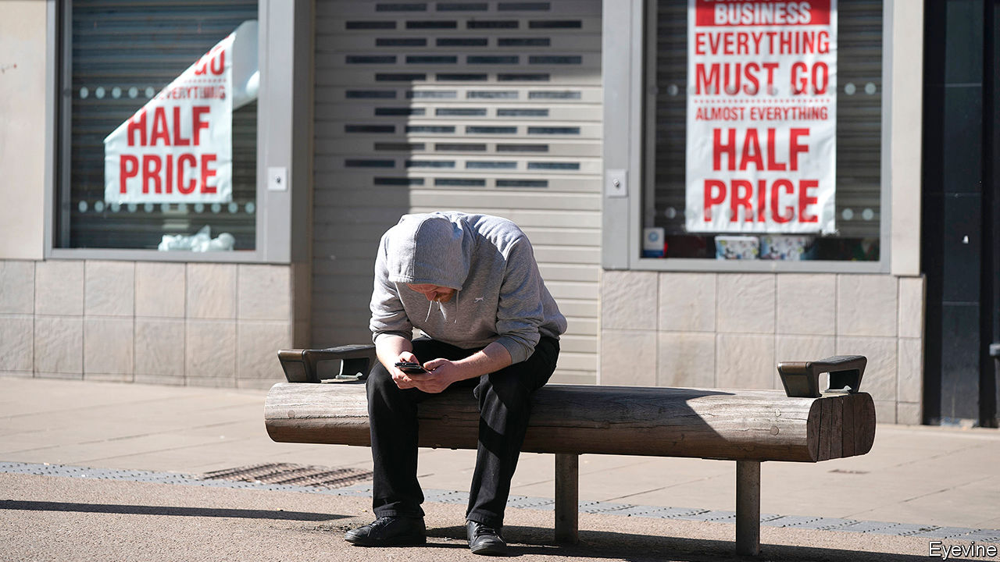

## A premium on change

# The threat of irrelevance spurs insurers to consider new ideas

> Insurers are rethinking their approach to systemic risks

> Jul 18th 2020

IN 2018 MARSH, an insurance broker, teamed up with Munich Re, a reinsurer, and Metabiota, a modelling firm, to launch a policy protecting businesses against losses linked to epidemics. The timing seemed right: the Ebola and Zika viruses had recently crossed entire continents. But many potential clients found the policy too niche and too dear. Plenty, having lost months of earnings to covid-induced lockdowns, will be kicking themselves.

Insurers have long been aware of the threat that pandemics pose to their businesses and have sought to minimise potential losses from them. Though they will not escape the covid-19 downturn unscathed, many may feel they have dodged a bullet. Instead the biggest risk the industry faces is that of irrelevance, as companies seeking protection from big new risks no longer see the point of insurance. The industry is scrambling to find ways to be helpful ahead of the next shock.

Make no mistake, the pandemic will hit insurers’ balance-sheets. Part of the shock is direct. Claims for aborted trips, unpaid trade invoices or cancelled events, such as music festivals or the Olympics, have picked up. But most of these have been assessed and their impact is limited. So far only $7bn in payouts has been announced.

Bigger losses will come from less direct sources. One area of worry is claims linked to litigation. Insurers themselves are party to some cases, as holders of policies covering business interruptions seek payouts for shutdowns. As of early July Cooley, a law firm, counted 677 motions against insurers related to these contracts in America. The bar for claimants to win seems high: most interruption policies require proof of physical damage. But courts could well force firms to pay up, as those in France and Germany have already done.

Insurers could also be on the hook for clients’ legal costs and payouts, adding up to tens of billions of dollars of losses. Staff might sue employers if they fall ill at work; customers could bring class actions against shops or entertainment venues. Lawyers already report a surge in cases.

Insurers’ assets have also taken a knock. At least half of the investments they hold to cover payouts and earn extra profit comprise bond holdings. Falling credit ratings have caused some asset values to decline, and raised the amount of capital insurers need to hold. It is very rare for one event to hit both sides of the balance-sheet, and so many lines and countries, points out John Neal, the boss of Lloyd’s, the world’s largest insurance marketplace. All told, property and casualty (P&C) insurers could suffer $203bn in losses worldwide in 2020.

Yet the industry, which writes P&C premiums worth $1.6trn globally, is escaping lightly compared with other sectors. It helped that insurers knew well the risk that pandemics posed to their business models, says George Netherton of Oliver Wyman, a consultancy. Typhoons and earthquakes do not happen everywhere at once; pandemics, by definition, do. Spooked by near-misses, like the SARS outbreak in 2003, insurers modelled the spread of viruses and excluded pandemics from most standard P&C contracts. Other lines have even benefited: people who stay home are less likely to crash cars or be burgled, resulting in record profits in personal insurance.

Solvency ratios, or insurers’ capital relative to their written premiums, remain healthy. Those of insurers have fallen from 200% at the start of the year to 150-190% globally, still well above the regulatory minimum of 100%. Despite falling in the first quarter, reinsurers’ capital buffers remain over 200%. The industry has also raised tens of billions in public and private equity and $70bn in debt since March, according to S&P Global, a rating agency.

Yet the mood is hardly upbeat. Insurers face a customer backlash on an unprecedented scale. Clients and brokers are unhappy that business-interruption policies have been of little use in tough times. More generally, customers feel insurers do a poor job of insulating them against intangible risks, like those of supply-chain disruptions and cyber attacks. John Doyle, who runs Marsh, says clients want to protect themselves against rare but damaging events. But many are losing faith that insurers can help them—or at least asking why they are not bearing more of the cost.

It would be ridiculous to expect insurers to underwrite all of the losses resulting from big systemic shocks. The sums injected by governments to support economies during the pandemic, for instance, exceed $5trn, more than the entire market value of listed insurers. But covid-19 has led insurers to consider public-private partnerships to cover such risks.

Various schemes are being floated. One idea, being discussed by American lawmakers, is for the government to cover some losses. Another, backed by Lloyd’s, is for insurers to pay into a kitty, and for states to bear losses when the pot is exhausted. As the kitty grows, the threshold for public action rises. An additional proposal would encourage companies to sign insurance contracts lasting 10-15 years, instead of the usual one year, with states guaranteeing premium payments if businesses go bust. This would help insurers amass firepower to cover big events over the period, knowing that customers will not leave in between. The solutions could help the industry insure against other systemic risks, such as climate change.

Plenty of thorny questions remain—whom to cover, and how much; how to encourage firms to buy insurance, rather than to expect bail-outs. But if they can answer these, insurers could be a bigger part of the solution to the world’s next crisis. ■