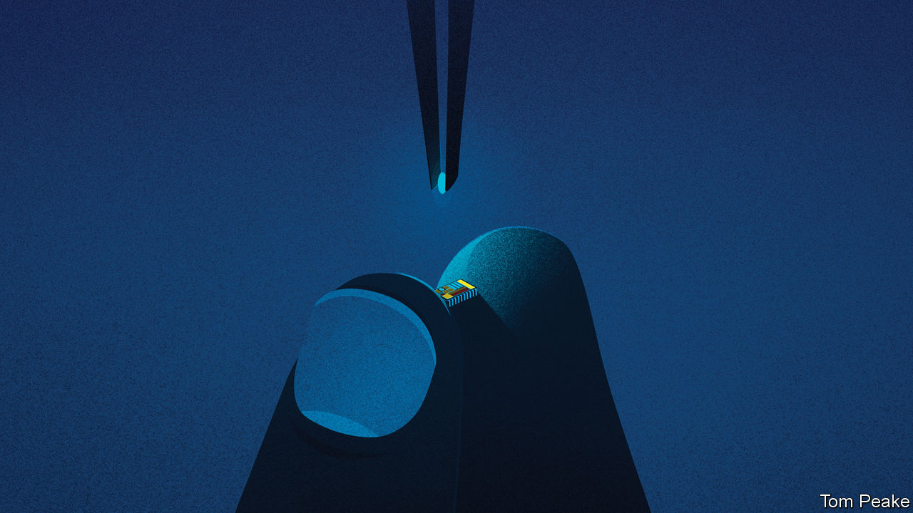

## The incredible shrinking machine

# A new material helps transistors become vanishingly small

> And more transistors mean more computing power

> Jul 18th 2020

THERE IS AN old joke in the semiconductor business that the number of people predicting the death of Moore’s law doubles every two years. This refers to another prediction, made in the 1970s by Gordon Moore, one of the founders of Intel, a giant chipmaker, that the number of transistors which can be crammed onto a silicon chip doubles every two years. When that number exceeded 1m in the mid-1980s, some said the rate of progress had to slow down. By 2005 the number of transistors on a chip rose above 1bn, which many thought was unsustainable. But there are now around 50bn transistors jostling for space on some chips and producers are gunning for more.

In the current state of the art, the smallest components (transistors and diodes) made on a silicon chip are about seven nanometres (billionths of a metre) across. That is a thousandth of the diameter of a red blood cell. But problems are mounting. As components shrink, electrons start to leak from the connections between them, causing interference and unreliability. The prophets of doom have therefore returned. Once again, however, they look like being wrong. The answer to the electron-leakage problem is better insulation between chip components. And a group of researchers in South Korea and Britain think they have the insulator required. It is called thin-film amorphous boron nitride (a-BN).

The backstory of this material is intriguing. Boron and nitrogen lie on either side of carbon in the periodic table, one consequence of which is that materials composed of equal numbers of boron and nitrogen atoms crystallise in the same ways that carbon does. There are, in other words, boron nitride equivalents of diamonds and graphite. There are also boron nitride versions of the tiny arrangements of carbon atoms known as fullerenes and nanotubes. So it was no surprise, after the creation in 2004 of yet another allotrope of carbon, graphene, which consists of single layers of atoms arranged in a hexagonal grid like a honeycomb, that it had a boron-nitride analogue. This has come to be known colloquially as white graphene.

To start with, white graphene was an also-ran in the new field of two-dimensional materials, as these sheets of atoms are often called. Real graphene, being incredibly strong and able to conduct heat and electricity extremely efficiently, was toted as a wonder material that might one day be used to make transistors much smaller and faster than the silicon-based variety, and thus keep Moore’s law ticking over. But for this purpose real graphene has a problem that is the obverse of its wonderfulness: it has no band gap.

A material’s band gap is a measure of the energy required for an electron to flow through it. A narrow band gap means that material is a conductor. A wide band gap makes it an insulator. Graphene’s band gap of zero, which is most unusual, makes it a very good conductor indeed. But to be a semiconductor, the type of material from which transistors are fabricated, requires a “Goldilocks” band gap that lies between the two extremes—neither too narrow nor too wide. Various methods of tinkering have produced versions of graphene which possess this fairy-tale property, but transistors made with them are, so far, confined to the laboratory.

Studying graphene and its analogues has, though, given technologists a huge amount of experience in the field of two-dimensional materials. And that is where boron nitride comes in. Though no use as a semiconductor it has a band gap wide enough to make it an extremely good insulator. It thus looks a suitable material, at least in principle, to deal with the problem of electron leakage.

Among the firms attempting to develop graphene transistors is Samsung, a giant South Korean electronics group. Its researchers have not, however, neglected boron nitride. One of them, Hyeon-Jin Shin, working in collaboration with Hyeon Suk Shin (no relation) of the Ulsan National Institute of Science and Technology in South Korea and Manish Chhowalla of the University of Cambridge, in Britain, has come up with a form of thin-film boron nitride that lacks the regular hexagonal structure of standard white graphene—hence the description “amorphous”. Crucially, the way this substance is made may permit the integration of boron nitride into the standard chipmaking process.

Thin-film materials are usually created by a process called chemical vapour deposition (CVD), and a-BN is no exception. The technique, as its name suggests, involves vaporising the material in question, or chemicals that will react together to make it, and then depositing the result on a substrate. In the case of microelectronics, this substrate is usually a wafer of silicon.

In general, for two-dimensional materials such as graphene and white graphene, CVD has to be done at above 700°C. This is too hot for existing fabs. But with thin-film a-BN, Hyeon-Jin Shin says, the temperature can be turned down as low as 400°C. That lower temperature should allow the material to be deposited directly onto silicon wafers and other substrates without having to retool the multi-billion-dollar factories, known as fabs, in which computer chips are made. This, she believes, means thin-film a-BN could be commercialised for chipmaking much faster than other two-dimensional materials.

The new, amorphous films are thicker than standard white graphene, but only slightly so. At three nanometres, they are well within the size-range needed to form part of the next sceptic-busting generation of components. They are also thermally, mechanically and electrically stable. And they preserve white graphene’s wide band gap, and thus its insulating properties. Add their fab-friendliness into the calculation and their future looks bright. With luck, then, the Moore’s-law naysayers have been outmanoeuvred again.■

## URL

https://www.economist.com/science-and-technology/2020/07/18/a-new-material-helps-transistors-become-vanishingly-small
