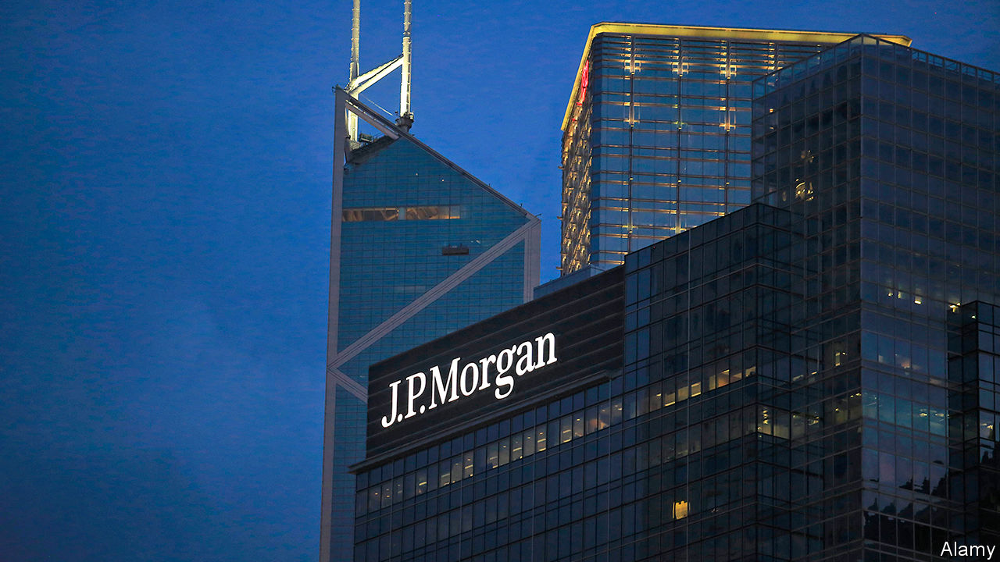
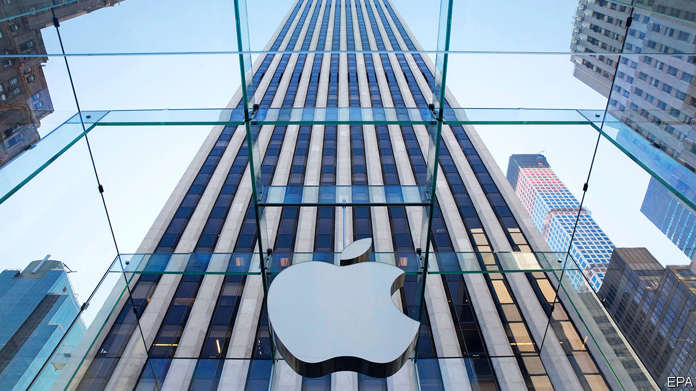

# Business this week

> Jul 18th 2020

American banks had a mixed start to the second-quarter earnings season, as loan-loss provisions dented earnings. JPMorgan Chase reported net income of $4.7bn, around half what it made in the same period last year, but more than the $3.3bn analysts had forecast. Citigroup’s net income of $1.3bn also beat expectations, but was down by 73% year on year. Goldman Sachs reported net income of $2.4bn, unchanged from the same period a year ago. By contrast, Wells Fargo made a net loss of $2.4bn during the quarter. See [article](https://www.economist.com//leaders/2020/07/18/banks-are-a-window-into-the-economy).

Singapore, which is among the first Asian economies to publish second-quarter GDP figures, announced that its economy had shrunk by a greater-than-expected 41.2% quarter on quarter, at an annualised rate, in the three months to the end of June. Meanwhile China’s GDP grew by 3.2% year on year in the three months to the end of June, beating forecasts. The figure followed a fall of 6.8% in the first quarter due to covid-19 outbreaks.

Britain said that Huawei’s equipment must be removed from the country’s 5G mobile networks by 2027. It also banned the Chinese company from providing new telecoms kit by the end of the year. The British government admitted that the decision, a U-turn from its previously less hostile position towards Huawei, will delay the country’s roll-out of 5G by up to three years. See [article](https://www.economist.com//briefing/2020/07/16/americas-war-on-huawei-nears-its-endgame).

PepsiCo reported a fall in profits but still beat analysts’ expectations. The American maker of fizzy drinks and snacks made net revenues of $15.9bn in the three months to June 13th, 3.1% less than in the same period a year ago. Bumper sales of snacks such as Frito-Lay crisps to people stuck at home during lockdown were offset by the damaging impact of restaurant closures on sales of its drinks.

Delta reported a pre-tax loss of $7bn in the second quarter, the second largest in the American carrier’s history. Travel restrictions helped to reduce operating revenue by 88% year on year. The airline also announced plans to scale back its flying schedule for August and to shed at least 17,000 of its 91,000 employees through early retirement. The carrier said it hoped to lure back flyers with promises of extra aircraft cleaning, including “disinfectant electrostatic spraying”.

The British government announced plans to spend £705m ($888m) on extra border infrastructure, including the construction of a 27-acre (11-hectare) lorry park in Kent for cross-border checks to take place. Britain is preparing for the imposition of trade controls between it and the European Union after the Brexit transition ends on December 31st. Even if a UK-EU trade deal is reached, officials calculate that firms will need to fill in an extra 215m customs declarations each year at an annual cost of about £7bn. See [article](https://www.economist.com//britain/2020/07/18/the-brexit-poster-campaign).

The European Union’s second-highest court dealt Apple a victory, declaring it will not have to pay a €13bn ($14.8bn) Irish tax bill. The ruling overturns a decision made in 2016 by the European Commission and presents its head of competition, Margrethe Vestager, with a challenge as she investigates national tax deals.

Seemingly unharmed by India’s severe lockdown, Infosys, an Indian IT giant, reported that second-quarter profits rose to 42.3bn rupees ($558m), up by 11.5% year on year.

Shares in Moderna, an American biotech firm, soared after it reported that an early trial of its covid-19 vaccine produced a “robust” antibody response in the 45 volunteers who took it. However, a much larger trial will be needed before regulators can approve it.

In a sign that Britain is not heading towards a “V-shaped” recovery, British GDP grew month-on-month by just 1.8% in May after a drop of 20.3% in April. Economists had expected growth of 5.5% in May.

Nissan unveiled its first major new car since Carlos Ghosn was dismissed as its chairman in November 2018. Shares in the Japanese carmaker jumped after it revealed the Ariya, its new all-electric sport utility vehicle, online. 

The European Court of Justice struck down an agreement that allowed companies in the bloc to transfer EU residents’ personal data to America. The surprise decision is a win for privacy activists, but could be costly for tech firms.

The Twitter accounts of several prominent American figures, including Barack Obama, Elon Musk and Bill Gates, were hacked by bitcoin scammers. In response Jack Dorsey, the firm’s chief executive, said “We all feel terrible this happened.”

Clarification (July 20th 2020): An earlier version of this article did not mention that the fall in Singapore’s GDP rate was at an annualised rate. 